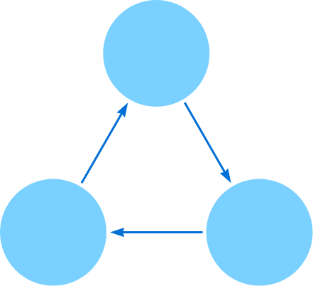
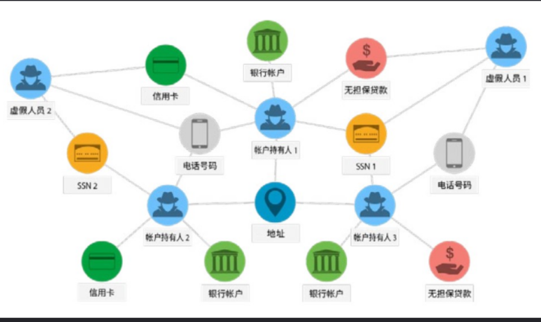
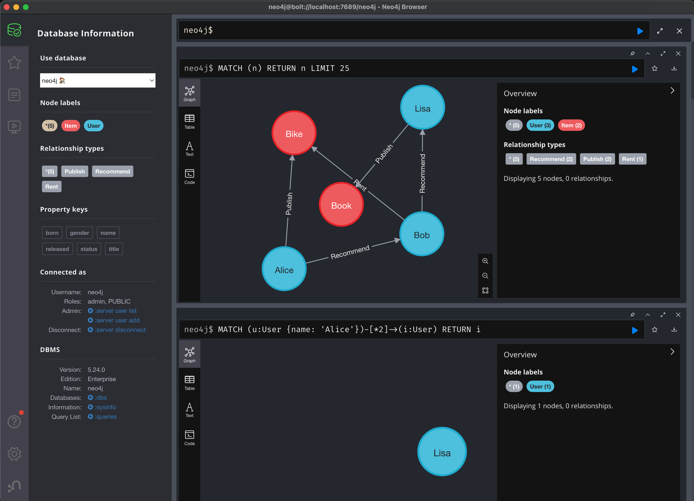

## 什么是图数据库（Graph Database）

图数据库是基于图论实现的一种NoSQL数据库，其数据存储结构和数据查询方式都是以图论为基础的，图数据库主要用于存储连接更多的数据。

>图论 ( Graph Theory ) 是数学的一个分支。它以图为研究对象图论中的图是由若干给定的点及连接两点的线所构成的图形，这种图形通常用来描述某些事物之间的某种特定关系，用点代表事物，用连接两点的线表示相应两个事物间具有这种关系。

<br>
<div v-click>
图（Graph）是一种数据结构，由节点（Node）和边（Edge）组成，节点可以通过边相连。以下是包含三个节点（圆圈）和三个边（箭头）的图像。


</div>

---

### 为什么需要图数据库
<br>

|  数据库类型   |  数据模型   | 数据存储   |  数据关系   |
| --- | --- | --- | --- |
| 关系型数据库 | 表 | 行和列 | 外键关联 |
| 文档数据库 | 文档 | 键值对 | 嵌套关联 |
| 键值数据库 | 键值对 | 键值对 | 键关联 |
| 图数据库 | 图 | 节点和边 | 关系连接 |


图数据库是基于图的数据模型，数据存储在节点和边中，节点和边之间通过关系相连，可以很好地处理动态的数据关系。图数据库的优势在于：
<v-clicks>

1.	发现节点之间的关系。
2.	深度遍历层级结构。
3.	寻找多层关系之间的隐藏联系。

</v-clicks>

<!--
这些数据库都是基于静态的数据模型，无法很好地处理动态的数据关系。
-->
---

### 图数据库的兴起
<br>

​随着社交、电商、金融、零售、物联网等行业的快速发展，现实社会织起了一张庞大而复杂的关系网，传统数据库很难处理关系运算。大数据行业需要处理的数据之间的关系随数据量呈几何级数增长，急需一种支持海量复杂数据关系运算的数据库，图数据库应运而生。

​世界上很多著名的公司都在使用图数据库，比如：
<v-clicks>

- **社交领域**：管理社交关系，实现好友推荐
- **零售领域**：商品实时推荐
- **金融及电信领域**：风控处理，反欺诈
- **物联网领域**：设备之间的关系

</v-clicks>
<!--
- **社交**：Facebook，LinkedIn，Twitter等社交网络公司使用图数据库来管理用户关系
- **电商**：亚马逊，京东，淘宝等电商公司用它来做商品推荐
- **金融**：摩根大通，花旗和瑞银等银行在用图数据库做风控处理
-->
---
layout: two-cols
layoutClass: gap-8
---

### 图数据库的应用场景
<br>

<v-clicks>

- 欺诈检测 
- 知识图谱
- 推荐系统
- 社交网络分析
- 网络安全
- ...
</v-clicks>

::right::



---

### 主要特点

- Neo4j是世界领先的图数据库
- 提供原生的图数据存储，检索和处理功能
- 具备成熟且稳健的数据库所需的所有功能
- 友好的查询语言 - Cypher
- ACID事务
- 高性能，支持大规模数据存储和查询。
- 支持多种语言的API，如Java、Python、JavaScript等
- 支持多种部署方式，如云、本地、容器等

<!--
程序员可以使用灵活的节点和关系网络结构进行开发，而不是静态的表格。
对于许多应用程序，Neo4j相比关系型数据库提供了数量级的性能提升。
-->
---

## 基本概念

Neo4j的数据模型是一个图，由节点和关系组成。节点是图的基本单位，用于表示实体。关系用于表示节点之间的连接。节点和关系都可以有属性。

<v-clicks>

- **图（Graph）**：图是节点和关系的集合。图是一个网络结构，由节点和关系组成。
- **节点（Node）**：节点是图中的基本单位，用于表示实体。
- **关系（Relationship）**：关系用于表示节点之间的连接。关系总是从一个节点指向另一个节点，有一个方向。
- **属性（Property）**：属性是节点和关系的特征。属性是键值对，键是属性的名称，值是属性的值。属性的值可以是任何数据类型，如字符串、整数、浮点数、布尔值、日期等。
- **标签（Label）**：标签是节点的类型。标签用于表示节点的类型。节点可以有零个或多个标签。标签是一个字符串，用于表示节点的类型。

</v-clicks>


---

### 对比关系型数据库

|  关系型数据库（RDBMS）   |  图数据库   |
| --- | --- |
| 表 | 图 |
| 行 | 节点 |
| 列和数据 | 属性和关系 |
| 约束 | 关系 |

---

### 性能测试
<br>

> 为了测试Neo4j的性能，我们将使用一个简单的查询，该查询将返回一个用户的所有朋友的朋友的朋友的朋友的朋友。我们将测试这个查询的深度，从2到5。我们将在一个包含1000个用户的数据库上运行这个查询。我们在MySQL和Neo4j中构建了这个查询，并且结果是惊人的。执行时间以秒为单位，对于1000个用户。

|  深度   |  MySQL 计算时间   | Neo4j 计算时间 |
| --- | --- | --- |
| 2 | 0.016 | 0.010 |
| 3 | 30.267 | 0.168 |
| 4 | 1,543.505 | 1.359 |
| 5 | Not Finished in 1 Hour | 2.132 |

来源：[图数据库到底有多快](https://neo4j.com/news/how-much-faster-is-a-graph-database-really/)

---

### 安装

- 安装Neo4j Server
```bash
docker run --name neo4j -p 7474:7474 -p 7687:7687 -d neo4j
```
- 安装Neo4j Client Neo4j Desktop



---

## 基本操作

```cypher
// 创建节点
CREATE (n1:Person {name: 'Tom Hanks', born: 1956})
CREATE (n2:Person {name: 'Tom Cruise', born: 1962})
CREATE (m1:Movie {title: 'Top Gun', released: 1986})

// 创建关系
MATCH (a:Person), (m:Movie) WHERE a.name = 'Tom Cruise' AND m.title = 'Top Gun' CREATE (a)-[r:ACTED_IN]->(m) RETURN r
MATCH (a:Person), (b:Person) WHERE a.name = 'Tom Cruise' AND b.name = 'Tom Hanks' CREATE (a)-[r:KNOWS]->(b) RETURN r

// 查询节点
MATCH (n:Person) WHERE n.name = 'Tom Hanks' RETURN n

// 查询关系
MATCH (n:Person) WHERE n.name = 'Tom Hanks' SET n.born = 1957

// 删除节点
MATCH (n:Person) WHERE n.name = 'Tom Hanks' DELETE n
MATCH (n) DETACH DELETE n
```

<!--
CREATE是创建操作，Person是标签，代表节点的类型。花括号{}代表节点的属性，属性类似Python的字典。这条语句的含义就是创建一个标签为Person的节点，该节点具有一个name属性，属性值是John。
MATCH是查询操作，Person是标签，代表节点的类型。WHERE是过滤条件，n.name = 'John'是过滤条件，表示查询name属性值为John的节点。RETURN是返回操作，表示返回查询结果。
SET是更新操作，n.age = 30是更新操作，表示将age属性值更新为30。
DELETE是删除操作，表示删除查询到的节点。
-->

---

### 需求分析

<v-clicks>

假设我们要做一个校园租借网络，需求是：
- 用户必须是推荐才能注册
- 用户可以发布物品
- 用户只能租借朋友的物品

为什么用图数据库Neo4j来实现这个系统？
- 用户可以有无限的层级关系，可以通过朋友的朋友的朋友找到物品
- 用户和物品之间有多种关系，如推荐、发布、租借
- 用户和物品都有属性，如姓名、性别、租借状态

</v-clicks>
---

### 建模设计
<br>

<v-clicks>

1. 提取实体 - Node & Label
    - 用户（User）
    - 物品（Item）
2. 定义属性 - Property
    - 用户: 姓名 Name, 性别 Gender
    - 物品: 名称 Name, 租借状态 Status
3. 提取关系 - Relationship
    - 推荐（Recommend）
    - 发布（Publish）
    - 租借（Rent）
</v-clicks>

<!--
- 用户节点有两个属性：姓名和性别
- 物品节点有两个属性：名称和租借状态
- 用户和用户之间有推荐关系
- 用户和物品之间有发布和租借关系
-->
---

### 建立图

```cypher
// 创建用户和物品节点
CREATE (u1:User {name: 'Alice', gender: 'female'})
CREATE (u2:User {name: 'Bob', gender: 'male'})
CREATE (u3:User {name: 'Lisa', gender: 'male'})
CREATE (i1:Item {name: 'Bike', status: 'rented'})
CREATE (i2:Item {name: 'Book', status: 'available'})

// 创建关系
CREATE (u1)-[:Recommend]->(u2)
CREATE (u2)-[:Recommend]->(u3)
CREATE (u1)-[:Publish]->(i1)
CREATE (u2)-[:Rent]->(i1)
CREATE (u3)-[:Publish]->(i2)
```

---

### 图查询

```cypher
// 查询Bob正在租借的物品
MATCH (u:User {name: 'Bob'})-[:Rent]->(i:Item) RETURN i

// 查询Alice的朋友的朋友
MATCH (u:User {name: 'Alice'})-[*2]->(i:User) RETURN i

// 查询Alice的朋友的朋友发布的物品
MATCH (u:User {name: 'Alice'})-[*2]-(f:User)-[:Publish]->(i:Item) RETURN i
```
