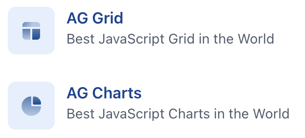

## AG-Grid

ag-Grid 是一个用于在企业级应用中构建功能强大的数据网格的 `JavaScript` 库。其中一个关键优势在于其提供了表格 `table` 和 `chart`两套数据展示方案。功能包括有：

---

### AG-Grid Table

<!-- ../components/BasicGrid.vue -->
<BasicGrid />

---

### AG-Grid Chart

<!-- ../components/BasicChart.vue -->
<BasicChart />

---

<!-- ../components/ColumnChart.vue -->
<ColumnChart />

---

<!-- ../components/PieChart.vue -->
<PieChart />

---

<!-- ../components/LineChart.vue -->
<LineChart />

---

<!-- ../components/ScatterChart.vue -->
<ScatterChart />

---

<!-- ../components/PolarChart.vue -->
<PolarChart />

---

<!-- ../components/StatisticalChart.vue -->
<StatisticalChart />

---

<!-- ../components/HierarchicalChart.vue -->
<HierarchicalChart />

---

<!-- ../components/CombinationChart.vue -->
<CombinationChart />

---

<!-- ../components/Sparkline.vue -->
<Sparkline />

---