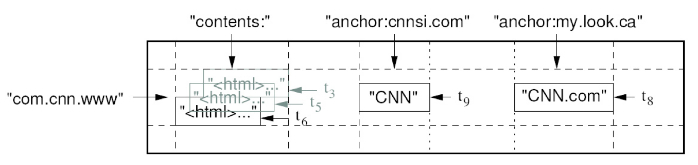
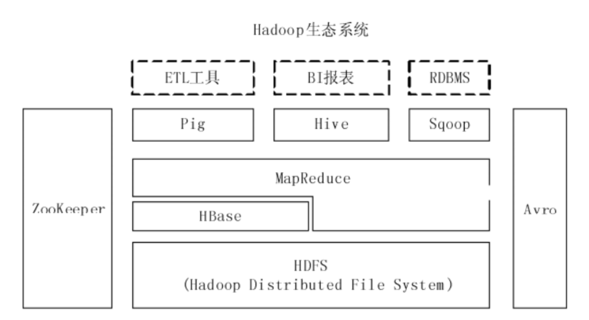
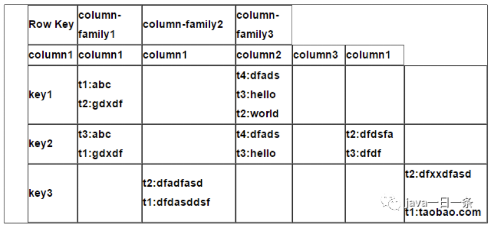
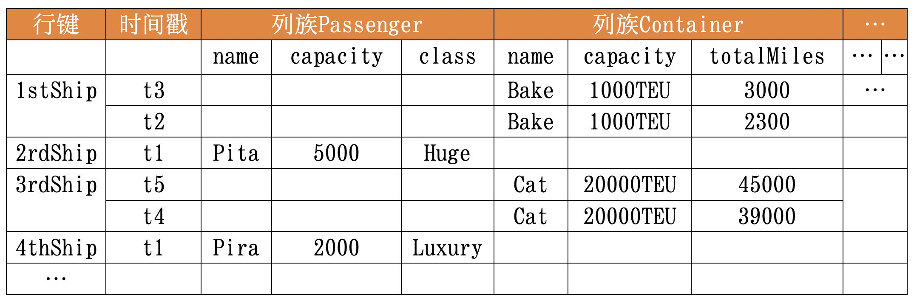

### HBase概述

#### 谷歌BigTable的开源实现

<v-clicks depths="2">

BigTable:
- 分布式存储系统(列族), 起初用于解决典型的互联网搜索问题
    

    1. 爬虫持续不断地抓取新页面，这些页面每页一行地存储到BigTable里 
    2. MapReduce计算作业运行在整张表上，生成索引，为网络搜索应用做准备
    3. 用户发起网络搜索请求
    4. 网络搜索应用查询建立好的索引，从BigTable得到网页 
    5. 搜索结果提交给用户
    

- 利用MapReduce分布式并行计算模型来处理海量数据
- 使用分布式文件系统GFS作为其底层数据存储方式
- 采用Chubby提供协同管理服务
- 可扩展到PB级别的数据和上千台机器
- 具备广泛应用性、可扩展性、高性能和高可用性等特点

</v-clicks>

---
layout: two-cols
layoutClass: gap-8
---

### Hbase 特性

 

- 分布式，面向列
- Hadoop MapReduce
- HDFS
- ZooKeeper
- 超10亿行数据和数百万列元素
- 可伸缩、高可靠、高性能

::right::

 

---

### HBase - 数据模型 - 表

- 表由行组成，行由行键唯一标识(row key), 最大长度64kb
- 行由多个列族组成, 基本访问控制单元
- 列族由多个列组成, 列由列名唯一标识, 无需预定义, 不同行间无需保持一致

---

### HBase - 数据实例

