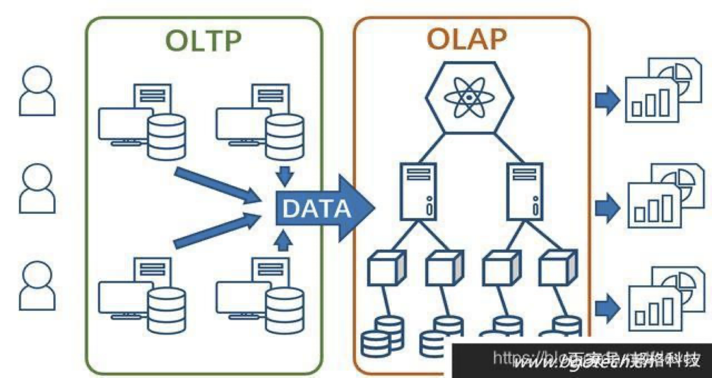
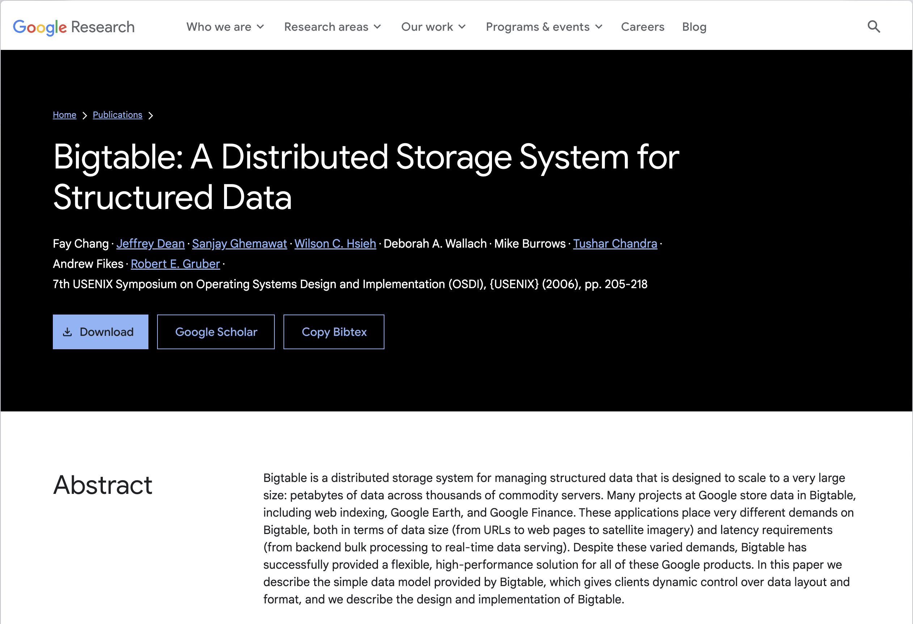

## OLAP 数据库

- 联机事务处理OLTP (On-Line Transaction Processing)
- 联机分析处理OLAP (On-Line Analytical Processing)

让我们以一家在全国经营数百家门店的大型零售公司为例。该公司拥有一个庞大的数据库，用于跟踪销售、库存、客户数据和其他关键指标。
- 使用 OLTP 处理订单、更新库存和管理客户账户
- 使用 OLAP 生成报告、执行复杂的数据分析和确定趋势

---

### OLTP vs OLAP 数据库

| OLTP | OLAP |
| --- | --- |
| 重点是CURD | 重在分析 |
| 强调数据范式(NF) | 不强调范式，数据冗余 |
| 对数据完整性有要求, 需要支持事务 | 不需要支持事务 |
| 实时处理，数据量小 | 批处理，数据量大 |
| 通常是关系型数据库 | 通常是数据仓库 |

OLAP 数据库通常是数据仓库。数据仓库是一个用于报告和分析的数据库。数据仓库中的数据是从 OLTP 数据库中提取的。

---

### OLAP - 列式存储 

分析型数据库（OLAP）通常使用列式存储，而不是行式存储。列式存储将数据存储在列中，而不是行中。这种存储方式有几个优点：
- 只检索所需的列，而不是整行
- 压缩数据更有效
- 更好的性能，特别是在大型数据集上

---
layout: two-cols
layoutClass: gap-8
---

### 谷歌BigTable论文
 

>Bigtable 是一个分布式存储系统，用于管理结构化数据，旨在扩展到非常大的规模：在数千台普通服务器上存储 PB 级的数据。谷歌的许多项目都将数据存储在 Bigtable 中，包括网页索引、谷歌地球和谷歌财务。这些应用对 Bigtable 提出了非常不同的需求，既包括数据大小（从 URL 到网页，再到卫星图像），也包括延迟要求（从后台批量处理到实时数据服务）。尽管需求各异，Bigtable 仍成功地为所有这些谷歌产品提供了一种灵活且高性能的解决方案。在本文中，我们描述了 Bigtable 提供的简单数据模型，该模型使客户能够动态控制数据的布局和格式，并描述了 Bigtable 的设计和实施。

::right::

---

分布式存储系统(列族), 起初用于解决典型的互联网搜索问题
<v-clicks>

1. 爬虫持续不断地抓取新页面，这些页面每页一行地存储到BigTable里 
2. MapReduce计算作业运行在整张表上，生成索引，为网络搜索应用做准备
3. 用户发起网络搜索请求
4. 网络搜索应用查询建立好的索引，从BigTable得到网页 
5. 搜索结果提交给用户

</v-clicks>

<!--
建立网页索引
搜索互联网
-->
---

### BigTable
 

<v-clicks>

- 分布式存储系统(列族), 起初用于解决典型的互联网搜索问题
- 利用MapReduce分布式并行计算模型来处理海量数据
- 使用分布式文件系统GFS作为其底层数据存储方式
- 采用Chubby提供协同管理服务
- 可扩展到PB级别的数据和上千台机器
- 具备广泛应用性、可扩展性、高性能和高可用性等特点
</v-clicks>

---
layout: two-cols
layoutClass: gap-8
---

### Hbase 特性

 

- 分布式，面向列
- Hadoop MapReduce 高性能计算
- HDFS 高可用底层存储
- ZooKeeper 协同服务
- 超10亿行数据和数百万列元素
- 可伸缩、高可靠、高性能

::right::

 

<!--
Pig Hive 高层语言支持SQL
Sqoop RDBMS数据导入
Avro 数据序列化
-->

---

### HBase - 数据模型

<v-clicks depths="2">

- **Row Key** 行键唯一标识, 最大长度64kb
    - 访问方式: 单个行键, 行键区间, 全表扫描
- **Column Family** 行由多个列族组成, 基本访问控制单元
- **Column** 列族由多个列组成, 列由列名唯一标识, 无需预定义, 不同行间无需保持一致

</v-clicks>

