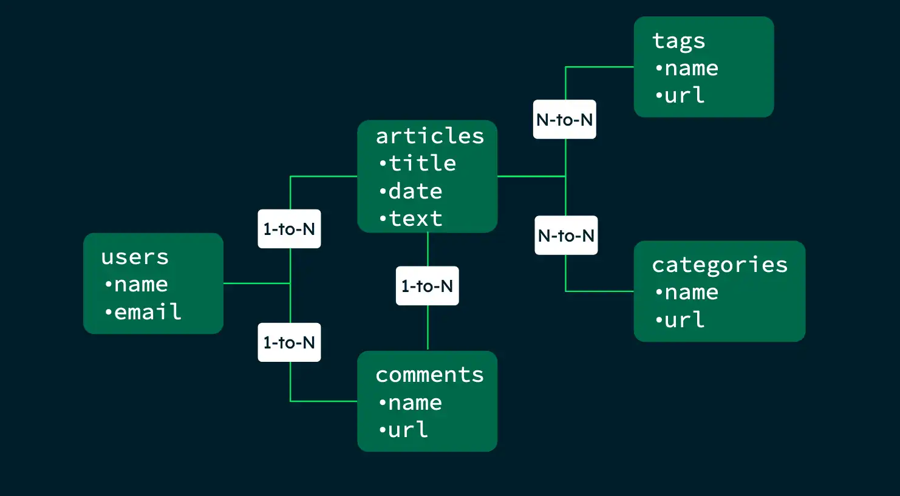

## MongoDB - 文档数据库

MongoDB 中的记录是一个文档，它是由字段和值对组成的数据结构。MongoDB 文档类似于**JSON**对象(BSON)。字段值可以包含其他文档、数组和文档数组。
下面是一个 MongoDB 文档的例子：
```json
{
  "name" : "MongoDB",
  "type" : "NoSQL",
  "year" : 2009,
  "versions": [
    { "version": "8.0", "release_date": "2024-10-02" },
    { "version": "7.0", "release_date": "2023-08-15" }
  ]
  //...
}
```

使用文档的优点是：
- 文档对应于许多编程语言中的原生数据类型。
- 嵌入式文档和数组可以减少成本高昂的的连接操作。
- 动态模式支持流畅的多态性。

<!--
MongoDB是一个介于关系数据库和非关系数据库之间的产品，是非关系数据库当中功能最丰富，最像关系数据库的。他支持的数据结构非常松散，是类似json的bson格式，因此可以存储比较复杂的数据类型。Mongo最大的特点是他支持的查询语言非常强大，其语法有点类似于面向对象的查询语言，几乎可以实现类似关系数据库单表查询的绝大部分功能，而且还支持对数据建立索引。
-->

---

### MongoDB - 术语和概念

|  SQL   | MongoDB    |
| --- | --- |
| 数据表（table） | 集合（collection） |
| 行（row） | 文档（document） |
| 列（column） | 字段（field） |
| 主键（primary key） | `_id` 字段 |
| 索引（index） | 索引（index） |
| 表连接 | 嵌入式文档 |
| 事务 | 事务（减少对多文档事务的需求） |

<!--
或者关系型网格Grid，一般由row、column组成table，而各个tables之间又存在一定的关系Relations。一个table的外键指向另一个table中的主键。而MongoDB中的数据模型是由多个文档组成的，文档是一个键值对的集合，类似于JSON对象。MongoDB中的文档可以包含其他文档，从而实现嵌套关系。
-->
---

### MongoDB - 主要功能

<v-clicks depths="2">

- 灵活数据结构
  - 单个集合中的文档不必具有相同的字段集。
  - 字段的数据类型可能因集合中的文档而异。
  - 为确保数据模型的一致性，可以创建模式验证规则。
- 查询 API
  - 读写操作 (CRUD)
  - 数据聚合 (Aggregation)
  - 文本搜索 & 地理空间查询
- 高可用性 Replica Set
  - 自动故障转移
  - 数据冗余
- 横向可扩展性 Sharding
- 支持多种存储引擎
  - WiredTiger (支持Encryption at Rest)
  - In-Memory (低延时)

</v-clicks>

<!--
MongoDB 提供高性能数据持久性。尤其是，对嵌入式数据模型的支持减少了数据库系统上的 I/O 活动。
索引支持更快的查询，并且可以包含嵌入式文档和数组的键。
副本集是一组 MongoDB 服务器，它们维护相同的数据集，并可提供冗余和提高数据可用性。
从 3.4 开始，MongoDB 支持基于分片键创建数据的区域。在均衡的集群中，MongoDB 仅将区域覆盖的读写定向到区域内的那些分片。
-->
---

### MongoDB - 安装

- 安装Mongodb Server

```bash
 docker run --name mongodb -p 27017:27017 -d mongodb/mongodb-community-server:latest
```
- 安装Mongodb Client 命令行 mongosh
- 安装Mongodb Client GUI mongodb compass
- mongosh 数据库操作
  - 创建数据库
  - 创建集合
  - 插入文档

---
layout: two-cols
layoutClass: gap-4
---

### MongoDB - 集合和文档操作

<v-clicks depths="2">

- 创建集合
  - db.createCollection()
- 插入文档
  - db.collection.insertOne()
  - db.collection.insertMany()
- 更新文档
  - db.collection.updateOne()
  - db.collection.updateMany()
  - db.collection.replaceOne()
- 删除文档
  - db.collection.deleteOne()
  - db.collection.deleteMany()

</v-clicks>

::right::

<v-clicks depths="2">

- 查询文档
  - db.collection.find()
- 聚合操作
  - db.collection.aggregate()
- 创建索引
  - db.collection.createIndex()
- 删除索引
  - db.collection.dropIndex()
- 删除集合
  - db.collection.drop()

</v-clicks>

---

### MongoDB - 举例

下表列出了各种 SQL 语句和相应的 MongoDB 语句。该表中的示例假定以下条件：
- 这些 SQL 示例假设有一个名为 people 的表。
- MongoDB 示例假设一个名为 people 的集合包含以下原型的文档：
```json
{
  "_id" : ObjectId("507f191e810c19729de860ea"),
  "name" : "Alice",
  "age" : 25,
  "status" : "A"
}
```

---
layout: two-cols
layoutClass: gap-4
---

#### SQL 创建和更改

<br>

```sql
CREATE TABLE people (
    id MEDIUMINT NOT NULL
        AUTO_INCREMENT,
    user_id Varchar(30),
    age Number,
    status char(1),
    PRIMARY KEY (id)
)

ALTER TABLE people
ADD join_date DATETIME

ALTER TABLE people
DROP COLUMN join_date

DROP TABLE people
```

::right::

#### MongoDB 创建和更改

<br>

```javascript
// db.createCollection("people")
db.people.insertOne( {
    user_id: "abc123",
    age: 55,
    status: "A"
 } )
 

db.people.updateMany(
    {}, { $set: { join_date: new Date() } }
)

db.people.updateMany(
    {}, { $unset: { "join_date": "" } }
)

db.people.drop()
```

<!--
在第一个 insertOne() 或 insertMany() 操作上隐式创建。如果未指定 _id 字段，则会自动添加主键 _id。
集合并不描述或强制执行其文档的结构。`updateMany()`操作可以使用 $set 操作符将字段添加到现有文档中,也可以使用 $unset 操作符从文档中删除字段。
-->

---
layout: two-cols
layoutClass: gap-4
---

#### SQL

单个索引
```sql
CREATE INDEX idx_user_id_asc
ON people(user_id)
```
复合索引
```sql
CREATE INDEX
       idx_user_id_asc_age_desc
ON people(user_id, age DESC)
```

::right::

#### MongoDB

单个索引
```javascript
db.people.createIndex( { user_id: 1 } )
```
复合索引
```javascript
db.people.createIndex( { user_id: 1, age: -1 } )
```

---
layout: two-cols
layoutClass: gap-4
---

#### SQL 插入语句
```sql
INSERT INTO people(user_id,
                  age,
                  status)
VALUES ("bcd001",
        45,
        "A")
```

::right::

#### MongoDB insertOne语句
```javascript
db.people.insertOne( {
    user_id: "bcd001",
    age: 45,
    status: "A"
 } )
```

---
layout: two-cols
layoutClass: gap-4
---

#### SQL SELECT语句
```sql
SELECT *
FROM people

SELECT id,
       user_id,
       status
FROM people

SELECT user_id, status
FROM people

SELECT *
FROM people
WHERE status = "A"

SELECT user_id, status
FROM people
WHERE status = "A"
```

::right::

#### MongoDB find语句
```javascript
db.people.find()

db.people.find(
    {},
    { user_id: 1, status: 1 }
)

db.people.find(
    {},
    { user_id: 1, status: 1 }
)

db.people.find(
    { status: "A" }
)

db.people.find(
    { status: "A" },
    { user_id: 1, status: 1 }
)
```

---

### MongoDB - 建模的考虑和步骤
<br>

| 关系数据库 | 文档数据库 |
| -- | -- |
| 在插入数据之前，您必须确定表格的模式 | 随着应用程序需求的变化，模式可能会随时间而变化|
| 经常需要确定多个不同表格的关联 | 避免多个集合之间的连接可以提高性能 |
| 事务是必需的，以确保数据的一致性 | 事务不是必需的，因为单个文档可以包含所有相关数据 |

<br>

模式设计过程包括以下步骤：
1. 确定工作负载: 确定您的应用程序最常运行的操作。
2. 映射关系: 确定应用程序数据中的关系，并决定是否链接或嵌入相关数据。
3. 应用设计模式: 应用模式设计模式来优化读取和写入。
4. 创建索引: 创建索引以支持常见查询模式。

---
layout: two-cols
layoutClass: gap-4
---

### MongoDB - 实体分析

假设我们有一个博客应用程序，用户可以发布文章并对文章进行评论。实体关系如下：
- 文章（Article）: 文章由标题、作者、正文和评论组成。
- 作者（Author）: 作者由名称、电子邮件和头像组成。
- 评论（Comment）: 评论由作者和评论文本组成。
- 标签（Tag）: 文章可以有多个标签。
- 类别（Category）: 文章可以属于多个类别。
- 阅读量（View）: 文章的阅读量。

::right::

<br>

实例图:

<br>



---

### MongoDB - 查询模式

| 操作 | 类型 | 信息 | 频率 | 优先级 |
| --- | --- | --- | --- | --- |
| 提交新文章 | 写入 | 作者、文本 | 每天 10 次 | 高 |
| 提交对文章的评论 | 写入 | 用户，文本 | 1,000 per day (100 per article) | 中型 |
| 查看文章 | 读取 | 文章 ID、文本、评论 | 每天 1,000,000 次 | 高 |
| 查看文章分析 | 读取 | 文章 ID、评论、点击 | 10 每小时 | 低 |

在这个模式中，我们将文章和评论存储在同一个文档中。这样，我们可以在一个查询中检索文章和评论，而不必执行多个查询。

<!--
用户为触发查询而采取的操作。
查询类型（读取或写入）。
由查询写入或返回的文档字段。
您的应用程序运行查询的频率。
经常运行的查询可从索引中获益，应对其进行优化以避免查找操作。
该查询对于您的应用程序有多重要。
-->

---

### MongoDB - 数据模式

我们可以使用以下模式来存储数据：
```json
{
  "_id" : ObjectId("507f191e810c19729de860ea"),
  "title" : "MongoDB",
  "author" : {
    "name": "alice123",
    "email": "alice@mycompany.com",
    "avatar": "photo1.jpg"
  },
  "body" : "NoSQL database bla bla bla...",
  "comments" : [
    {
      "author" : "Bob",
      "comment" : "Great article!"
    },
    {
      "author" : "Charlie",
      "comment" : "Thanks for sharing!"
    }
  ],
  "tags" : [
    "NoSQL",
    "Innovation"
  ],
  "category" : ["Technology", "Database"],
  "views" : 1000
}
```

---
layout: two-cols
layoutClass: gap-4
---

### MongoDB - 拆分数据

当然也不是所有的数据都应该存储在一个文档中。例如，我们可以将作者信息存储在单独的文档中：

```json
{
  "_id" : ObjectId("507f191e810c19729de860eb"),
  "name": "alice123",
  "email": "alice@mycompany.com",
  "avatar": "photo1.jpg"
}
```

::right::

```json
{
  "_id" : ObjectId("507f191e810c19729de860ea"),
  "title" : "MongoDB",
  "author" : ObjectId("507f191e810c19729de860eb"),
  "body" : "NoSQL database bla bla bla...",
  "comments" : [
    {
      "author" : "Bob",
      "comment" : "Great article!"
    },
    {
      "author" : "Charlie",
      "comment" : "Thanks for sharing!"
    }
  ],
  "tags" : [
    "NoSQL",
    "Innovation"
  ],
  "category" : ["Technology", "Database"],
  "views" : 1000
}
```