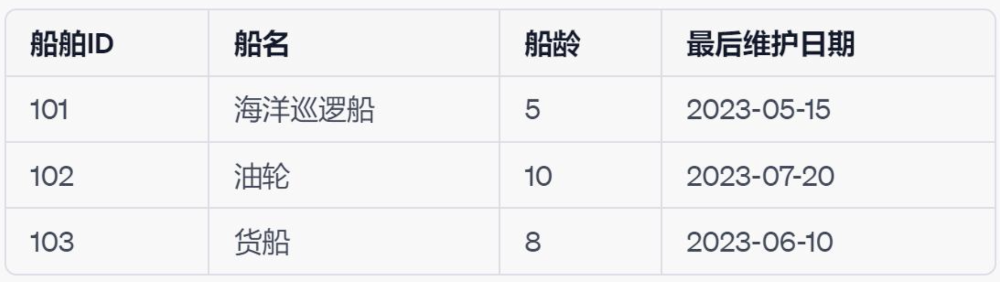
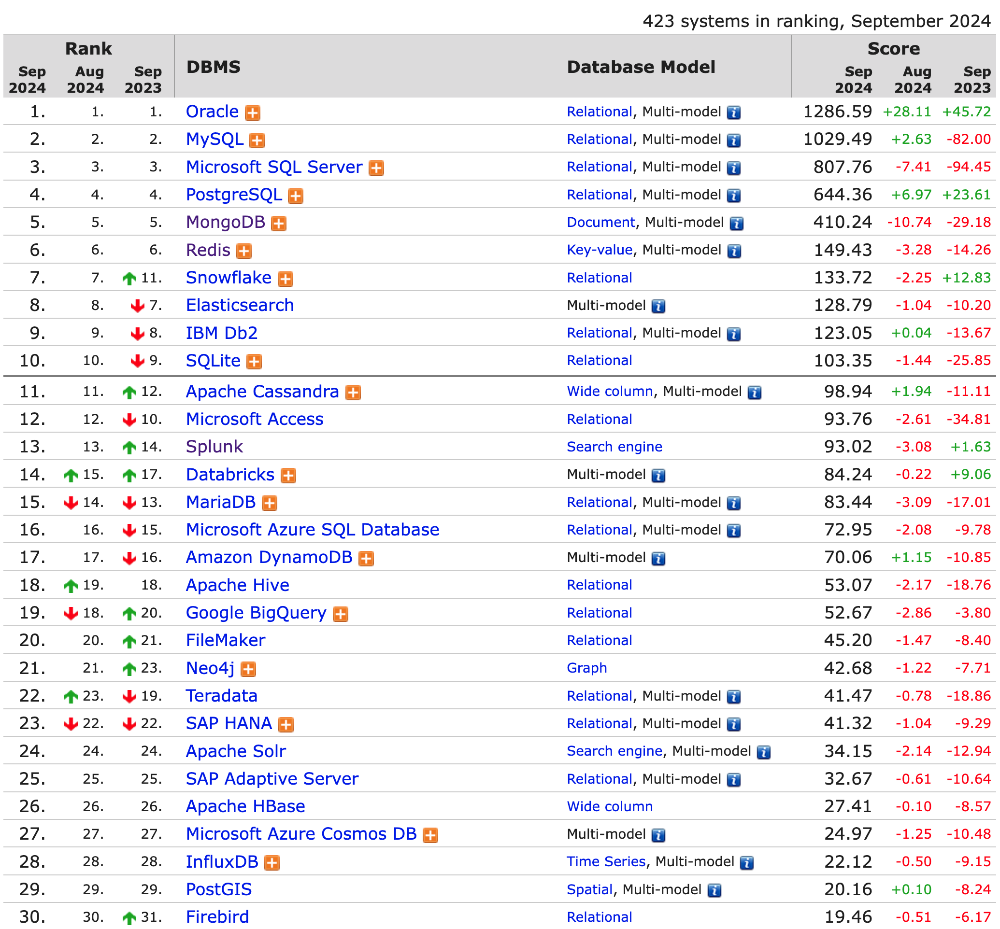
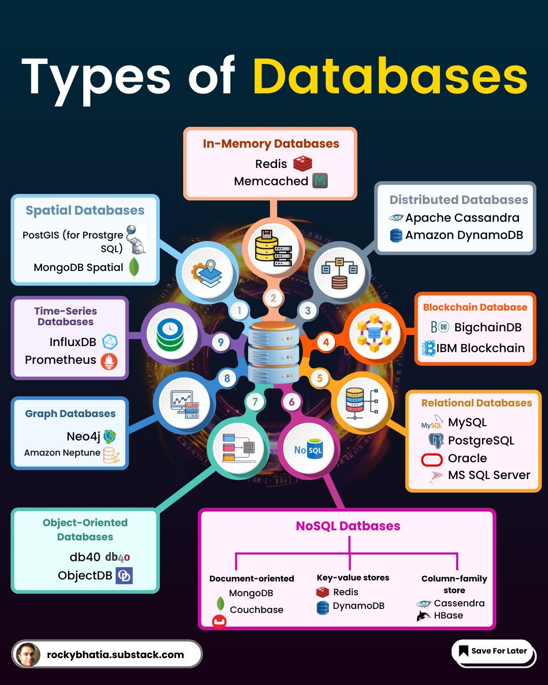

## NoSQL兴起

---

### 关系型数据库
   
<v-switch>
  <template #1> 
    - 固定的表结构：表、行、列 
    
  </template>
  <template #2> 
    - 固定的表结构：表、行、列
     
    - 高效的查询处理
  </template>
  <template #3> 
    - 固定的表结构：表、行、列
     
    - 高效的查询处理
     
    - 完善的事务管理机制
  </template>
</v-switch>

---
layout: two-cols
layoutClass: gap-8
---

## 数据库概览

 

来源于 [DB-engines](https://db-engines.com/en/ranking)

::right::

