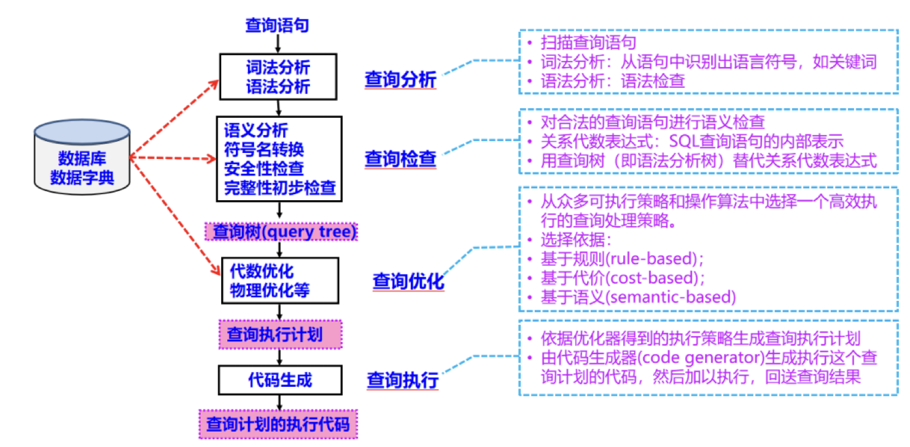

### 很久很久以前...

关系数据库之父 - Edgar F. Codd。来源: [IBM](https://www.ibm.com/history/edgar-codd)

::right::

### "A Relational Model of Data for Large Shared Data Banks" (1970)

---

## 关系型数据库 (RDBMS)

   
<v-switch>
  <template #1> 
    <li> 固定的表结构：表、行、列 </li>
    
  </template>
  <template #2> 
    <li> 固定的表结构：表、行、列 </li>
     
    <li> 高效的查询处理 </li>
    
  </template>
  <template #3> 
    <li> 固定的表结构：表、行、列 </li>
    <li> 高效的查询处理 </li>
     
    <li> 完善的事务管理机制 
      <ol>
        <li> 一组数据库操作 </li>
        <li> 事务管理机制用来确保数据的一致性、可靠性和完整性 </li>
        <li> 四个重要属性ACID </li>
      </ol>
    </li>
  </template>
</v-switch>

---

## ACID

<v-clicks depths="2">

- **A** (Atomicity：原子性)
  - 事务被视为不可分割的单元，要么全部执行成功，要么全部失败。
  - 如果在事务中的任何操作失败，整个事务将回滚，以保持数据的一致性。
- **C** (Consistency：一致性)
  - 事务将数据库从一个一致状态转移到另一个一致状态。
  - 这意味着事务的执行不会破坏数据库中的完整性约束，如唯一键、外键等。
- **I** (Isolation：隔离性)
  - 事务之间是相互隔离的，一个事务的执行不会影响其他事务。
  - 事务之间的隔离性是通过锁机制实现的。

</v-clicks>

<!--
A: 银行转账，从A账户转100元至B账户，分为两个步骤：1）从A账户取100元；2）存入100元至B账户。这两步要么一起完成，要么一起不完成，如果只完成第一步，第二步失败，钱会莫名其妙少了100元。
C: 保证数据的完整性，外键关联的数据不能为null。
I: 比如现在有个交易是从A账户转100元至B账户，在这个交易还未完成的情况下，如果此时B查询自己的账户，是看不到新增加的100元的。
-->
---

### 隔离性 - 事务并发问题
❗❗❗数据不一致

<v-clicks depths="2">

- **脏读 (Dirty Read)**：
  - 一个事务读取到了另一个事务未提交的数据。
  - 假设事务A正在修改某个数据，但还没有提交，同时事务B读取了这个数据。如果事务A在之后回滚了，事务B就读到了无效的数据，这就是脏读。
- **不可重复读 (Non-Repeatable Read)**：
  - 不可重复读发生在一个事务在多次读取同一行数据时，得到了不同的结果。
  - 假设事务A读取了某行数据，然后事务B修改了这行数据并提交，事务A再次读取这行数据时，得到了不同的结果，这就是不可重复读。 
- **幻读 (Phantom Read)**：
  - 幻读发生在一个事务在多次读取同一范围的数据时，得到了不同的结果。
  - 假设事务A读取了某个范围的数据，然后事务B插入了一行数据并提交，事务A再次读取这个范围的数据时，得到了不同的结果，这就是幻读。

</v-clicks>

---

### 隔离性 - 隔离级别

- **读未提交 (READ UNCOMMITTED)**：
  - 最低的隔离级别。
  - 允许一个事务可以读取另一个事务尚未提交的未经确认的数据更改。
  - 可能导致脏读、不可重复读、幻读。
- **读提交 (READ COMMITTED)**：
  - 一个事务只能读取其他事务已经提交的数据更改。
  - 防止了脏读，但仍可能出现不可重复读和幻读问题。
- **可重复读 (REPEATABLE READ)**：
  - 一个事务可以读取其他事务已提交的数据，但不允许其他事务插入或更新已读取的数据。
  - 防止脏读和不可重复读，但仍可能出现幻读问题。
- **串行化 (SERIALIZABLE)**：
  - 最高的隔离级别，确保并发事务不会产生冲突。
  - 任何一个事务的读或写都会锁定相关的数据，直到事务结束。
  - 可以完全防止脏读、不可重复读和幻读问题，但致使事务并发性较低且性能开销较大。 

---

### ACID - 完
 

- **A** (Atomicity：原子性)
  - 事务被视为不可分割的单元，要么全部执行成功，要么全部失败。
  - 如果在事务中的任何操作失败，整个事务将回滚，以保持数据的一致性。
- **C** (Consistency：一致性)
  - 事务将数据库从一个一致状态转移到另一个一致状态。
  - 这意味着事务的执行不会破坏数据库中的完整性约束，如唯一键、外键等。
- **I** (Isolation：隔离性)
  - 事务之间是相互隔离的，一个事务的执行不会影响其他事务。
  - 事务之间的隔离性是通过锁机制实现的。
- **D** (Durability：持久性)
  - 一旦事务提交，其结果将永久保存在数据库中，即使系统崩溃也不会丢失。
  - 通常通过将事务日志写入磁盘来实现。

---

## 事务举例

- 船舶信息表 (Ship)

- 维修记录表 (MaintenanceRecord)

- 财务记录 (FinancialRecord)

---
layout: two-cols
layoutClass: gap-4
---

### 事务举例 - 船舶维护和维修
 
<v-clicks>

1. 检查维修必要性：查询数据库以查看需要维修的船舶
2. 创建维修记录：针对一条船舶创建一条维修记录，包括维修日期、维修类型和维修费用。
3. 更新船舶信息：更新船舶的最后维护日期和船龄，以反映维修的发生。
4. 维修费用：将维修费用添加到公司的财务记录表中。
</v-clicks>
 
<v-clicks>

- 确保所有维修信息和财务记录是永久的 -> **（D）**。
- 如果在任何步骤中出现问题，事务将被回滚，以确保数据的一致性 -> **（A & C）**。
- 事务是独立的，不受到其他事务的影响 -> **（I）**。
</v-clicks>

::right::

- 船舶信息表 (Ship)

- 维修记录表 (MaintenanceRecord)

- 财务记录 (FinancialRecord)

---

## NoSQL数据库 - 兴起背景
   
<Transform :scale="2">
  <v-switch>
    <template #1> 
      
    </template>
    <template #2> 
      
    </template>
    <template #3> 
      
    </template>
  </v-switch>
</Transform>

---
layout: two-cols
layoutClass: gap-4
---

### 数据量 - 爆发式增长
 

来源: [w3resource](https://www.w3resource.com/mongodb/nosql.php)

::right::

### 数据多样性 - 结构化 vs. 非结构化
 

来源: [IDC Digital Universe Study](https://www.crn.com/news/storage/231000629/idc-digital-universe-study-issues-opportunities-from-the-data-explosion)

---

### NoSQL兴起背景

NoSQL一词最早出现于1998年，是Carlo Strozzi开发的一个轻量、开源、不提供SQL功能的关系数据库。

2009年，Last.fm的Johan Oskarsson发起了一次关于分布式开源数据库的讨论，来自Rackspace的Eric Evans再次提出了NoSQL的概念，这时的NoSQL主要指非关系型、分布式、不提供ACID的数据库设计模式。

2009年在亚特兰大举行的"no:sql(east)"讨论会是一个里程碑，其口号是"select fun, profit from real_world where relational=false;"。因此，对NoSQL最普遍的解释是"非关联型的"，强调Key-Value Stores和文档数据库的优点，而不是单纯的反对RDBMS。

<Transform :scale="2">
  
</Transform>

---

### NoSQL数据库的特点
 
<v-clicks depths=2>

- **灵活的横向扩展**
  - 传统数据库：升级硬件实现纵向扩展；性能提升速度趋缓并且高性能硬件成本极高 -> 不现实
  - NoSQL: 使用普通且廉价的硬件完成横向扩展
- **灵活的数据模型**
  - 传统数据库：死板数据类型 -> 无法满足新兴业务需求
  - NoSQL: 天生旨在摆脱束缚，允许一个数据元素存储不同类型数据，如文档、图、列族等
- **分布式架构**
  - 传统数据库：单机存储 -> 无法满足大规模数据存储需求
  - NoSQL: 分布式存储，数据分片存储在多个节点上，提高了数据的可用性和可靠性
- **与云计算紧密融合**：
  - 传统数据库：高性能硬件 -> 成本高
  - NoSQL: 充分利用云计算基础设施，将数据库融入云计算环境，构建基于NoSQL的云数据库服务

</v-clicks>

---
layout: two-cols
layoutClass: gap-8
---

### CAP定理 
 

>The CAP theorem, first introduced by Eric Brewer in 2000 and formalized in 2002, outlines the trade-offs between consistency, availability, and partition tolerance in distributed systems. This theorem serves as a guide for designing robust systems that can manage the complexities of distributed data. Quote: [CAP Theorem](https://dev.to/muhammetyasinarli/-the-cap-theorem-brewers-theorem-in-nosql-databases-2lbj)

<v-clicks depths=2>

- **C** (Consistency：一致性)
  - 所有节点上的数据是一致的。
- **A** (Availability：可用性)
  - 所有请求都会收到响应。
- **P** (Partition Tolerance：分区容错性)
  - 系统在网络分区的情况下仍然能够继续工作。

最多同时满足两个: CA , CP , AP

</v-clicks>

::right::

<!--
[click]
C - 任何一个读操作总是能够读到之前完成的写操作的结果，也就是在分布式环境中，多点的数据是一致的，或者说，所有节点在同一时间具有相同的数据。
[click]
A - 指快速获取数据，可以在确定的时间内返回操作结果，保证每个请求不管成功或者失败都有响应。
[click]
P - 指当出现网络分区的情况时（即系统中的一部分节点无法和其他节点进行通信），分离的系统也能够正常运行，也就是说，系统中任意信息的丢失或失败不会影响系统的继续运作。
[click]
CAP理论的核心是：一个分布式系统不可能同时很好的满足一致性，可用性和分区容错性这三个需求，最多只能同时较好的满足两个。
因此，根据 CAP 原理将 NoSQL 数据库分成了满足 CA 原则、满足 CP 原则和满足 AP 原则三 大类：
CA - 单点集群，满足一致性，可用性的系统，通常在可扩展性上不太强大。
CP - 满足一致性，分区容忍性的系统，通常性能不是特别高。
AP - 满足可用性，分区容忍性的系统，通常可能对一致性要求低一些。
-->
---

### BASE理论
 

<v-clicks depths=2>

- **BA** (Basically Available：基本可用)
  - 系统保证基本的可用性，允许损失部分可用性。
- **S** (Soft state：软状态)
  - 系统允许数据在不同节点间存在延时，不同节点的数据副本可能不一致。
- **E** (Eventually consistent：最终一致性)
  - 强一致性 vs. 弱一致性
  - 系统保证在一段时间内，数据最终会达到一致状态。

</v-clicks>
<!--
[click]
BA - 指一个分布式系统的一部分发生问题变得不可用时，其他部分仍然可以正常使用，也就是允许分区失败的情形出现。
[click]
S - “硬状态”指始终保证数据一致性。“软状态”是指状态可以有一段时间不同步，具有一定的滞后性
[click]
E - 最终一致性是指系统保证在一段时间内，数据最终会达到一致状态。在这个过程中，系统不保证数据的强一致性，但会保证数据最终一致。
强一致性 vs. 弱一致性：高并发的数据访问操作下，后续操作是否能够获取最新的数据，是则强，反之弱。
最终一致性是弱一致性的一种特例，允许后续的访问操作可以暂时读不到更新后的数据，但是经过一段时间之后，必须最终读到更新后的数据。
-->
---
layout: two-cols
layoutClass: gap-8
---
### BASE理论后续

对于分布式数据系统：
- **N**：数据复制的份数
- **W**：更新数据时需要保证写完成的节点数
- **R**：读取数据时需要读取的节点数

 

- **强一致性**：W + R > N (写的节点和读的节点重叠)
- **弱一致性**：W + R <= N 

 

  <Counter :label="'W'" :count="1" />
  <Counter :label="'R'" :count="1" />
  <Counter :label="'N'" :count="2" />

 
高可用 -> 减少W，增加R，降低一致性

::right::

<v-switch>
  <template #1> 

  </template>
  <template #2>

  </template>
  <template #3>

  </template>
</v-switch>

<!--
强一致性:对于典型的一主一备同步复制的数据库，N=2, W=2, R=1，则不管读的是主库还是备库的数据，都是一致的。一般设定是R＋W = N+1，这是保证强一致性的最小设定
弱一致性:对于一主一备异步复制的数据库，N=2, W=1, R=1，则如果读的是备库，就可能无法读取主库已经更新过的数据，是弱一致性。
不同的N,W,R组合，是在可用性和一致性之间取一个平衡，以适应不同的应用场景。
强一致性：N=W, R=1，任何一个写节点失效，都会导致写失败，因此可用性会降低。
-->
---
layout: two-cols
layoutClass: gap-8
---

## 当前数据库概览

 

来源于 [DB-engines](https://db-engines.com/en/ranking)

::right::

---
layout: two-cols
layoutClass: gap-8
---

### 这次我们学习的是...
 

- 文档数据库 - MongoDB
- 键值数据库 - Redis
- 图数据库 - Neo4j
- 列族数据库 - HBase

 P.S. 这些分类并不是互斥的，很多数据库可以同时属于多个分类。

::right::

