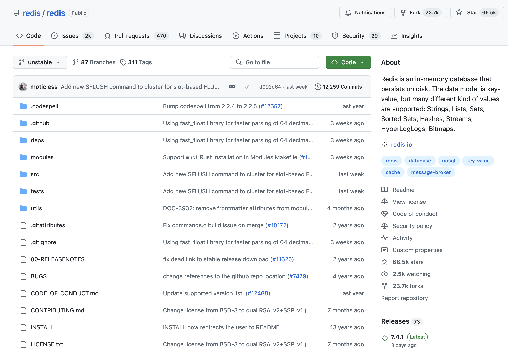
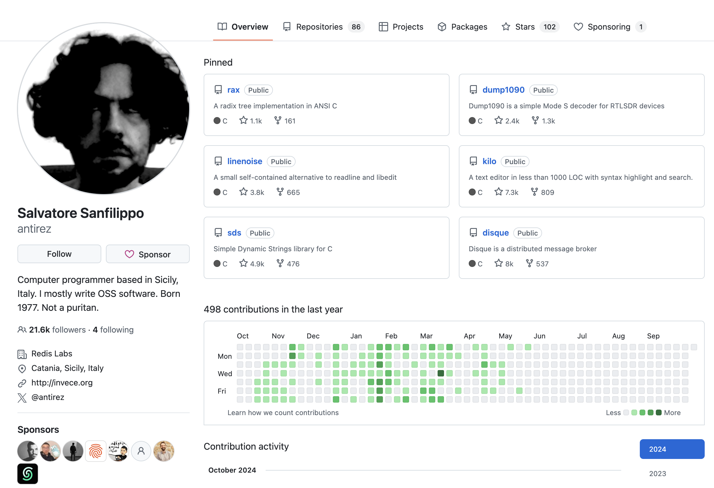
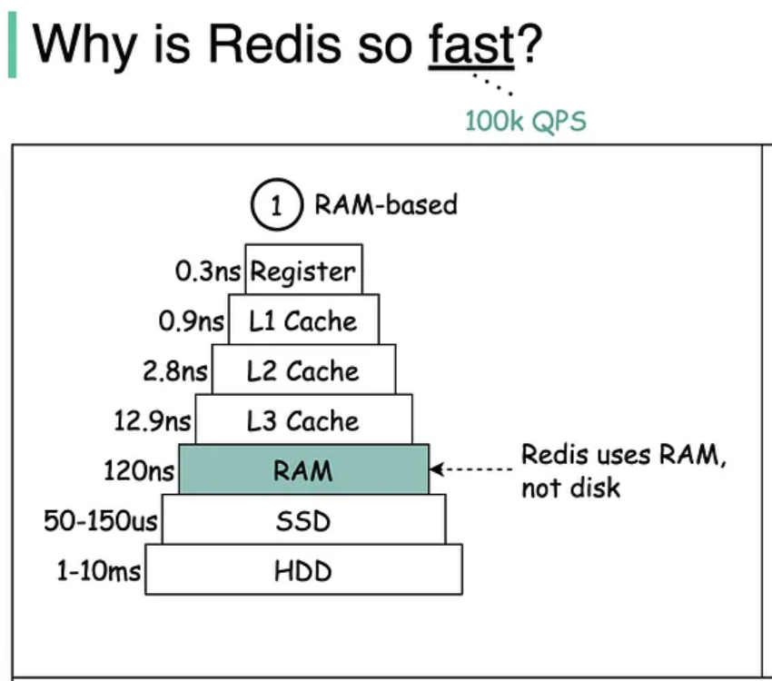
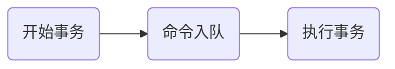

### Redis - 开源内存数据库



::right::

### Redis创始人 Antirez


---

### why is redis so fast



---

### Redis - 安装

- 安装Redis Server

```bash
 docker run -d --name redis-server -p 6379:6379 redis/redis-stack-server:latest
```
- 安装Redis Cli 命令行 
- 安装Redis Insight UI管理工具
---

### 数据类型

Redis 支持很多数据类型，这次主要讲5个基本类型和4个高级类型。

- **string**（字符串）: 基本的数据存储单元，可以存储字符串、整数或者浮点数。
- **hash**（哈希）:一个键值对集合，可以存储多个字段。
- **list**（列表）:一个简单的列表，可以存储一系列的字符串元素。
- **set**（集合）:一个无序集合，可以存储不重复的字符串元素。
- **sorted set** (有序集合): 类似于集合，但是每个元素都有一个分数（score）与之关联。
<br />

- **HyperLogLogs**（超日志）：用于基数统计，可以估算集合中的唯一元素数量。
- **Geospatial**（地理空间）：用于存储地理位置信息。
- **Pub/Sub**（发布/订阅）：一种消息通信模式，允许客户端订阅消息通道，并接收发布到该通道的消息。
- **Streams**（流）：用于消息队列和日志存储，支持消息的持久化和时间排序。


---

### String - 字符串 - 基础数据结构

string 是 redis 最基本的类型，一个 key 对应一个 value。
string 类型是二进制安全的，可以包含任何数据，比如jpg图片或者序列化的对象。
string 类型是 Redis 最基本的数据类型，string 类型的值最大能存储 512MB。

- **SET key value** 设置键的值。
- **GET key** 获取键的值。
- **INCR key** 将键的值加 1。
- **DECR key** 将键的值减 1。
- **APPEND key value** 将值追加到键的值之后。

```bash
SET name "redis"
// OK
GET name
// "redis"
SET age 30
// OK
INCR age
// 31
GET age
// 31
```

---

### Redis - key 操作

Redis key 是唯一的，如果设置了相同的 key，那么后面的值会覆盖前面的值。

- **DEL key** 删除 key。
- **EXISTS key** 检查 key 是否存在。
- **KEYS pattern** 查找所有符合给定模式 pattern 的 key。
- **RENAME key newkey** 修改 key 的名称。
- **TYPE key** 返回 key 所储存的值的类型。

```bash
SET name "redis"
// OK
DEL name
// 1
EXISTS name
// 0
```

---

### Redis - 过期时间

Redis 可以为 key 设置过期时间，当 key 过期时，会自动删除 key。

* **EXPIRE key seconds** 设置 key 的过期时间。
- **TTL key** 获取 key 的剩余过期时间。
- **PERSIST key** 移除 key 的过期时间。

```bash
SET name "redis"
// OK
EXPIRE name 10
// 1
TTL name
// 10
```

---

### Hash - 哈希表 - 基础数据结构

Redis hash 是一个键值\{key:value\}对集合，类似于一个小型的 NoSQL 数据库。
Redis hash 是一个 string 类型的 field 和 value 的映射表，hash 特别适合用于存储对象。
每个哈希最多可以存储 2^32 - 1 个键值对。

- **HSET key field value** 设置哈希表中字段的值。
- **HGET key field** 获取哈希表中字段的值。
- **HGETALL key** 获取哈希表中所有字段和值。
- **HDEL key field** 删除哈希表中的一个或多个字段。

```bash
HSET user name "redis"
// 1
HSET user age 30
// 1
HGET user name
// "redis"
HGETALL user
// 1) "name"
// 2) "redis"
// 3) "age"
// 4) "30"
```

---

### List - 列表 - 基础数据结构

Redis 列表是简单的字符串列表，按照插入顺序排序。你可以添加一个元素到列表的头部（左边）或者尾部（右边）。
列表最多可以存储 2^32 - 1 个元素 (40多亿)。

- **LPUSH key value** 将值插入到列表头部。
- **RPUSH key value** 将值插入到列表尾部。
- **LPOP key** 移出并获取列表的第一个元素。
- **RPOP key** 移出并获取列表的最后一个元素。
- **LRANGE key start stop** 获取列表在指定范围内的元素。

```bash
LPUSH list 1
// 1
LPUSH list 2
// 2
RPUSH list 3
// 3
LRANGE list 0 -1
// 1) "2"
// 2) "1"
// 3) "3"
```

---

### Set - 集合 - 基础数据结构

Redis 的 Set 是 string 类型的无序集合。
集合是通过哈希表实现的，所以添加，删除，查找的复杂度都是 O(1)。

- **SADD key member** 向集合添加一个或多个成员。
- **SREM key member** 移除集合中一个或多个成员。
- **SMEMBERS key** 获取集合的所有成员。
- **SISMEMBER key member** 判断 member 元素是否是集合 key 的成员。

```bash
SADD set 'Antirez'
// 1
SADD set 'Oran'
// 1
SMEMBERS set 
// 1) "Antirez"
// 2) "Oran"
SISMEMBER set 'Antirez'
// 1
```

---

### Sorted Set - 有序集合 - 基础数据结构

Redis 有序集合和集合一样也是 string 类型元素的集合,且不允许重复的成员。
不同的是每个元素都会关联一个 double 类型的分数。redis 正是通过分数来为集合中的成员进行从小到大的排序。
有序集合的成员是唯一的,但分数(score)却可以重复。
集合是通过哈希表实现的，所以添加，删除，查找的复杂度都是 O(1)。 集合中最大的成员数为 2^32 - 1 (40多亿)。

- **ZADD key score member** 向有序集合添加一个或多个成员，或者更新已存在成员的分数。
- **ZSCORE key member** 返回有序集 key 中，成员 member 的 score 值。
- **ZRANGE key start stop [WITHSCORES]** 通过索引区间返回有序集合成指定区间内的成员。
- **ZREVRANGE key start stop [WITHSCORES]** 返回有序集合中指定区间内的成员，通过索引，分数从高到底。

```bash
ZADD zset 3 'Antirez'
// 1
ZADD zset 2 'Oran'
// 1
ZADD zset 1 'Pieter'
// 1
ZRANGE zset 0 -1
// 1) "Antirez"
// 2) "Oran"
// 3) "Pieter"
```

---

### Redis - 事务

Redis 事务可以一次执行多个命令， 并且带有以下三个重要的保证：
- 批量操作在发送 EXEC 命令前被放入队列缓存。
- 收到 EXEC 命令后进入事务执行，事务中任意命令执行失败，其余的命令依然被执行。
- 在事务执行过程，其他客户端提交的命令请求不会插入到事务执行命令序列中。

一个事务从开始到执行会经历以下三个阶段：


例子
```bash
MULTI
// OK
SET name "redis"
// QUEUED
SET age 30
// QUEUED
EXEC
// 1) OK
// 2) OK
```

---

### Geo - 地理空间 - 高级数据结构

Redis Geo 是一个地理信息系统，它提供了一种存储地理位置信息的数据结构。
Geo 可以用来存储地理位置信息，比如经纬度信息，地理位置名称等。
Geo 可以用来计算两个地理位置之间的距离，以及获取地理位置附近的其他地理位置。

- **GEOADD key longitude latitude member [longitude latitude member ...]** 添加地理位置信息。
- **GEODIST key member1 member2 `[unit]`** 计算两个地理位置之间的距离。
- **GEORADIUS key longitude latitude radius m|km|ft|mi `[WITHDIST] [COUNT count]`** 获取地理位置附近的其他地理位置。
- **GEORADIUSBYMEMBER key member radius m|km|ft|mi `[WITHDIST] [COUNT count]`** 获取地理位置附近的其他地理位置。

```bash
GEOADD city 116.405285 39.904989 'Beijing'
// 1
GEOADD city 121.472644 31.231706 'Shanghai'
// 1
GEODIST city 'Beijing' 'Shanghai' km
// 1068.3761
GEORADIUS city 116 40 100 km WITHDIST
// 1) 1) "Beijing"
//    2) "36.1356"
```

---

### HyperLogLogs - 超日志 - 高级数据结构

Redis HyperLogLog 是用来做基数统计的算法，HyperLogLog 的优点是，在输入元素的数量或者体积非常非常大时，计算基数所需的空间总是固定 的、并且是很小的。
在 Redis 里面，每个 HyperLogLog 键只需要花费 12 KB 内存，就可以计算接近 2^64 个不同元素的基 数。这和计算基数时，元素越多耗费内存就越多的集合形成鲜明对比。
但是，因为 HyperLogLog 只会根据输入元素来计算基数，而不会储存输入元素本身，所以 HyperLogLog 不能像集合那样，返回输入的各个元素。

> 什么是**基数**: 比如数据集 `{1, 3, 5, 7, 5, 7, 8}`，那么这个数据集的基数集为 `{1, 3, 5 ,7, 8}`，基数(不重复元素)为5。基数估计就是在误差可接受的范围内，快速计算基数。

- **PFADD key element [element ...]** 添加指定元素到 HyperLogLog 中。
- **PFCOUNT key [key ...]** 返回给定 HyperLogLog 的基数估算值。
- **PFMERGE destkey sourcekey [sourcekey ...]** 将多个 HyperLogLog 合并为一个 HyperLogLog。

```bash
PFADD hll 1 2 3 4 5
// 1
PFADD hll 6 7 8 9 10
// 1
PFCOUNT hll
// 10
```

---

### Pub/Sub - 发布订阅 - 高级数据结构

Redis 发布订阅 (pub/sub) 是一种消息通信模式，主要用于消息的推送和订阅。
在这种模式下，消息发送者 (称为发布者) 发送消息，订阅者 (称为订阅者) 接收消息。
Redis 客户端可以订阅任意数量的频道。

- **SUBSCRIBE channel** 订阅给定的一个或多个频道。
- **PUBLISH channel message** 将信息发送到指定的频道。

```bash 
SUBSCRIBE news
// Reading messages...
PUBLISH news "Hello, Redis!"  
// 1
```

---

### Streams - 流 - 高级数据结构

Redis Streams 是一个新的数据结构，用于支持消息队列和日志存储。
Streams 是一个有序的消息流，每个消息都有一个唯一的 ID，消息可以包含多个字段。
Streams 可以用于实现消息队列、消息通知、日志存储等功能。

- **XADD stream ID field value [field value ...]** 向流中添加一个消息。
- **XRANGE stream start end [COUNT count]** 获取流中的消息。
- **XREAD [COUNT count] STREAMS key ID** 读取流中的消息。
- **XTRIM key MAXLEN count** 修剪流中的消息。

```bash 
XADD stream * name "redis"
// 1600000000000-0
XADD stream * name "mongodb"
// 1600000000001-0
XRANGE stream - +
// 1) 1) "1600000000000-0"
//    2) 1) "name"
//       2) "redis"
// 2) 1) "1600000000001-0"
//    2) 1) "name"
//       2) "mongodb"
```

---

### Streams - 流 - 实现原理


- **Stream** 是一个有序的消息流，每个消息都有一个唯一的 ID。
- **Consumer Group** 是一个消费者组，每个消费者组有一个或多个消费者。
- **Consumer** 是一个消费者，每个消费者都有一个消费者 ID。
- **Pending List** 是一个挂起列表，用于存储未确认的消息。
- **Consumer Offset** 是一个消费者偏移量，用于记录消费者消费的消息 ID。

---
layout: two-cols
layoutClass: gap-8
---

### Streams - 流 - 相关命令

消息队列相关命令：

- **XADD** - 添加消息到末尾
- **XTRIM** - 对流进行修剪，限制长度
- **XDEL** - 删除消息
- **XLEN** - 获取流包含的元素数量，即消息长度
- **XRANGE** - 获取消息列表，会自动过滤已经删除的消息
- **XREVRANGE** - 反向获取消息列表，ID 从大到小
- **XREAD** - 以阻塞或非阻塞方式获取消息列表

::right::

消费者组相关命令：

- **XGROUP CREATE** - 创建消费者组
- **XREADGROUP GROUP** - 读取消费者组中的消息
- **XACK -** 将消息标记为"已处理"
- **XGROUP SETID** - 为消费者组设置新的最后递送消息ID
- **XGROUP DELCONSUMER** - 删除消费者
- **XGROUP DESTROY** - 删除消费者组
- **XPENDING -** 显示待处理消息的相关信息
- **XCLAIM -** 转移消息的归属权
- **XINFO -** 查看流和消费者组的相关信息；
- **XINFO GROUPS** - 打印消费者组的信息；
- **XINFO STREAM** - 打印流信息

---

### Redis - 持久化

Redis 支持两种持久化方式：RDB 和 AOF。

- **RDB** 是 Redis 数据库的默认持乯化方式，RDB 持久化是通过快照的方式来进行持久化的。
- **AOF** 是 Redis 数据库的另一种持久化方式，AOF 持久化是通过保存 Redis 服务器所执行的写命令来记录数据库状态。

```bash
SAVE
// OK
BGSAVE
// Background saving started
```
