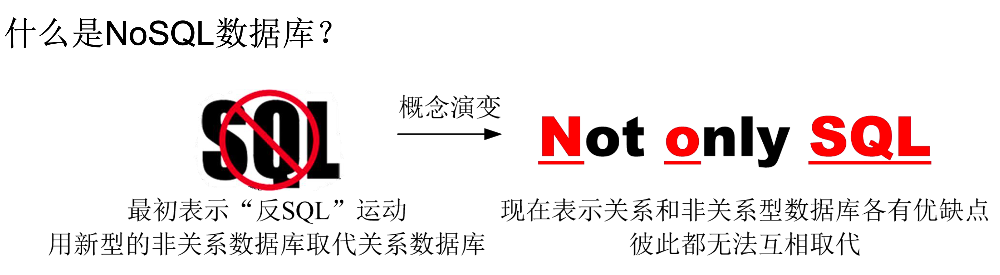

# NoSQL数据库

上海海事大学 - 2024.10

  
    Let's rock 🤘<carbon:arrow-right class="inline"/>
  

  <a href="https://github.com/MingLi19/slides" target="_blank" alt="GitHub" title="Open in GitHub"
    class="text-xl slidev-icon-btn opacity-50 !border-none !hover:text-white">
    <carbon-logo-github />
  </a>

---

# 课程大纲

<Toc v-click columns="2" minDepth="2" maxDepth="2"></Toc>

---

### NoSQL兴起背景

---

### 关系型数据库
   
<v-switch>
  <template #1> 
    - 固定的表结构：表、行、列 
    
  </template>
  <template #2> 
    - 固定的表结构：表、行、列
     
    - 高效的查询处理
  </template>
  <template #3> 
    - 固定的表结构：表、行、列
     
    - 高效的查询处理
     
    - 完善的事务管理机制
  </template>
</v-switch>

---
layout: two-cols
layoutClass: gap-8
---

## 数据库概览

 

来源于 [DB-engines](https://db-engines.com/en/ranking)

::right::

---
src: ./pages/mongodb.md 
---
---
src: ./pages/redis.md
---
src: ./pages/neo4j.md
---