## 问题描述

二分查找 `binary search` 是一种基于分治策略 `divide and conquer` 的高效搜索算法。它利用数据的有序性，每轮缩小一半搜索范围，直至找到目标元素或搜索区间为空为止。

>给定一个长度为 n 的数组 nums ，元素按从小到大的顺序排列且不重复。请查找并返回元素 target 在该数组中的索引。若数组不包含该元素，则返回 -1。示例如图 10-1 所示。

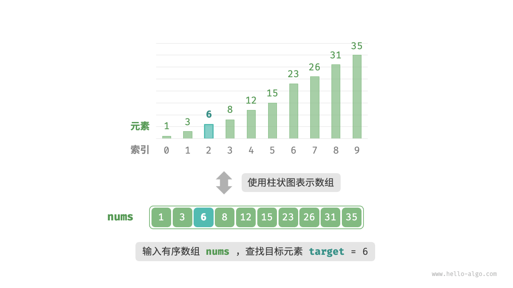

---

我们先初始化指针 `i = 0` 和 `j = n - 1` ，分别指向数组首元素和尾元素，代表搜索区间 `[0 , n - 1]`。接下来，循环执行以下两步: 
1. 计算中点索引 m = $\bigl \lfloor (i + j)/2 \bigr \rfloor$ ，其中 $\bigl \lfloor$ 和 $\bigr \rfloor$ 表示向下取整操作。
2. 判断 `nums[m]` 和 `target` 的大小关系，分为以下三种情况。
    1. 当 `nums[m]` < `target` 时，说明 `target` 在区间 $[ \, m + 1, i ] \,$ 中，因此执行 `i = m + 1`。
    2. 当 `nums[m]` > `target` 时，说明 `target` 在区间 $[ \, i, m - 1 ] \,$ 中，因此执行 `j = m - 1`。
    3. 当 `nums[m]` = `target` 时，说明找到 `target`，因此返回索引 `m`。
    4. 若数组不包含目标元素，搜索区间最终会缩小为空。此时返回 -1。

<v-switch>
    <template #0> 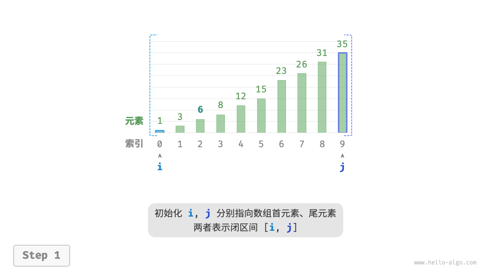 </template>
    <template #1> 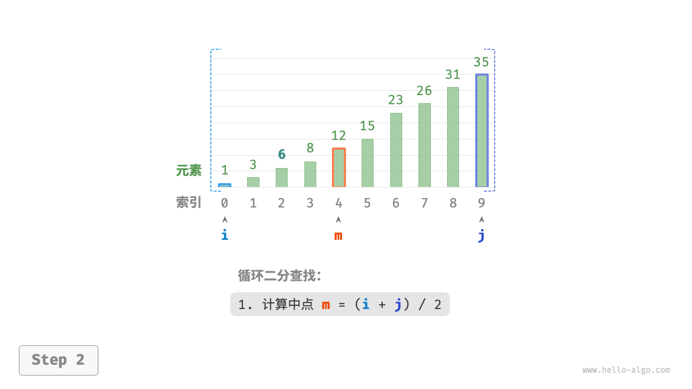 </template>
    <template #2> 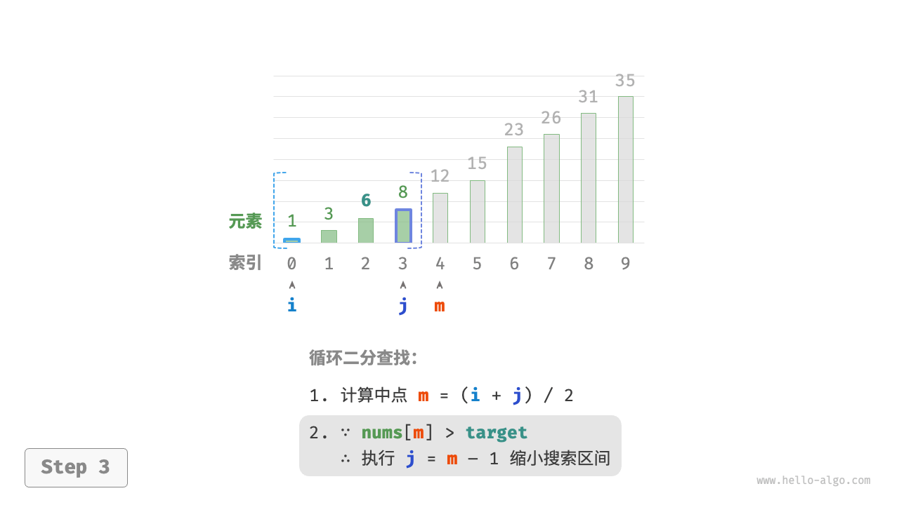 </template>
    <template #3> 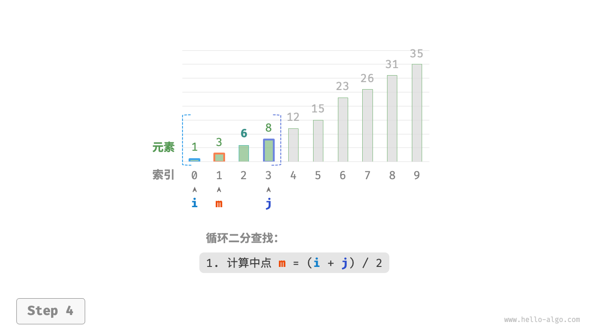 </template>
    <template #4> 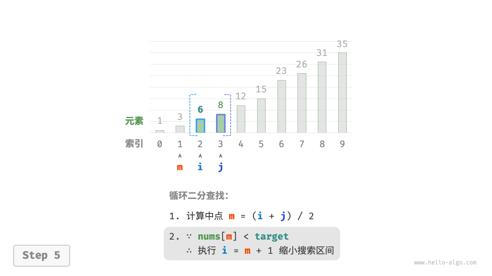 </template>
    <template #5> 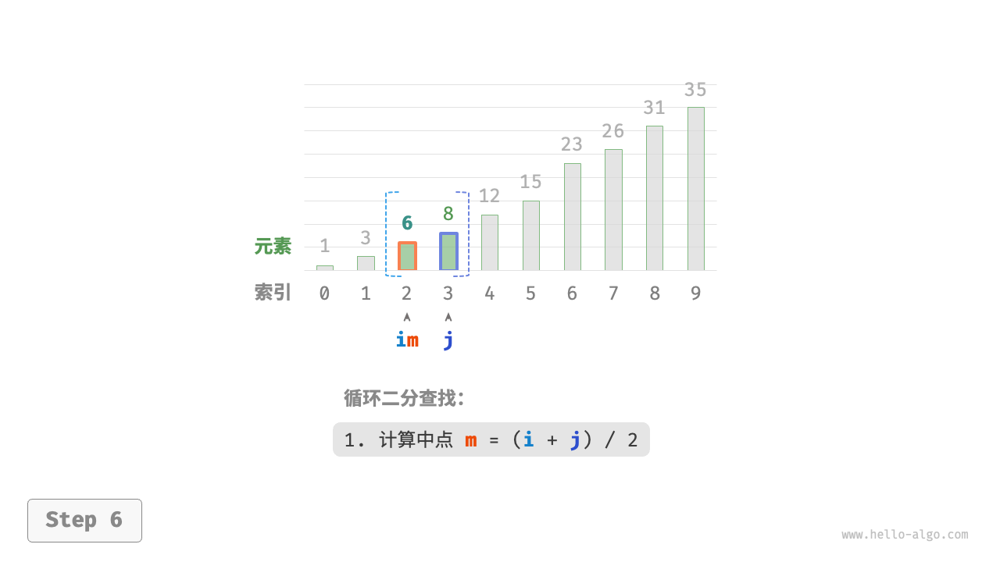 </template>
    <template #6>  </template>
</v-switch>

<style>
li {
  font-size: 12px;
}
</style>
<!--
请注意，中括号表示闭区间，其包含边界值本身。
-->
---

```py {*|2-4|5-6|7-8|9-14|15|*}
def binary_search(nums: list[int], target: int) -> int:
    """二分查找（双闭区间）"""
    # 初始化双闭区间 [0, n-1] ，即 i, j 分别指向数组首元素、尾元素
    i, j = 0, len(nums) - 1
    # 循环，当搜索区间为空时跳出（当 i > j 时为空）
    while i <= j:
        # 理论上 Python 的数字可以无限大（取决于内存大小），无须考虑大数越界问题
        m = (i + j) // 2  # 计算中点索引 m
        if nums[m] < target:
            i = m + 1  # 此情况说明 target 在区间 [m+1, j] 中
        elif nums[m] > target:
            j = m - 1  # 此情况说明 target 在区间 [i, m-1] 中
        else:
            return m  # 找到目标元素，返回其索引
    return -1  # 未找到目标元素，返回 -1
```

- 时间复杂度为 `O(logn)` : 在二分循环中，区间每轮缩小一半，因此循环次数为 $\log ^2(n)$ 。
- 空间复杂度为 `O(1)` : 指针 `i` 和 `j` 仅使用常数大小空间。

PS: 在某些语言中，由于 `i` 和 `j` 都是整型数字类型，因此 `m` 可能会超出类型的取值范围。为了避免大数越界，我们通常采用公式 $\bigl \lfloor i + (j - i)/2 \bigr \rfloor$ 来计算中点。
---

## 优点与局限性

**二分查找在时间和空间方面都有较好的性能**
- 二分查找的时间效率高。在大数据量下，对数阶的时间复杂度具有显著优势。例如，当数据大小 $n = 2^{20}$ 时，线性查找需要 $2^{20} = 1048576$ 轮循环，而二分查找仅需 $\log ^2(n) = 20$ 轮循环。
- 二分查找无须额外空间。相较于需要借助额外空间的搜索算法（例如哈希查找），二分查找更加节省空间。

**二分查找并非适用于所有情况，以下是一些局限性**
- 二分查找仅适用于有序数据。若输入数据无序，为了使用二分查找而专门进行排序，得不偿失。因为排序算法的时间复杂度通常为 $O(n \log n)$ ，比线性查找和二分查找都更高。对于频繁插入元素的场景，为保持数组有序性，需要将元素插入到特定位置，时间复杂度为 $O(n)$ ，也是非常昂贵的。
- 二分查找仅适用于数组。二分查找需要跳跃式（非连续地）访问元素，而在链表中执行跳跃式访问的效率较低，因此不适合应用在链表或基于链表实现的数据结构。
- 小数据量下，线性查找性能更佳。在线性查找中，每轮只需 1 次判断操作；而在二分查找中，需要 1 次加法、1 次除法、1 ~ 3 次判断操作、1 次加法（减法），共 4 ~ 6 个单元操作；因此，当数据量 n 较小时，线性查找反而比二分查找更快。

<style>
li {
  font-size: 14px;
}
</style>
<!--

-->
---

## 其他查找算法

给定大小为 `n` 的一组数据，我们可以使用线性搜索、二分查找、树查找、哈希查找等多种方法从中搜索目标元素。

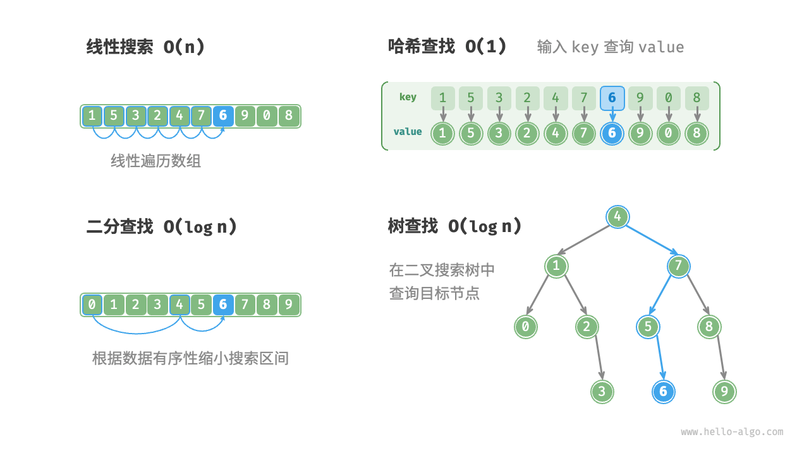

---

## 算法对比

| 操作 | 线性搜索(数组) |	二分查找(有序数组) | 树查找(二叉树) |	哈希查找(哈希表) |
| --- | --- | --- | --- | --- |
| 查找元素 | $O(n)$ |	$O(\log n)$ |	$O(\log n)$ |	$O(1)$ |
| 插入元素 | $O(1)$ |	$O(n)$ |	$O(\log n)$ |	$O(1)$ |
| 删除元素 | $O(n)$ |	$O(n)$ |	$O(\log n)$ |	$O(1)$ |
| 额外空间 | $O(1)$ |	$O(1)$ | $O(n)$ |	$O(n)$ |
| 数据预处理 | / | 排序 $O( \log n)$ |	构建树 $O(n \log n)$ |	构建哈希表 $O(n)$ |
| 数据是否有序 | 无序	| 有序 | 有序 |	无序

---
layout: two-cols
layoutClass: gap-4
---

## Coding Challenge

LeetCode 001. [两数之和](https://leetcode-cn.com/problems/two-sum/)
> 给定一个整数数组 nums 和一个整数目标值 target，请你在该数组中找出 和为目标值 target  的那 两个 整数，并返回它们的数组下标。你可以假设每种输入只会对应一个答案，并且你不能使用两次相同的元素。你可以按任意顺序返回答案。

提示：
- `2 <= nums.length <= 104`
- `-109 <= nums[i] <= 109`
- `-109 <= target <= 109`
- **只会存在一个有效答案**

::right::

- 示例 1：
    - 输入：nums = [2,7,11,15], target = 9
    - 输出：[0,1]
    - 解释：因为 nums[0] + nums[1] == 9 ，返回 [0, 1] 。
- 示例 2：
    - 输入：nums = [3,2,4], target = 6
    - 输出：[1,2]
- 示例 3：
    - 输入：nums = [3,3], target = 6
    - 输出：[0,1]


<style>
li {
    font-size: 16px;
}
</style>

---

### 解题思路 - 线性查找

**以时间换空间**

考虑直接遍历所有可能的组合。如图所示，我们开启一个两层循环，在每轮中判断两个整数的和是否为 `target` ，若是，则返回它们的索引。

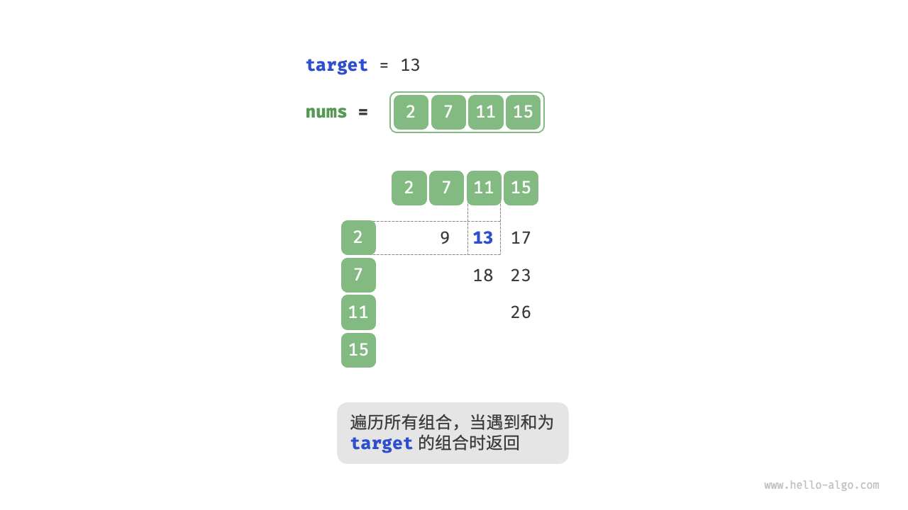

---

### 代码实现 - 线性查找

<br>

```py
def two_sum_brute_force(nums: list[int], target: int) -> list[int]:
    """方法一：暴力穷举"""
    # 两层循环，时间复杂度为 O(n^2)
    for i in range(len(nums) - 1):
        for j in range(i + 1, len(nums)):
            if nums[i] + nums[j] == target:
                return [i, j]
    return []
```

此方法的时间复杂度为 $n^2$ ，空间复杂度为 $O(1)$ 。在大数据量下非常耗时。

---

### 解题思路 - 哈希查找

**以空间换时间**

借助一个哈希表，键值对分别为数组元素和元素索引。循环遍历数组，每轮执行图所示的步骤:
1. 判断数字 `target - nums[i]` 是否在哈希表中，若是，则直接返回这两个元素的索引。
2. 将键值对 `nums[i]` 和索引 `i` 添加进哈希表。

<v-switch>
    <template #0> 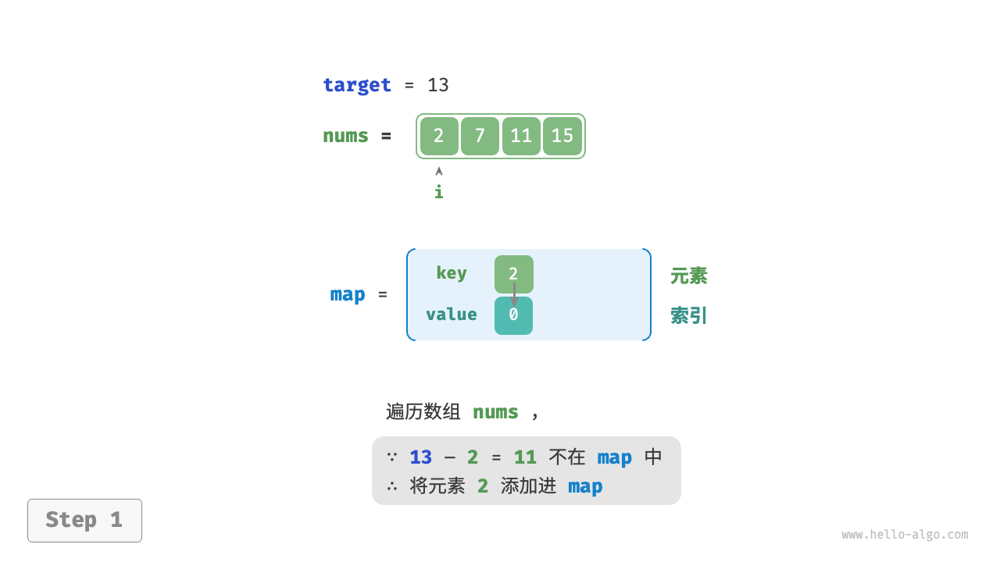 </template>
    <template #1> 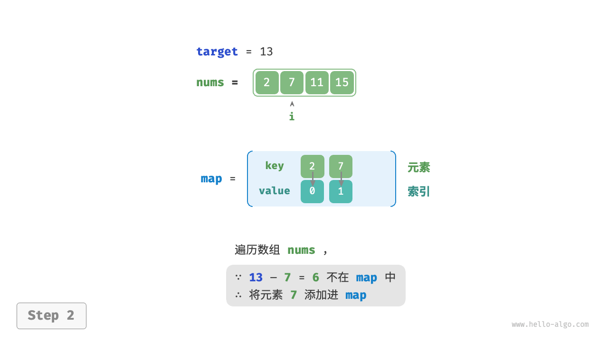 </template>
    <template #2> 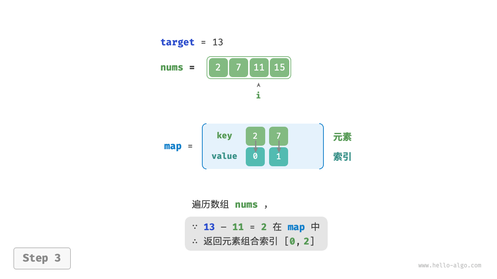 </template>
</v-switch>

---

### 代码实现 - 哈希查找

<br>

```py
def two_sum_hash_table(nums: list[int], target: int) -> list[int]:
    """方法二：辅助哈希表"""
    # 辅助哈希表，空间复杂度为 O(n)
    hash_table = {}
    # 单层循环，时间复杂度为 O(n)
    for i in range(len(nums)):
        if target - nums[i] in hash_table:
            return [hash_table[target - nums[i]], i]
        hash_table[nums[i]] = i
    return []
```