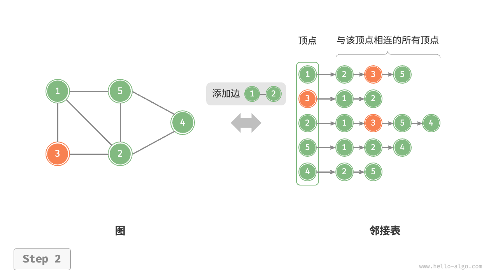
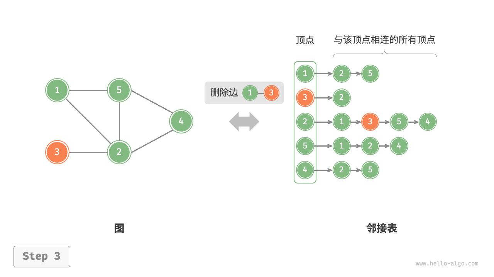
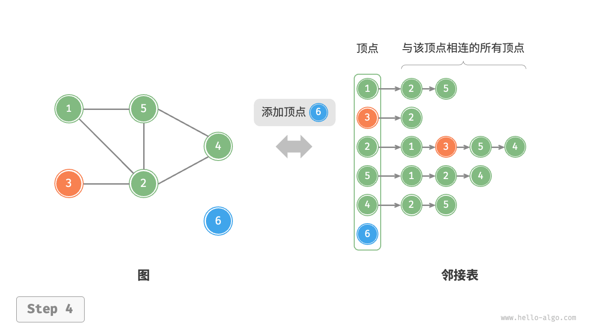
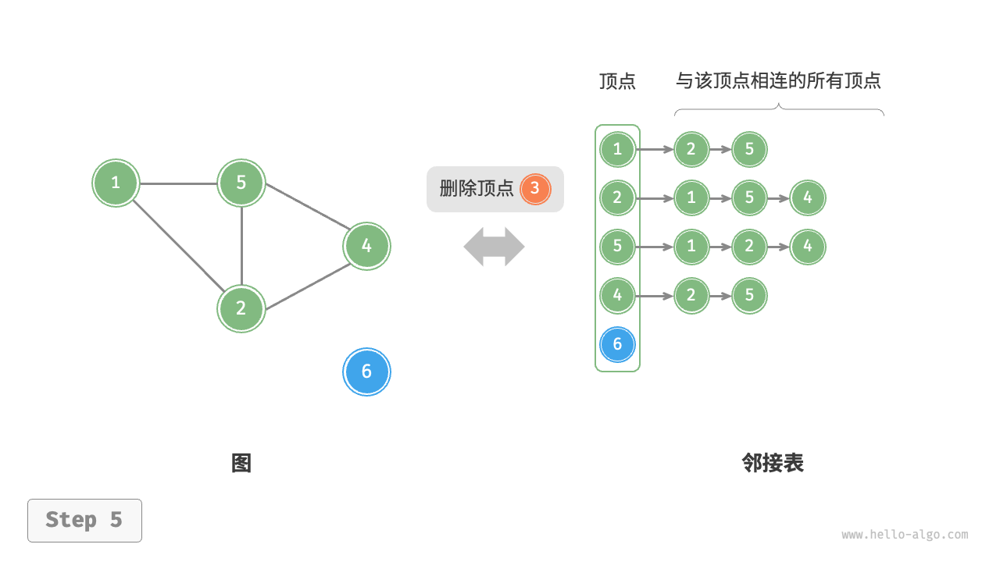
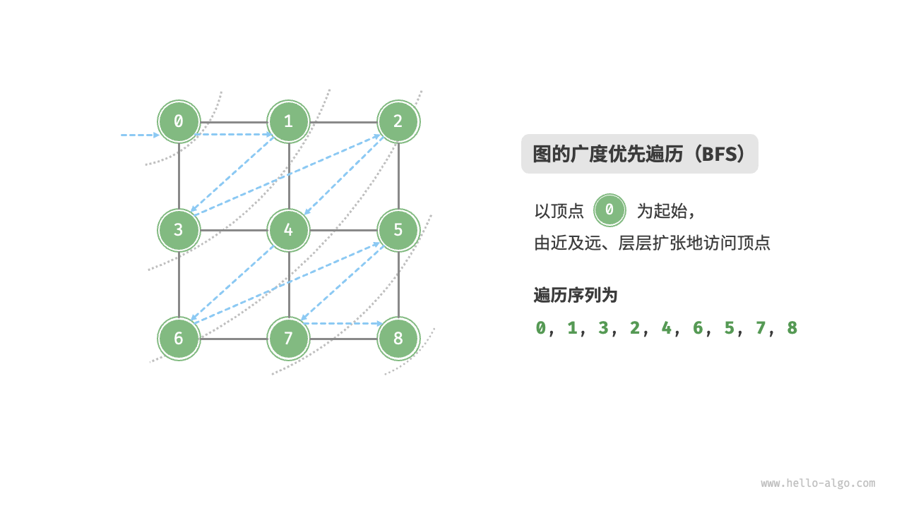
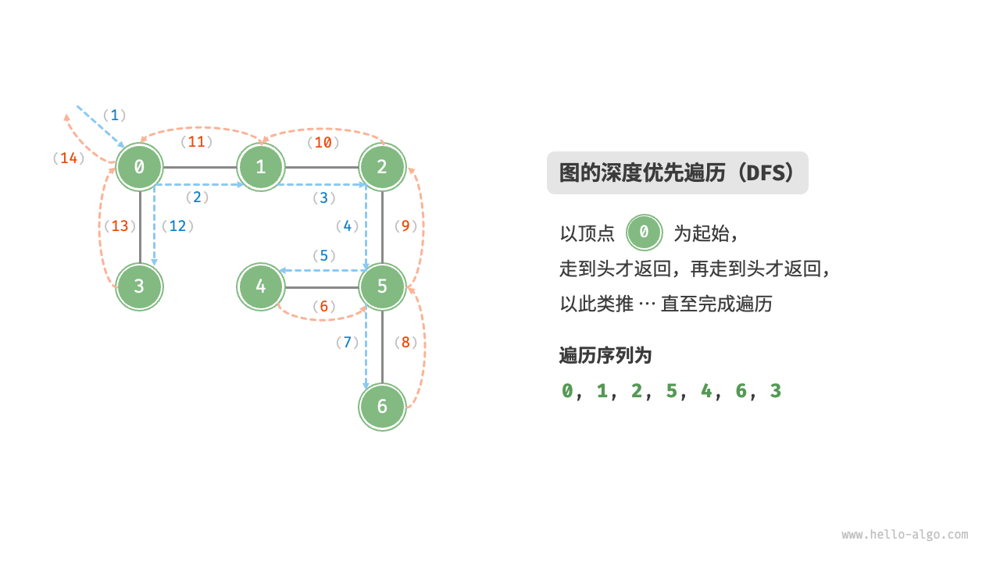

图 `graph` 是一种非线性数据结构, 由顶点 `vertex` 和边 `edge` 组成。我们可以将图 G 抽象地表示为一组顶点 V 和一组边 E 的集合。以下示例展示了一个包含 5 个顶点和 7 条边的图。

$$
V = \{0, 1, 2, 3, 4\}, \\
E = \{(0, 1), (0, 2), (1, 2), (1, 3), (2, 4), (3, 4), (4, 0)\} \\
G = (V, E)
$$

如果将顶点看作节点, 将边看作连接各个节点的引用（指针）, 我们就可以将图看作一种从链表拓展而来的数据结构。如图所示, 相较于线性关系（链表）和分治关系（树）, 网络关系（图）的自由度更高, 因而更为复杂。


---

### 图的常见类型与术语

根据边是否具有方向, 可分为无向图 `undirected graph` 和有向图`directed graph`, 如图所示。

- 在无向图中, 边表示两顶点之间的“双向”连接关系, 例如微信中的 `好友关系`。
- 在有向图中, 边具有方向性, 即 `A -> B` 表示 A 指向 B, 例如 Twitter 中的 `关注关系`。


---

根据所有顶点是否连通, 可分为连通图 `connected graph` 和非连通图 `disconnected graph`, 如图所示。

- 对于连通图, 从某个顶点出发, 可以到达其余任意顶点。
- 对于非连通图, 从某个顶点出发, 至少有一个顶点无法到达。


---

根据边是否具有权值, 可分为加权图 `weighted graph` 和无权图 `unweighted graph`, 如图所示。


- 邻接 `adjacency`：当两顶点之间存在边相连时, 称这两顶点“邻接”。在图中, 顶点 1 的邻接顶点为顶点 2、3、5。
- 路径 `path`：从顶点 A 到顶点 B 经过的边构成的序列被称为从 A 到 B 的“路径”。在图中, 边序列 1-5-2-4 是顶点 1 到顶点 4 的一条路径。
- 度 `degree`：一个顶点拥有的边数。对于有向图, 入度 `in-degree` 表示有多少条边指向该顶点, 出度 `out-degree` 表示有多少条边从该顶点指出。

<style>
li {
    font-size: 14px;   
}
</style>
---

## 图的表示

图的常用表示方式包括 `邻接矩阵` 和 `邻接表`。以下使用无向图进行举例。

1. 邻接矩阵

设图的顶点数量为 n , 邻接矩阵 `adjacency matrix` 使用一个 n * n 大小的矩阵来表示图, 每一行（列）代表一个顶点, 矩阵元素代表边, 用 1 或 0 表示两个顶点之间是否存在边。


如图所示, 设邻接矩阵为 `M` , 顶点列表为 `V = {0, 1, 2, 3, 4}` , 那么矩阵元素 `M[i][j]` 表示顶点 `i` 到顶点 `j` 之间存在边, 反之 `M[i][j]` 表示两顶点之间无边。

---

## 邻接矩阵

<v-clicks>

- 在简单图中, 顶点不能与自身相连, 此时邻接矩阵主对角线元素没有意义。
- 对于无向图, 两个方向的边等价, 此时邻接矩阵关于主对角线对称。
- 将邻接矩阵的元素从 `1` 和 `0` 替换为权重, 则可表示有权图。
</v-clicks>

<div v-click>

使用邻接矩阵表示图时, 我们可以直接访问矩阵元素以获取边, 因此增删查改操作的效率很高, 
- 时间复杂度均为 $O(1)$
- 矩阵的空间复杂度为 $O(n^2)$ , 当顶点数量较多时, 内存占用较多。
</div>
---

## 领接表

邻接表 `adjacency list` 使用 `n` 个链表来表示图, 链表节点表示顶点。第 i 个链表对应顶点 `i`, 其中存储了该顶点的所有邻接顶点（与该顶点相连的顶点）。图展示了一个使用邻接表存储的图的示例。


邻接表结构与哈希表中的“链式地址”非常相似, 因此我们也可以采用类似的方法来优化效率。比如当链表较长时, 可以将链表转化为 `AVL树` 或 `红黑树`, 从而将时间效率从 $O(n)$ 优化至 $O(log n)$ ；还可以把链表转换为哈希表, 从而将时间复杂度降至 $O(1)$ 。

<!--
邻接表仅存储实际存在的边, 而边的总数通常远小于 $n^2$ , 因此它更加节省空间。然而, 在邻接表中需要通过遍历链表来查找边, 因此其时间效率不如邻接矩阵。
-->
---

## 常见应用

图是一种非线性数据结构, 具有较高的自由度, 因此在实际应用中被广泛使用。以下列举了一些常见的图应用场景。

| 应用场景 | 顶点 | 边 | 图计算问题 |
| --- | --- | --- | --- |
| 社交网络 | 用户 | 好友关系 | 潜在好友推荐 |
| 地铁线路 | 站点 | 站点间的连通性 | 最短路线推荐 |
| 太阳系 | 星体 | 星体间的万有引力作用 | 行星轨道计算 |

---

## 基础操作

图的基础操作可分为对“边”的操作和对“顶点”的操作。在“邻接矩阵”和“邻接表”两种表示方法下, 实现方式有所不同。先看看“邻接矩阵”下的基础操作。

给定一个顶点数量为 n 的无向图, 则各种操作的实现方式如图所示。

<v-switch>
<template #1>

</template>
<template #2>

</template>
<template #3>

</template>
<template #4>

</template>
<template #5>

</template>
</v-switch>

---

### 基于邻接矩阵的无向图实现

<br>

<v-clicks>

- **添加或删除边** 直接在邻接矩阵中修改指定的边即可, 使用 $O(1)$ 时间。由于是无向图, 因此需要同时更新两个方向的边。
- **添加顶点** 在邻接矩阵的尾部添加一行一列, 并全部填 `0` 即可, 使用 $O(n)$ 时间。
- **删除顶点** 在邻接矩阵中删除一行一列。当删除首行首列时达到最差情况, 需要将 $(n-1)^2$ 个元素“向左上移动”, 从而使用 $O(n^2)$ 时间。
- **初始化** 传入 `n` 个顶点, 初始化长度为 `n` 的顶点列表 `vertices` , 使用 $O(n)$ 时间。初始化 $n * n$ 大小的邻接矩阵 `adjMat` , 使用 $O(n^2)$ 时间。 
</v-clicks>

---

```py {*}{maxHeight: '480px'}
class GraphAdjMat:
    """基于邻接矩阵实现的无向图类"""

    def __init__(self, vertices: list[int], edges: list[list[int]]):
        """构造方法"""
        # 顶点列表, 元素代表“顶点值”, 索引代表“顶点索引”
        self.vertices: list[int] = []
        # 邻接矩阵, 行列索引对应“顶点索引”
        self.adj_mat: list[list[int]] = []
        # 添加顶点
        for val in vertices:
            self.add_vertex(val)
        # 添加边
        # 请注意, edges 元素代表顶点索引, 即对应 vertices 元素索引
        for e in edges:
            self.add_edge(e[0], e[1])

    def size(self) -> int:
        """获取顶点数量"""
        return len(self.vertices)

    def add_vertex(self, val: int):
        """添加顶点"""
        n = self.size()
        # 向顶点列表中添加新顶点的值
        self.vertices.append(val)
        # 在邻接矩阵中添加一行
        new_row = [0] * n
        self.adj_mat.append(new_row)
        # 在邻接矩阵中添加一列
        for row in self.adj_mat:
            row.append(0)

    def remove_vertex(self, index: int):
        """删除顶点"""
        if index >= self.size():
            raise IndexError()
        # 在顶点列表中移除索引 index 的顶点
        self.vertices.pop(index)
        # 在邻接矩阵中删除索引 index 的行
        self.adj_mat.pop(index)
        # 在邻接矩阵中删除索引 index 的列
        for row in self.adj_mat:
            row.pop(index)

    def add_edge(self, i: int, j: int):
        """添加边"""
        # 参数 i, j 对应 vertices 元素索引
        # 索引越界与相等处理
        if i < 0 or j < 0 or i >= self.size() or j >= self.size() or i == j:
            raise IndexError()
        # 在无向图中, 邻接矩阵关于主对角线对称, 即满足 (i, j) == (j, i)
        self.adj_mat[i][j] = 1
        self.adj_mat[j][i] = 1

    def remove_edge(self, i: int, j: int):
        """删除边"""
        # 参数 i, j 对应 vertices 元素索引
        # 索引越界与相等处理
        if i < 0 or j < 0 or i >= self.size() or j >= self.size() or i == j:
            raise IndexError()
        self.adj_mat[i][j] = 0
        self.adj_mat[j][i] = 0

    def print(self):
        """打印邻接矩阵"""
        print("顶点列表 =", self.vertices)
        print("邻接矩阵 =")
        print_matrix(self.adj_mat)
```

---

### 基于邻接表的实现

<br>

<v-clicks>

- **添加边** 在顶点对应链表的末尾添加边即可，使用 $O(1)$ 时间。因为是无向图，所以需要同时添加两个方向的边。
- **删除边** 在顶点对应链表中查找并删除指定边，使用 $O(n)$ 时间。在无向图中，需要同时删除两个方向的边。
- **添加顶点** 在邻接表中添加一个链表，并将新增顶点作为链表头节点，使用 $O(1)$ 时间。
- **删除顶点** 需遍历整个邻接表，删除包含指定顶点的所有边，使用 $O(n)$ 时间。
- **初始化** 在邻接表中创建 `n` 个顶点和 `m` 条边，使用 $O(n+m)$ 时间。
</v-clicks>

---

给定一个顶点数量为 n 的无向图, 基于邻接表的实现方式如图所示。

<v-switch>
<template #1>

</template>
<template #2>

</template>
<template #3>

</template>
<template #4>

</template>
<template #5>

</template>
</v-switch>

---

```py {*}{maxHeight: '480px'}
class GraphAdjList:
    """基于邻接表实现的无向图类"""

    def __init__(self, edges: list[list[Vertex]]):
        """构造方法"""
        # 邻接表，key：顶点，value：该顶点的所有邻接顶点
        self.adj_list = dict[Vertex, list[Vertex]]()
        # 添加所有顶点和边
        for edge in edges:
            self.add_vertex(edge[0])
            self.add_vertex(edge[1])
            self.add_edge(edge[0], edge[1])

    def size(self) -> int:
        """获取顶点数量"""
        return len(self.adj_list)

    def add_edge(self, vet1: Vertex, vet2: Vertex):
        """添加边"""
        if vet1 not in self.adj_list or vet2 not in self.adj_list or vet1 == vet2:
            raise ValueError()
        # 添加边 vet1 - vet2
        self.adj_list[vet1].append(vet2)
        self.adj_list[vet2].append(vet1)

    def remove_edge(self, vet1: Vertex, vet2: Vertex):
        """删除边"""
        if vet1 not in self.adj_list or vet2 not in self.adj_list or vet1 == vet2:
            raise ValueError()
        # 删除边 vet1 - vet2
        self.adj_list[vet1].remove(vet2)
        self.adj_list[vet2].remove(vet1)

    def add_vertex(self, vet: Vertex):
        """添加顶点"""
        if vet in self.adj_list:
            return
        # 在邻接表中添加一个新链表
        self.adj_list[vet] = []

    def remove_vertex(self, vet: Vertex):
        """删除顶点"""
        if vet not in self.adj_list:
            raise ValueError()
        # 在邻接表中删除顶点 vet 对应的链表
        self.adj_list.pop(vet)
        # 遍历其他顶点的链表，删除所有包含 vet 的边
        for vertex in self.adj_list:
            if vet in self.adj_list[vertex]:
                self.adj_list[vertex].remove(vet)

    def print(self):
        """打印邻接表"""
        print("邻接表 =")
        for vertex in self.adj_list:
            tmp = [v.val for v in self.adj_list[vertex]]
            print(f"{vertex.val}: {tmp},")
```

---

### 图的遍历

图的遍历是指从图中的某个顶点出发, 访问图中所有顶点且仅访问一次的过程。图的遍历有两种方式：`广度优先搜索` 和 `深度优先搜索` 。

- **广度优先搜索** `Breadth First Search, BFS`：从起始顶点开始, 依次访问其所有邻接顶点, 再依次访问邻接顶点的邻接顶点, 以此类推。广度优先搜索使用队列来存储待访问的顶点, 保证先访问的顶点先出队列。



---

- **深度优先搜索** `Depth First Search, DFS`：从起始顶点开始, 递归访问其所有邻接顶点, 直到无法继续访问为止, 然后回溯到上一个顶点, 继续访问其他邻接顶点。深度优先搜索使用栈来存储待访问的顶点, 保证后访问的顶点先出栈。



图的遍历算法是图算法中的基础, 也是许多图算法的基础。在实际应用中, 我们可以通过图的遍历来解决许多问题, 如 `连通性问题`、`最短路径问题` 等。

---

### 图论算法

<br>

图论算法是一类研究图结构的算法, 主要包括以下几种：

<v-clicks>

- **图的遍历算法**：用于访问图中的所有顶点, 如 `BFS` 算法、`DFS` 算法。
- **最短路径算法**：用于计算图中两个顶点之间的最短路径, 如 `Dijkstra` 算法、`Floyd-Warshall` 算法。
- **最小生成树算法**：用于计算图中的最小生成树, 如 `Prim` 算法、`Kruskal` 算法。
- **拓扑排序算法**：用于对有向无环图进行排序, 如 `Kahn` 算法、`DFS` 算法。
- **强连通分量算法**：用于计算有向图中的强连通分量, 如 `Tarjan` 算法、`Kosaraju` 算法。

</v-clicks>

<br>

<div v-click>

这些算法在实际应用中被广泛使用, 如 `最短路径规划`、`网络流量优化`、`社交网络分析` 等。在这里就不展开讲解了, 有兴趣的同学可以自行查阅相关资料。
</div>
---