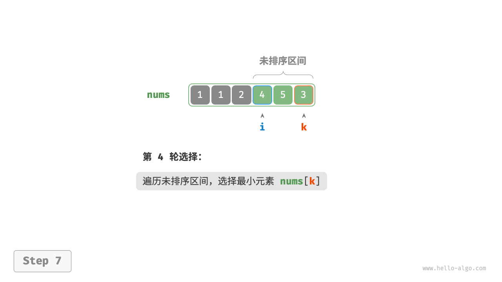
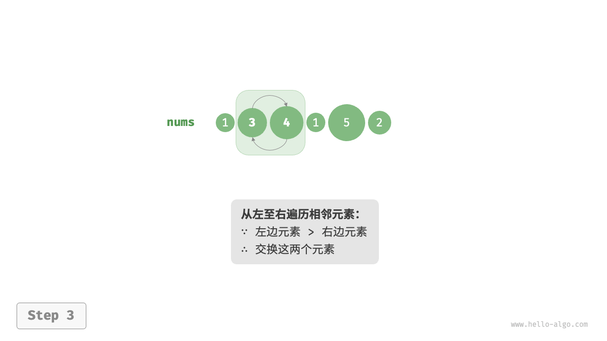

## 定义

排序算法 `sorting algorithm` 用于对一组数据按照特定顺序进行排列。排序算法有着广泛的应用，因为有序数据通常能够被更高效地查找、分析和处理。


如图所示，排序算法中的数据类型可以是整数、浮点数、字符或字符串等。排序的判断规则可根据需求设定，如数字大小、字符 ASCII 码顺序或自定义规则。

---

## 评价维度

<br>

<v-clicks>

- **运行效率** 期望排序算法的时间复杂度尽量低，且总体操作数量较少（时间复杂度中的常数项变小）。对于大数据量的情况，运行效率显得尤为重要。
- **就地性** 顾名思义，原地排序通过在原数组上直接操作实现排序，无须借助额外的辅助数组，从而节省内存。通常情况下，原地排序的数据搬运操作较少，运行速度也更快。
- **稳定性** 稳定排序在完成排序后，相等元素在数组中的相对顺序不发生改变。
- **自适应性** 自适应排序能够利用输入数据已有的顺序信息来减少计算量，达到更优的时间效率。自适应排序算法的最佳时间复杂度通常优于平均时间复杂度。
- **是否基于比较** 基于比较的排序依赖比较运算符（<、>、=）来判断元素的相对顺序，从而排序整个数组，理论最优时间复杂度为 $O(nlogn)$ 。而非比较排序不使用比较运算符，时间复杂度可达 $O(n)$ ，但其通用性相对较差。
</v-clicks>

<br>

<div v-click>
理想排序算法: **运行快、原地、稳定、自适应、通用性好**。迄今为止<span v-mark.circle.red="7">尚未发现</span>兼具以上所有特性的排序算法。
</div>
---

### 稳定性例子

<br>

```py
# 输入数据是按照姓名排序好的
# (name, age)
  ('A', 19)
  ('B', 18)
  ('C', 21)
  ('D', 19)
  ('E', 23)

# 假设使用非稳定排序算法按年龄排序列表，
# 结果中 ('D', 19) 和 ('A', 19) 的相对位置改变，
# 输入数据按姓名排序的性质丢失
  ('B', 18)
  ('D', 19)
  ('A', 19)
  ('C', 21)
  ('E', 23)
```

---

## 选择排序 

选择排序 `selection sort` 的工作原理非常简单：开启一个循环，每轮从未排序区间选择最小的元素，将其放到已排序区间的末尾。设数组的长度为 `n`，选择排序的算法流程如图所示。

1. 初始状态下，所有元素未排序，即未排序（索引）区间为 `[0, n-1]`，已排序区间为空。
2. 选取区间 `[0, n-1]` 中的最小元素，将其与索引 `0` 处的元素交换。完成后，数组前 1 个元素已排序。
3. 选取区间 `[1, n-1]` 中的最小元素，将其与索引 `1` 处的元素交换。完成后，数组前 2 个元素已排序。
4. 以此类推。经过 `n-1` 轮选择与交换后，数组前 `n-1` 个元素已排序。
5. 仅剩的一个元素必定是最大元素，无须排序，因此数组排序完成。

<v-switch>
  <template #1> 
    
  </template>
  <template #2> 
    
  </template>
  <template #3> 
    
  </template>
  <template #4> 
    
  </template>
  <template #5> 
    
  </template>
  <template #6> 
    
  </template>
  <template #7> 
    
  </template>
  <template #8> 
    
  </template>
  <template #9> 
    
  </template>
  <template #10> 
    
  </template>
  <template #11> 
    
  </template>
</v-switch>


---

在代码中，我们用 `k` 来记录未排序区间内的最小元素

```py {*|3-5|6-10|11-12|*}
def selection_sort(nums: list[int]):
    """选择排序"""
    n = len(nums)
    # 外循环：未排序区间为 [i, n-1]
    for i in range(n - 1):
        # 内循环：找到未排序区间内的最小元素
        k = i
        for j in range(i + 1, n):
            if nums[j] < nums[k]:
                k = j  # 记录最小元素的索引
        # 将该最小元素与未排序区间的首个元素交换
        nums[i], nums[k] = nums[k], nums[i]
```

时间复杂度为 $O(n^2)$，空间复杂度为 $O(1)$，是一种原地、非稳定的排序算法。


<!--
完成选择排序后，数组中相等元素的相对位置可能发生改变，因此选择排序是一种非稳定排序算法。比如第一轮选择排序后，两个 `4` 的相对位置发生了改变。
-->
---

## 冒泡排序

冒泡排序 `bubble sort` 通过连续地比较与交换相邻元素实现排序。这个过程就像气泡从底部升到顶部一样，因此得名冒泡排序。

冒泡过程可以利用元素交换操作来模拟：从数组最左端开始向右遍历，依次比较相邻元素大小，如果“左元素 > 右元素”就交换二者。遍历完成后，最大的元素会被移动到数组的最右端。

<v-switch>
  <template #1> 
    
  </template>
  <template #2> 
    
  </template>
  <template #3> 
    
  </template>
  <template #4> 
    
  </template>
  <template #5> 
    
  </template>
  <template #6> 
    
  </template>
  <template #7> 
    
  </template>
</v-switch>

---

### 算法流程

设数组的长度为 `n` ，冒泡排序的步骤如图所示。

1. 首先，对 `n` 个元素执行“冒泡”，将数组的最大元素交换至正确位置。
2. 接下来，对剩余 `n-1` 个元素执行“冒泡”，将第二大元素交换至正确位置。
3. 以此类推，经过 `n-1` 轮“冒泡”后，前 `n-1` 大的元素都被交换至正确位置。
4. 仅剩的一个元素必定是最小元素，无须排序，因此数组排序完成。

<br>


---

### 代码实现

```py {*|3-5|6-10|*}
def bubble_sort(nums: list[int]):
    """冒泡排序"""
    n = len(nums)
    # 外循环：未排序区间为 [0, i]
    for i in range(n - 1, 0, -1):
        # 内循环：将未排序区间 [0, i] 中的最大元素交换至该区间的最右端
        for j in range(i):
            if nums[j] > nums[j + 1]:
                # 交换 nums[j] 与 nums[j + 1]
                nums[j], nums[j + 1] = nums[j + 1], nums[j]
```

<div v-click="4">

如果某轮“冒泡”中 <span v-mark.red="5">没有执行任何交换操作</span> ，说明数组已经完成排序，可直接返回结果。因此，可以增加一个标志位 `flag` 来监测这种情况，一旦出现就立即返回。
</div>


---

````md magic-move
```py 
def bubble_sort(nums: list[int]):
    """冒泡排序"""
    n = len(nums)
    # 外循环：未排序区间为 [0, i]
    for i in range(n - 1, 0, -1):
        # 内循环：将未排序区间 [0, i] 中的最大元素交换至该区间的最右端
        for j in range(i):
            if nums[j] > nums[j + 1]:
                # 交换 nums[j] 与 nums[j + 1]
                nums[j], nums[j + 1] = nums[j + 1], nums[j]
```
```py
def bubble_sort_with_flag(nums: list[int]):
    """冒泡排序（标志优化）"""
    n = len(nums)
    # 外循环：未排序区间为 [0, i]
    for i in range(n - 1, 0, -1):
        flag = False  # 初始化标志位
        # 内循环：将未排序区间 [0, i] 中的最大元素交换至该区间的最右端
        for j in range(i):
            if nums[j] > nums[j + 1]:
                # 交换 nums[j] 与 nums[j + 1]
                nums[j], nums[j + 1] = nums[j + 1], nums[j]
                flag = True  # 记录交换元素
        if not flag:
            break  # 此轮“冒泡”未交换任何元素，直接跳出
```
````

<div v-click="3">

经过优化，冒泡排序的最差时间复杂度和平均时间复杂度仍为 $O(n^2)$，但最佳时间复杂度可达 $O(n)$。空间复杂度为 $O(1)$，是一种原地、稳定的排序算法。
</div>

---

## 插入排序

插入排序 `insertion sort` 是一种简单的排序算法，它的工作原理与手动整理一副牌的过程非常相似。

如图所示，我们在未排序区间选择一个基准元素，将该元素与其左侧已排序区间的元素逐一比较大小，并将该元素插入到正确的位置。设基准元素为 base ，我们需要将从目标索引到 base 之间的所有元素向右移动一位，然后将 base 赋值给目标索引。


---

### 算法流程

插入排序的整体流程如图所示。
1. 初始状态下，数组的第 `1` 个元素已完成排序。
2. 选取数组的第 `2` 个元素作为 `base` ，将其插入到正确位置后，数组的前 `2` 个元素已排序。
3. 选取第 `3` 个元素作为 `base` ，将其插入到正确位置后，数组的前 `3` 个元素已排序。
4. 以此类推，在最后一轮中，选取最后一个元素作为 `base` ，将其插入到正确位置后，所有元素均已排序。

<br>


---

### 代码实现

```py {*|3-4|5-6|7-11|*}
def insertion_sort(nums: list[int]):
    """插入排序"""
    # 外循环：已排序区间为 [0, i-1]
    for i in range(1, len(nums)):
        base = nums[i]
        j = i - 1
        # 内循环：将 base 插入到已排序区间 [0, i-1] 中的正确位置
        while j >= 0 and nums[j] > base:
            nums[j + 1] = nums[j]  # 将 nums[j] 向右移动一位
            j -= 1
        nums[j + 1] = base  # 将 base 赋值到正确位置
```

插入排序的时间复杂度为 $O(n^2)$，空间复杂度为 $O(1)$，是一种原地、稳定的排序算法。

插入排序的优势: 在处理小规模数据时，插入排序的性能通常优于选择排序和冒泡排序。

后面我们将学习到时间复杂度为 $O(nlogn)$ 的排序算法，如快速排序、归并排序等。但在数据量较小的情况下，插入排序通常更快。这个结论与线性查找和二分查找的适用情况的结论类似。因为插入排序的内循环中，每轮中的单元操作数量起到决定性作用。

<!--
实际上，许多编程语言（例如 Java）的内置排序函数采用了插入排序，大致思路为：对于长数组，采用基于分治策略的排序算法，例如快速排序；对于短数组，直接使用插入排序。
-->
---

## 快速排序

快速排序 `quick sort` 是一种基于分治策略的排序算法，运行高效，应用广泛。

快速排序的核心操作是“哨兵划分”，其目标是：选择数组中的某个元素作为“基准数”，将所有小于基准数的元素移到其左侧，而大于基准数的元素移到其右侧。经过一轮划分后，基准数的位置已经确定，且左右两侧的子数组分别未排序。

```py
def partition(self, nums: list[int], left: int, right: int) -> int:
    """哨兵划分"""
    # 以 nums[left] 为基准数
    i, j = left, right
    while i < j:
        while i < j and nums[j] >= nums[left]:
            j -= 1  # 从右向左找首个小于基准数的元素
        while i < j and nums[i] <= nums[left]:
            i += 1  # 从左向右找首个大于基准数的元素
        # 元素交换
        nums[i], nums[j] = nums[j], nums[i]
    # 将基准数交换至两子数组的分界线
    nums[i], nums[left] = nums[left], nums[i]
    return i  # 返回基准数的索引
```

---

### 哨兵划分

<br>

1. 选取数组最左端元素作为基准数，初始化两个指针 `i` 和 `j` 分别指向数组的两端。
2. 设置一个循环，在每轮中使用 `i(j)` 分别寻找第一个比基准数大（小）的元素，然后交换这两个元素。
3. 循环执行步骤 2. ，直到 `i` 和 `j` 相遇时停止，最后将基准数交换至两个子数组的分界线。

哨兵划分的实质是将一个较长数组的排序问题简化为两个较短数组的排序问题。

<v-switch>
  <template #1> 
    
  </template>
  <template #2> 
    
  </template>
  <template #3> 
    
  </template>
  <template #4> 
    
  </template>
  <template #5> 
    
  </template>
  <template #6> 
    
  </template>
  <template #7> 
    
  </template>
  <template #8> 
    
  </template>
  <template #9> 
    
  </template>
</v-switch>

---

### 整体流程

<br>

1. 首先，对原数组执行一次“哨兵划分”，得到未排序的左子数组和右子数组。
2. 然后，对左子数组和右子数组分别递归执行“哨兵划分”。
3. 持续递归，直至子数组长度为 1 时终止，从而完成整个数组的排序。

<br>


<br>

哨兵划分完成后，原数组被划分成三部分：左子数组、基准数、右子数组，且满足“左子数组任意元素 <= 基准数 <= 右子数组任意元素”。因此，我们接下来只需对这两个子数组进行排序。

---

### 代码实现

<br> 

```py
def quick_sort(self, nums: list[int], left: int, right: int):
    """快速排序"""
    # 子数组长度为 1 时终止递归
    if left >= right:
        return
    # 哨兵划分
    pivot = self.partition(nums, left, right)
    # 递归左子数组、右子数组
    self.quick_sort(nums, left, pivot - 1)
    self.quick_sort(nums, pivot + 1, right)
```

<br> 

- 时间复杂度为 $O(n\log n)$ 、非自适应排序：在平均情况下，哨兵划分的递归层数为 `logn` ，每层中的总循环数为 `n` ，总体使用 $O(n\log n)$ 时间。在最差情况下，每轮哨兵划分操作都将长度为 `n` 的数组划分为长度为 `0` 和 `n-1` 的两个子数组，此时递归层数达到 `n` ，每层中的循环数为 `n` ，总体使用 $O(n^2)$ 时间。
- 空间复杂度为 $O(n)$ 、原地排序：在输入数组完全倒序的情况下，达到最差递归深度 `n` ，使用栈帧空间。排序操作是在原数组上进行的，未借助额外数组。
- 非稳定排序：在哨兵划分的最后一步，基准数可能会被交换至相等元素的右侧。

---

### 快速排序为什么快

从名称上就能看出，快速排序在效率方面应该具有一定的优势。尽管快速排序的平均时间复杂度与“归并排序”和“堆排序”相同，但通常快速排序的效率更高，主要有以下原因。

- 出现最差情况的概率很低：虽然快速排序的最差时间复杂度为 $O(n^2)$ ，没有归并排序稳定，但在绝大多数情况下，快速排序能在 $O(n\log n)$ 的时间复杂度下运行。
- 缓存使用效率高：在执行哨兵划分操作时，系统可将整个子数组加载到缓存，因此访问元素的效率较高。而像“堆排序”这类算法需要跳跃式访问元素，从而缺乏这一特性。
- 复杂度的常数系数小：在上述三种算法中，快速排序的比较、赋值、交换等操作的总数量最少。这与“插入排序”比“冒泡排序”更快的原因类似。

---

### 基准数优化

快速排序在某些输入下的时间效率可能降低。举一个极端例子，假设输入数组是完全倒序的，由于我们选择最左端元素作为基准数，那么在哨兵划分完成后，基准数被交换至数组最右端，导致左子数组长度为 `n-1` ，右子数组长度为 `0`如此递归下去，每轮哨兵划分后都有一个子数组的长度为 `0` ，分治策略失效，快速排序退化为“冒泡排序”的近似形式。时间复杂度为 $O(n^2)$ 。

为了尽量避免这种情况发生，我们可以优化哨兵划分中的基准数的选取策略。
- 随机选取一个元素作为基准数
- 三数取中法：选取左端、中间、右端三个元素的中位数作为基准数

---

````md magic-move
```py
def partition(self, nums: list[int], left: int, right: int) -> int:
    """哨兵划分"""
    # 以 nums[left] 为基准数
    i, j = left, right
    while i < j:
        while i < j and nums[j] >= nums[left]:
            j -= 1  # 从右向左找首个小于基准数的元素
        while i < j and nums[i] <= nums[left]:
            i += 1  # 从左向右找首个大于基准数的元素
        # 元素交换
        nums[i], nums[j] = nums[j], nums[i]
    # 将基准数交换至两子数组的分界线
    nums[i], nums[left] = nums[left], nums[i]
    return i  # 返回基准数的索引
```
```py
def median_three(self, nums: list[int], left: int, mid: int, right: int) -> int:
    """选取三个候选元素的中位数"""
    l, m, r = nums[left], nums[mid], nums[right]
    if (l <= m <= r) or (r <= m <= l):
        return mid  # m 在 l 和 r 之间
    if (m <= l <= r) or (r <= l <= m):
        return left  # l 在 m 和 r 之间
    return right

def partition(self, nums: list[int], left: int, right: int) -> int:
    """哨兵划分（三数取中值）"""
    # 以 nums[left] 为基准数
    med = self.median_three(nums, left, (left + right) // 2, right)
    # 将中位数交换至数组最左端
    nums[left], nums[med] = nums[med], nums[left]
    # 以 nums[left] 为基准数
    i, j = left, right
    while i < j:
        while i < j and nums[j] >= nums[left]:
            j -= 1  # 从右向左找首个小于基准数的元素
        while i < j and nums[i] <= nums[left]:
            i += 1  # 从左向右找首个大于基准数的元素
        # 元素交换
        nums[i], nums[j] = nums[j], nums[i]
    # 将基准数交换至两子数组的分界线
    nums[i], nums[left] = nums[left], nums[i]
    return i  # 返回基准数的索引
```
````

---

### 尾递归优化

快速排序是一种递归算法，递归调用会占用栈空间。在某些输入下，快速排序可能占用空间较多。当递归深度过大时，可能会导致栈溢出。以完全有序的输入数组为例，设递归中的子数组长度为 `m` , 每轮哨兵划分操作都将产生长度为 `0` 的左子数组和长度为 `m-1` 的右子数组，这意味着每一层递归调用减少的问题规模非常小（只减少一个元素），递归树的高度会达到 `n-1` ，此时需要占用大小为 `O(n)` 的栈帧空间。

为了防止栈帧空间的累积，我们可以在每轮哨兵排序完成后，比较两个子数组的长度，仅对较短的子数组进行递归。由于较短子数组的长度不会超过 `n/2` ，因此这种方法能确保递归深度不超过 $\log n$ ，从而将最差空间复杂度优化至 $O(\log n)$ 。 

````md magic-move
```py
def quick_sort(self, nums: list[int], left: int, right: int):
    """快速排序"""
    # 子数组长度为 1 时终止递归
    if left >= right:
        return
    # 哨兵划分
    pivot = self.partition(nums, left, right)
    # 递归左子数组、右子数组
    self.quick_sort(nums, left, pivot - 1)
    self.quick_sort(nums, pivot + 1, right)
```
```py
def quick_sort(self, nums: list[int], left: int, right: int):
    """快速排序（尾递归优化）"""
    # 子数组长度为 1 时终止
    while left < right:
        # 哨兵划分操作
        pivot = self.partition(nums, left, right)
        # 对两个子数组中较短的那个执行快速排序
        if pivot - left < right - pivot:
            self.quick_sort(nums, left, pivot - 1)  # 递归排序左子数组
            left = pivot + 1  # 剩余未排序区间为 [pivot + 1, right]
        else:
            self.quick_sort(nums, pivot + 1, right)  # 递归排序右子数组
            right = pivot - 1  # 剩余未排序区间为 [left, pivot - 1]
```
````
---

## 归并排序 

归并排序 `merge sort` 是一种基于分治策略的排序算法，其核心思想是将原数组划分为若干个子数组，然后对这些子数组进行排序，最后将排好序的子数组合并成一个有序数组。
- **划分阶段** 通过递归不断地将数组从中点处分开，将长数组的排序问题转换为短数组的排序问题。
- **合并阶段** 当子数组长度为 1 时终止划分，开始合并，持续地将左右两个较短的有序数组合并为一个较长的有序数组，直至结束。


---

### 算法流程

“划分阶段”从顶至底递归地将数组从中点切分为两个子数组。
1. 计算数组中点 `mid` ，递归划分左子数组（ `[left, mid]` ）和右子数组（ `[mid + 1, right]` ）。
2. 递归执行步骤 1. ，直至子数组区间长度为 1 时终止。
“合并阶段”从底至顶地将左子数组和右子数组合并为一个有序数组。需要注意的是，从长度为 1 的子数组开始合并，合并阶段中的每个子数组都是有序的。

<v-switch>
  <template #1> 
    
  </template>
  <template #2> 
    
  </template>
  <template #3> 
    
  </template>
  <template #4> 
    
  </template>
  <template #5> 
    
  </template>
  <template #6> 
    
  </template>
  <template #7> 
    
  </template>
  <template #8> 
    
  </template>
  <template #9> 
    
  </template>
  <template #10> 
    
  </template>
</v-switch>

---
layout: two-cols
layoutClass: gap-4
---


```py {*|3-5|6-7|8-16|17-25|*}
def merge(nums: list[int], left: int, mid: int, right: int):
    """合并左子数组和右子数组"""
    # 创建一个临时数组 tmp ，用于存放合并后的结果
    tmp = [0] * (right - left + 1)
    # 初始化左子数组和右子数组的起始索引
    i, j, k = left, mid + 1, 0
    # 当左右子数组都还有元素时，将较小的元素复制到临时数组中
    while i <= mid and j <= right:
        if nums[i] <= nums[j]:
            tmp[k] = nums[i]
            i += 1
        else:
            tmp[k] = nums[j]
            j += 1
        k += 1
    # 将左子数组和右子数组的剩余元素复制到临时数组中
    while i <= mid:
        tmp[k] = nums[i]
        i += 1
        k += 1
    while j <= right:
        tmp[k] = nums[j]
        j += 1
        k += 1
    # 将临时数组 tmp 中的元素复制回原数组 nums 的对应区间
    for k in range(0, len(tmp)):
        nums[left + k] = tmp[k]
```

::right::

左子数组区间为 [left, mid], 右子数组区间为 [mid+1, right]

```py
def merge_sort(nums: list[int], left: int, right: int):
    """归并排序"""
    # 终止条件
    if left >= right:
        return  # 当子数组长度为 1 时终止递归
    # 划分阶段
    mid = (left + right) // 2 # 计算中点
    merge_sort(nums, left, mid)  # 递归左子数组
    merge_sort(nums, mid + 1, right)  # 递归右子数组
    # 合并阶段
    merge(nums, left, mid, right)
```

---

### 算法特性

<br>

- 时间复杂度为 $O(n\log n)$ 、非自适应排序：划分产生高度为 $O\log n$ 的递归树，每层合并的总操作数量为 `n` ，因此总体时间复杂度为 $O(n\log n)$ 。
- 空间复杂度为 $O(n)$ 、非原地排序：递归深度为 $\log n$ ，使用 $O(\log n)$ 大小的栈帧空间。合并操作需要借助辅助数组实现，使用 $O(n)$ 大小的额外空间。
- 稳定排序：在合并过程中，相等元素的次序保持不变。

<br>

#### 链表排序

对于链表，归并排序相较于其他排序算法具有显著优势，可以将链表排序任务的空间复杂度优化至 $O(1)$ 。
- 划分阶段：可以使用“迭代”替代“递归”来实现链表划分工作，从而省去递归使用的栈帧空间。
- 合并阶段：在链表中，节点增删操作仅需改变引用（指针）即可实现，因此合并阶段（将两个短有序链表合并为一个长有序链表）无须创建额外链表。