## 二叉树

二叉树 `Binary Tree` 是一种非线性数据结构，代表“祖先”与“后代”之间的派生关系，体现了“一分为二”的分治逻辑`Dive and Conquer`。与 `Linked List`类似，二叉树的基本单元是节点，每个节点包含值、左子节点引用和右子节点引用。

```py
class TreeNode:
    """二叉树节点类"""
    def __init__(self, val: int):
        self.val: int = val                # 节点值
        self.left: TreeNode | None = None  # 左子节点引用
        self.right: TreeNode | None = None # 右子节点引用
```

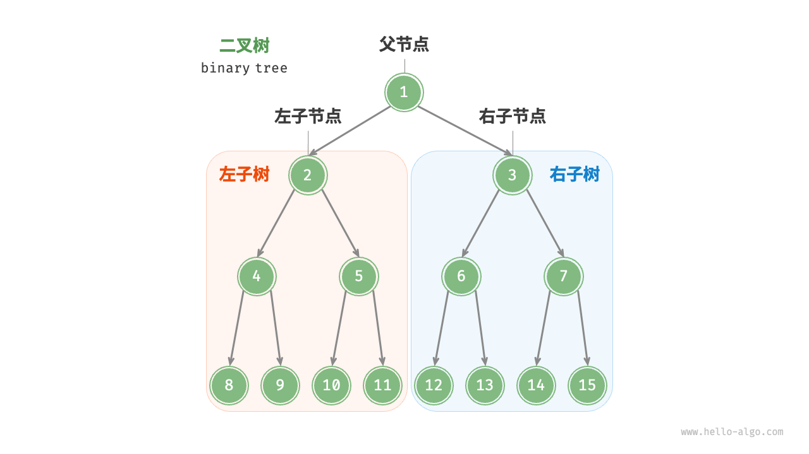

<!--
每个节点都有两个引用（指针），分别指向左子节点（left-child node）和右子节点（right-child node），该节点被称为这两个子节点的父节点（parent node）。当给定一个二叉树的节点时，我们将该节点的左子节点及其以下节点形成的树称为该节点的左子树（left subtree），同理可得右子树（right subtree）。
-->

---

## 常见术语

<br>

- **根节点（root node）** 位于二叉树顶层的节点，没有父节点。
- **叶节点（leaf node）** 没有子节点的节点，其两个指针均指向 None 。
- **边（edge）** 连接两个节点的线段，即节点引用（指针）。
- **节点所在的层（level）** 从顶至底递增，根节点所在层为 1 。
- **节点的度（degree）** 节点的子节点的数量。在二叉树中，度的取值范围是 0、1、2 。
- **二叉树的高度（height）** 从根节点到最远叶节点所经过的边的数量。
- **节点的深度（depth）** 从根节点到该节点所经过的边的数量。
- **节点的高度（height）** 从距离该节点最远的叶节点到该节点所经过的边的数量。

---

## 初始化二叉树

<br>

1. 初始化节点
2. 构建节点之间的引用（指针）

<br>

```py {1-7|8-12}
# 初始化二叉树
# 初始化节点
n1 = TreeNode(val=1)
n2 = TreeNode(val=2)
n3 = TreeNode(val=3)
n4 = TreeNode(val=4)
n5 = TreeNode(val=5)
# 构建节点之间的引用（指针）
n1.left = n2
n1.right = n3
n2.left = n4
n2.right = n5
```

---

## 插入与删除节点

<br>

```py
# 插入与删除节点
p = TreeNode(0)
# 在 n1 -> n2 中间插入节点 P
n1.left = p
p.left = n2
# 删除节点 P
n1.left = n2
```

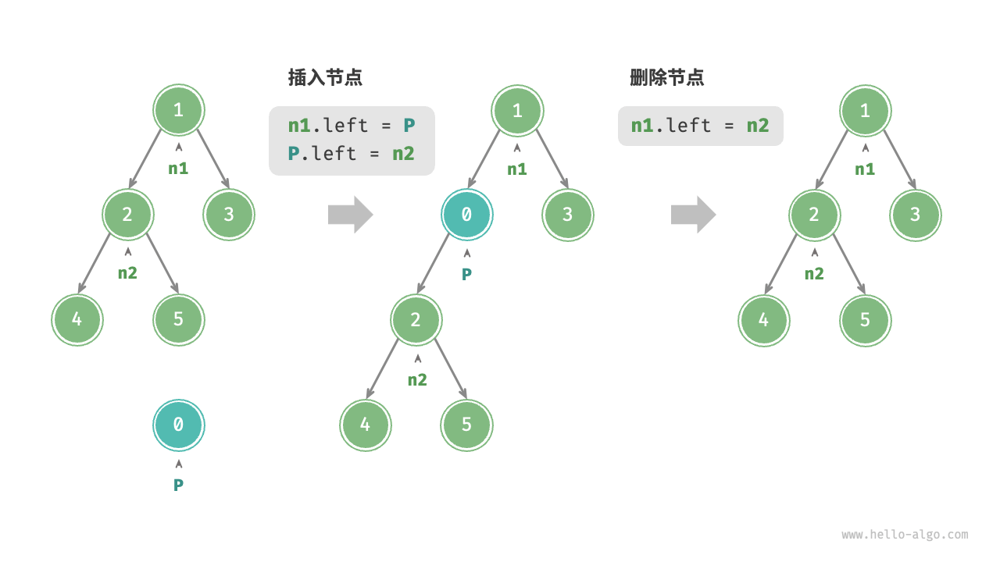

---

layout: two-cols
layoutClass: gap-2

---

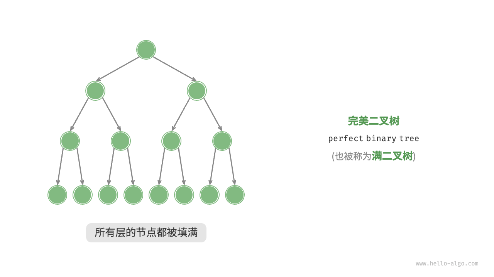

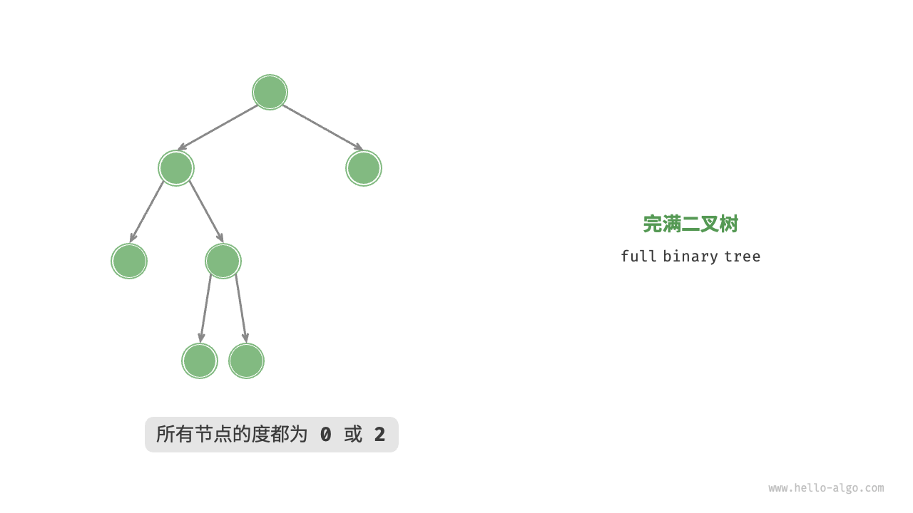

::right::

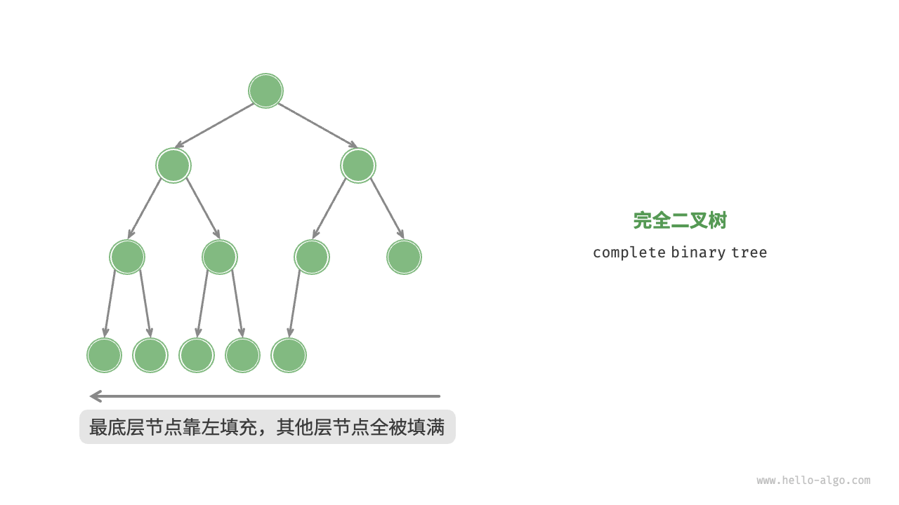

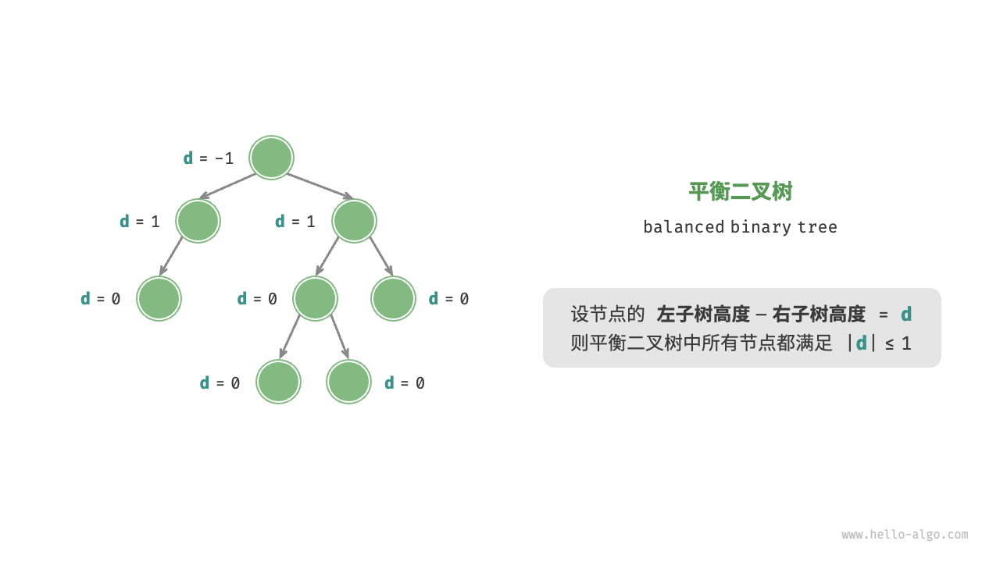
<!--
 所有层的节点都被完全填满。在完美二叉树中，叶节点的度为 0 ，其余所有节点的度都为 2 ；若树的高度为 h ，则节点总数为  $2^{h+1} - 1$ ，呈现标准的指数级关系，反映了自然界中常见的细胞分裂现象。
 只有最底层的节点未被填满，且最底层节点尽量靠左填充。请注意，完美二叉树也是一棵完全二叉树。
-->
---

## 二叉树的退化

展示了二叉树的理想结构与退化结构。当二叉树的每层节点都被填满时，达到“完美二叉树”；而当所有节点都偏向一侧时，二叉树退化为“链表”。

- 完美二叉树是理想情况，可以充分发挥二叉树“分治”的优势。
- 链表则是另一个极端，各项操作都变为线性操作，时间复杂度退化至 `O(n)`

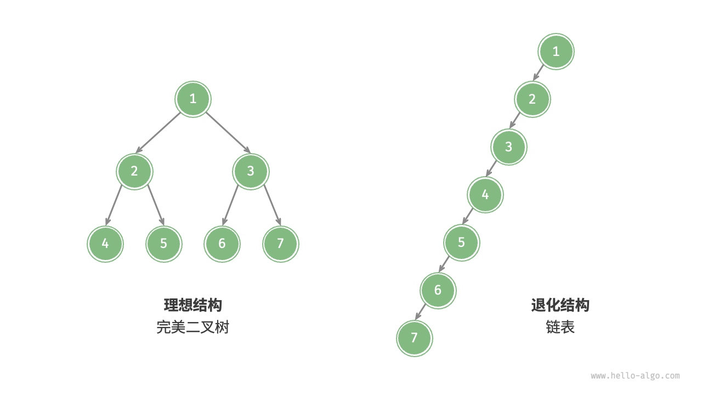

---

## 二叉树的最佳结构与最差结构

在最佳结构和最差结构下，二叉树的叶节点数量、节点总数、高度等达到极大值或极小值。

|                             | 完美二叉树        | 链表  |
| --------------------------- | ----------------- | ----- |
| 第 `i` 层的节点数量         | $2^{i-1}$         | 1     |
| 高度为 `h` 的树的叶节点数量 | $2^h$             | 1     |
| 高度为 `h` 的树的节点总数   | $2^{h+1} - 1$     | $h+1$ |
| 节点总数为 `n` 的树的高度   | $\log_2(n+1) - 1$ | $n-1$ |

---

## 二叉树遍历

从物理结构的角度来看，树是一种基于链表的数据结构，因此其遍历方式是通过指针逐个访问节点。然而，树是一种非线性数据结构，这使得遍历树比遍历链表更加复杂，需要借助搜索算法来实现。

二叉树常见的遍历方式包括

- 层序遍历 `level-order traversal`
- 前序遍历 `pre-order traversal`
- 中序遍历 `in-order traversal`
- 后序遍历 `post-order traversal`

---

## 层序遍历

广度优先遍历通常借助“队列”来实现。队列遵循 <span v-mark.red>先进先出</span> 的规则，而广度优先遍历则遵循 <span v-mark.red>逐层推进</span> 的规则，两者背后的思想是一致的。

```py {*|1-5|6-7|8-16}
def level_order(root: TreeNode | None) -> list[int]:
    """层序遍历"""
    # 初始化队列，加入根节点
    queue: deque[TreeNode] = deque()
    queue.append(root)
    # 初始化一个列表，用于保存遍历序列
    res = []
    # 遍历队列
    while queue:
        node: TreeNode = queue.popleft()  # 队列出队
        res.append(node.val)  # 保存节点值
        if node.left is not None:
            queue.append(node.left)  # 左子节点入队
        if node.right is not None:
            queue.append(node.right)  # 右子节点入队
    return res
```

---

## 前序、中序、后序遍历

相应地，前序、中序和后序遍历都属于深度优先遍历 `depth-first traversal`，也称深度优先搜索`depth-first search` 或 `DFS`。 它体现了一种 <span v-mark.red>先走到尽头，再回溯继续</span> 的遍历方式。

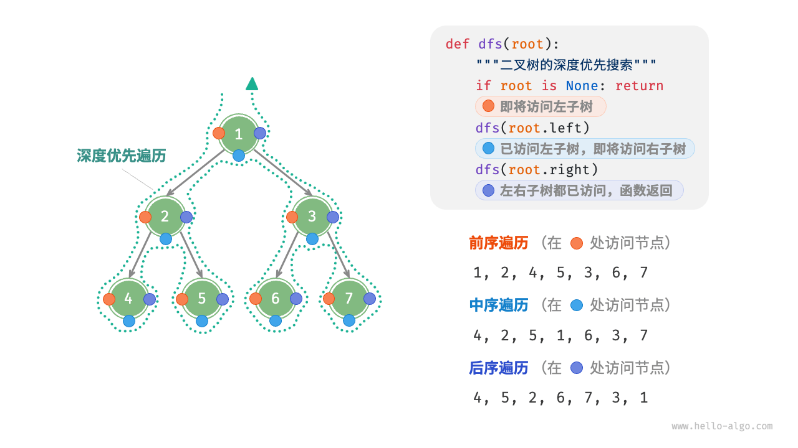

---

```py {1-8|10-17|19-26}
def pre_order(root: TreeNode | None):
    """前序遍历"""
    if root is None:
        return
    # 访问优先级：根节点 -> 左子树 -> 右子树
    res.append(root.val)
    pre_order(root=root.left)
    pre_order(root=root.right)

def in_order(root: TreeNode | None):
    """中序遍历"""
    if root is None:
        return
    # 访问优先级：左子树 -> 根节点 -> 右子树
    in_order(root=root.left)
    res.append(root.val)
    in_order(root=root.right)

def post_order(root: TreeNode | None):
    """后序遍历"""
    if root is None:
        return
    # 访问优先级：左子树 -> 右子树 -> 根节点
    post_order(root=root.left)
    post_order(root=root.right)
    res.append(root.val)
```

---

## 二叉树数组表示

如何将二叉树表示为数组？给定一棵完美二叉树，我们将所有节点按照层序遍历的顺序存储在一个数组中，则每个节点都对应唯一的数组索引。

根据层序遍历的特性，我们可以推导出父节点索引与子节点索引之间的 <span v-mark.red>映射公式</span>：若某节点的索引为 `i`, 则该节点的左子节点索引为 `2*i+1`, 右子节点索引为 `2*i+2`。

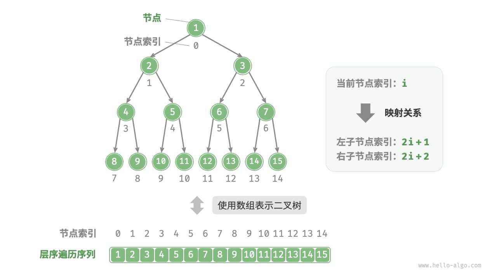

<!--
映射公式的角色相当于链表中的节点引用（指针）。给定数组中的任意一个节点，我们都可以通过映射公式来访问它的左（右）子节点。
-->

---

layout: two-cols
layoutClass: gap-2

---

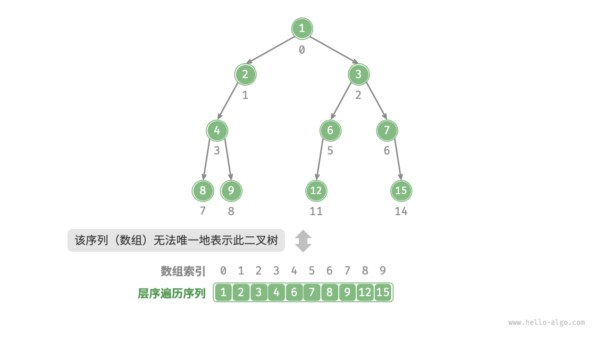

```py
# 层序遍历的数组表示
tree = [1, 2, 3, 4, 6, 7, 8, 9, 12, 15]
```

::right::

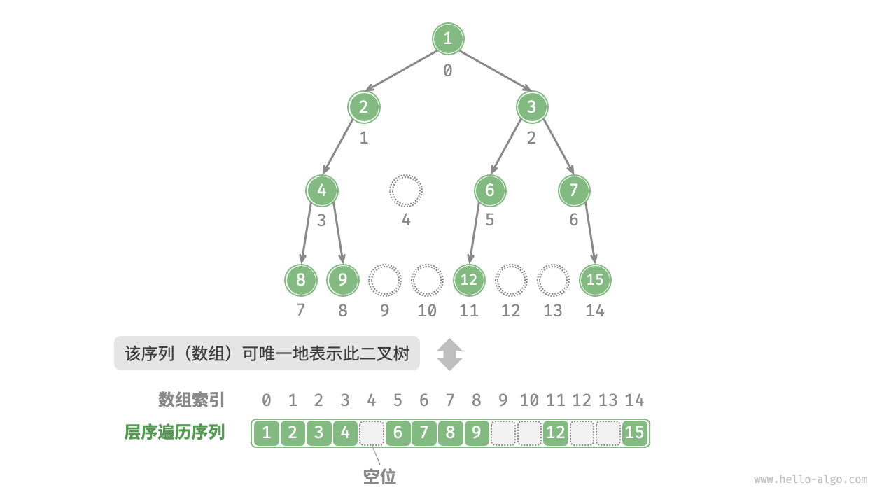

```py
# 使用 None 来表示空位
tree = [1, 2, 3, 4, None, 6, 7, 8, 9, None, None, 12, None, None, 15]
```

---

## 完全二叉树的数组表示

完全二叉树非常适合使用数组来表示。回顾完全二叉树的定义，`None` 只出现在最底层且靠右的位置，因此所有 None 一定出现在层序遍历序列的末尾。这意味着使用数组表示完全二叉树时，可以省略存储所有 `None`。

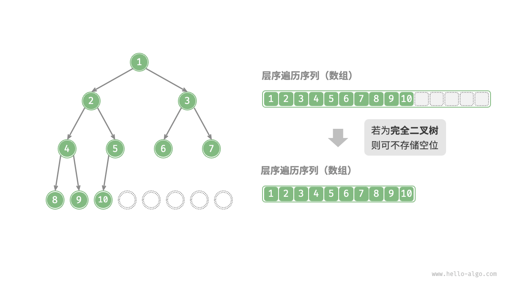

---

````md magic-move
```py
class ArrayBinaryTree:
    def size(self):
        """列表容量"""
        pass

    def val(self, i: int) -> int | None:
        """获取索引为 i 节点的值"""
        pass

    def left(self, i: int) -> int | None:
        """获取索引为 i 节点的左子节点的索引"""
        pass

    def right(self, i: int) -> int | None:
        """获取索引为 i 节点的右子节点的索引"""
        pass

    def parent(self, i: int) -> int | None:
        """获取索引为 i 节点的父节点的索引"""
        pass
```

```py
class ArrayBinaryTree:
    def __init__(self, arr: list[int | None]):
        """构造方法"""
        self._tree = list(arr)

    def size(self):
        """列表容量"""
        return len(self._tree)

    def val(self, i: int) -> int | None:
        """获取索引为 i 节点的值"""
        # 若索引越界，则返回 None ，代表空位
        if i < 0 or i >= self.size():
            return None
        return self._tree[i]

    def left(self, i: int) -> int | None:
        """获取索引为 i 节点的左子节点的索引"""
        return 2 * i + 1

    def right(self, i: int) -> int | None:
        """获取索引为 i 节点的右子节点的索引"""
        return 2 * i + 2

    def parent(self, i: int) -> int | None:
        """获取索引为 i 节点的父节点的索引"""
        return (i - 1) // 2
```
````

<!--
以下代码实现了一棵基于数组表示的二叉树，包括以下几种操作。
给定某节点，获取它的值、左（右）子节点、父节点。
获取前序遍历、中序遍历、后序遍历、层序遍历序列。
-->

---

layout: two-cols
layoutClass: gap-4

---

````md magic-move
```py
    def level_order(self) -> list[int]:
        """层序遍历"""
        pass

    def dfs(self, i: int, order: str):
        """深度优先遍历"""
        pass
```

```py
    def level_order(self) -> list[int]:
        """层序遍历"""
        self.res = []
        # 直接遍历数组
        for i in range(self.size()):
            if self.val(i) is not None:
                self.res.append(self.val(i))
        return self.res

    def dfs(self, i: int, order: str):
        """深度优先遍历"""
        if self.val(i) is None:
            return
        # 前序遍历
        if order == "pre":
            self.res.append(self.val(i))
        self.dfs(self.left(i), order)
        # 中序遍历
        if order == "in":
            self.res.append(self.val(i))
        self.dfs(self.right(i), order)
        # 后序遍历
        if order == "post":
            self.res.append(self.val(i))
```
````

::right::

````md magic-move
```py
    def pre_order(self) -> list[int]:
        """前序遍历"""
        pass

    def in_order(self) -> list[int]:
        """中序遍历"""
        pass

    def post_order(self) -> list[int]:
        """后序遍历"""
        pass
```

```py
    def pre_order(self) -> list[int]:
        """前序遍历"""
        self.res = []
        self.dfs(0, order="pre")
        return self.res

    def in_order(self) -> list[int]:
        """中序遍历"""
        self.res = []
        self.dfs(0, order="in")
        return self.res

    def post_order(self) -> list[int]:
        """后序遍历"""
        self.res = []
        self.dfs(0, order="post")
        return self.res
```
````

---

## 二叉树总结

二叉树的数组表示主要有以下优点。

- 数组存储在连续的内存空间中，对缓存友好，访问与遍历速度较快。
- 不需要存储指针，比较节省空间。
- 允许随机访问节点。

然而，数组表示也存在一些局限性。

- 数组存储需要连续内存空间，因此不适合存储数据量过大的树。
- 增删节点需要通过数组插入与删除操作实现，效率较低。
- 当二叉树中存在大量 `None` 时，数组中包含的节点数据比重较低，空间利用率较低。

---

## 二叉搜索树

二叉搜索树（binary search tree）满足以下条件:

1. 对于根节点，`左子树中所有节点的值` < `根节点的值` < `右子树中所有节点的值`。
2. 任意节点的左、右子树也是二叉搜索树，即同样满足条件 `1.` 。

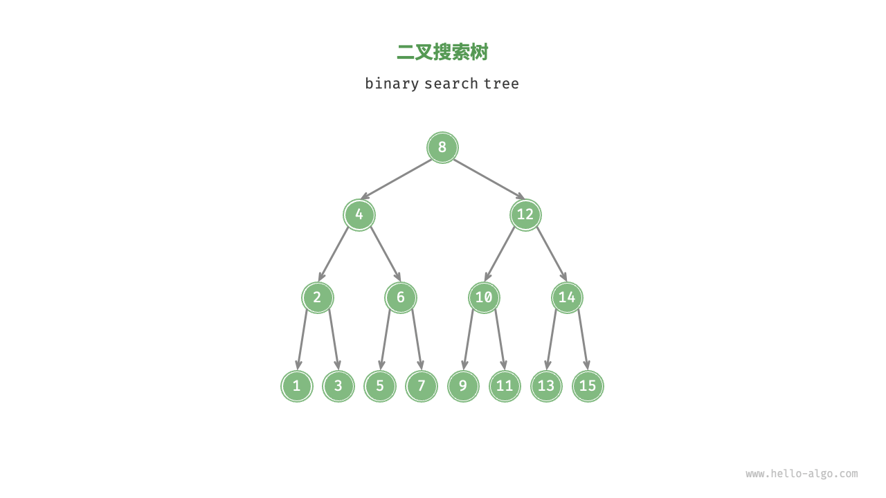

---

## 搜索操作

我们将二叉搜索树封装为一个类 `BinarySearchTree` ，并声明一个成员变量 `root` ，指向树的根节点。

1. 查找节点
   给定目标节点值 `num` ，可以根据二叉搜索树的性质来查找。如图所示，我们声明一个节点 `cur` ，从二叉树的根节点 `root` 出发，循环比较节点值 `cur.val` 和 `num` 之间的大小关系。

- 若 `cur.val < num` ，则目标节点位于 `cur` 的右子树，更新 `cur = cur.right` 。
- 若 `cur.val > num` ，则目标节点位于 `cur` 的左子树，更新 `cur = cur.left` 。
- 若 `cur.val == num` ，则找到目标节点，返回 `cur` 。

<v-switch>
  <template #1> 
        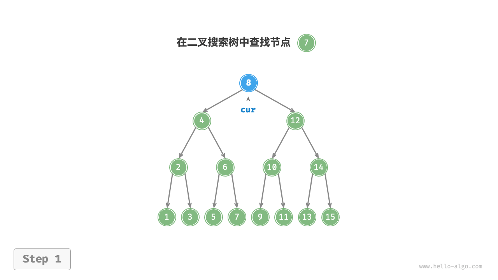
    </template>
    <template #2>
        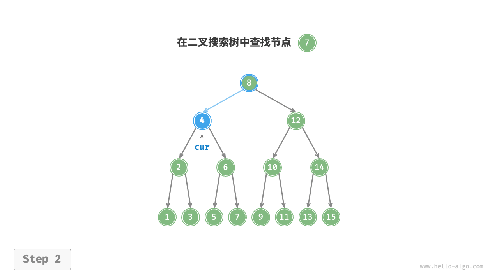
    </template>
    <template #3>
        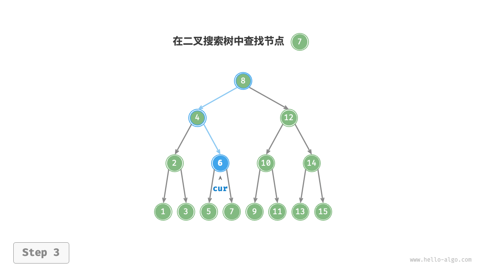
    </template>
    <template #4>
        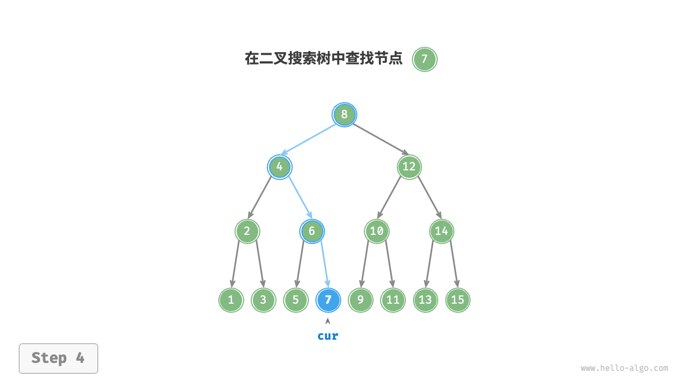
    </template>
</v-switch>

---

二叉搜索树的查找操作与二分查找算法的工作原理一致，都是每轮排除一半情况。循环次数最多为二叉树的高度，当二叉树平衡时，使用 $O(\log n)$ 时间复杂度即可找到目标节点。

```py
def search(self, num: int) -> TreeNode | None:
    """查找节点"""
    cur = self._root
    # 循环查找，越过叶节点后跳出
    while cur is not None:
        # 目标节点在 cur 的右子树中
        if cur.val < num:
            cur = cur.right
        # 目标节点在 cur 的左子树中
        elif cur.val > num:
            cur = cur.left
        # 找到目标节点，跳出循环
        else:
            break
    return cur
```

---

## 插入节点

给定一个待插入元素 `num` ，为了保持二叉搜索树“左子树 < 根节点 < 右子树”的性质，插入操作流程如图所示。

1. 查找插入位置：与查找操作相似，从根节点出发，根据当前节点值和 num 的大小关系循环向下搜索，直到越过叶节点（遍历至 `None` ）时跳出循环。
2. 在该位置插入节点：初始化节点 `num` ，将该节点置于 `None` 的位置。

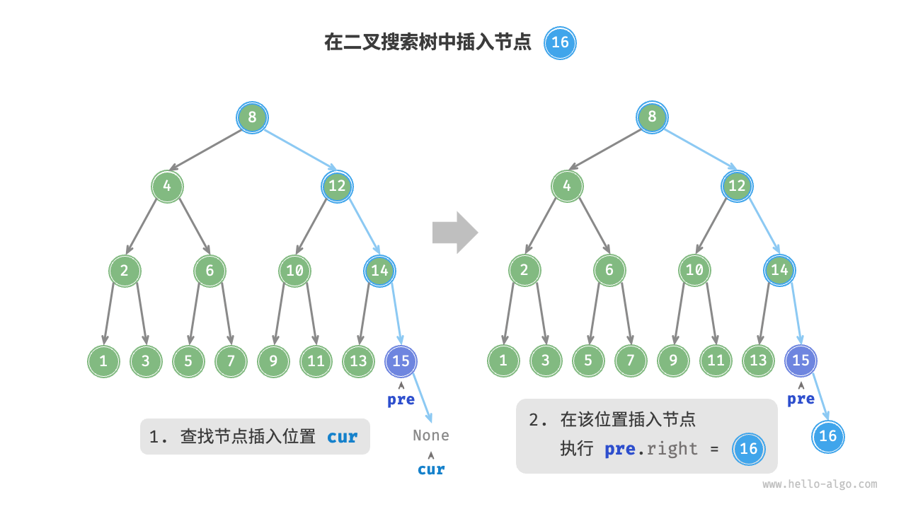

---

```py
def insert(self, num: int):
    # 若树为空，则初始化根节点
    if self._root is None:
        self._root = TreeNode(num)
        return
    # 循环查找，越过叶节点后跳出
    cur, pre = self._root, None
    while cur is not None:
        # 找到重复节点，直接返回
        if cur.val == num:
            return
        pre = cur
        # 插入位置在 cur 的右子树中
        if cur.val < num:
            cur = cur.right
        # 插入位置在 cur 的左子树中
        else:
            cur = cur.left
    # 插入节点
    node = TreeNode(num)
    if pre.val < num:
        pre.right = node
    else:
        pre.left = node
```

- 二叉搜索树不允许存在重复节点。因此，若待插入节点在树中已存在，则不执行插入，直接返回。
- 借助节点 `pre` 保存上一轮循环的节点。这样在遍历至 `None` 时，可以获取到其父节点完成节点插入操作。

<style>
li {
        font-size: 16px;
}
</style>

---

## 删除节点

先在二叉树中查找到目标节点，再将其删除。与插入节点类似，我们需要保证在删除操作完成后，二叉搜索树的“左子树 < 根节点 < 右子树”的性质仍然满足。因此，我们根据目标节点的子节点数量，分 0、1 和 2 三种情况，执行对应的删除节点操作。

1. 若目标节点为叶节点，则直接删除。
2. 若目标节点只有一个子节点，则将其子节点替换目标节点。
3. 若目标节点有两个子节点，由于要保持二叉搜索树“左子树 < 根节点 < 右子树”的性质, 则找到目标节点的中序遍历前驱或后继节点 (右子树的最小节点或左子树的最大节点)，将其值替换目标节点的值。

<v-switch>
  <template #1> 
        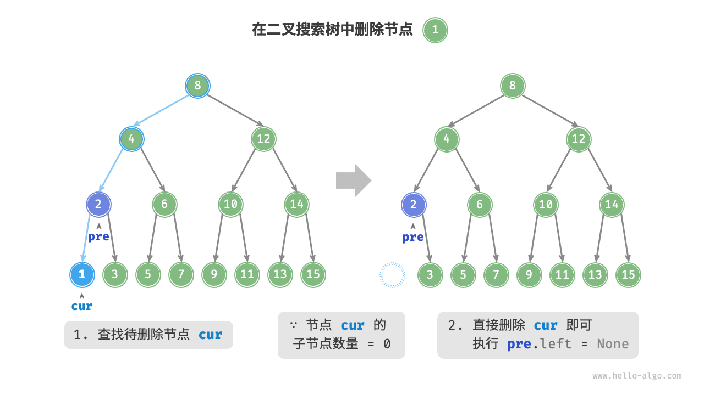
    </template>
    <template #2>
        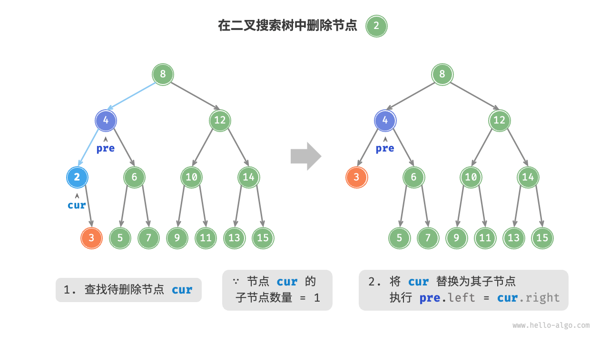
    </template>
    <template #3>
        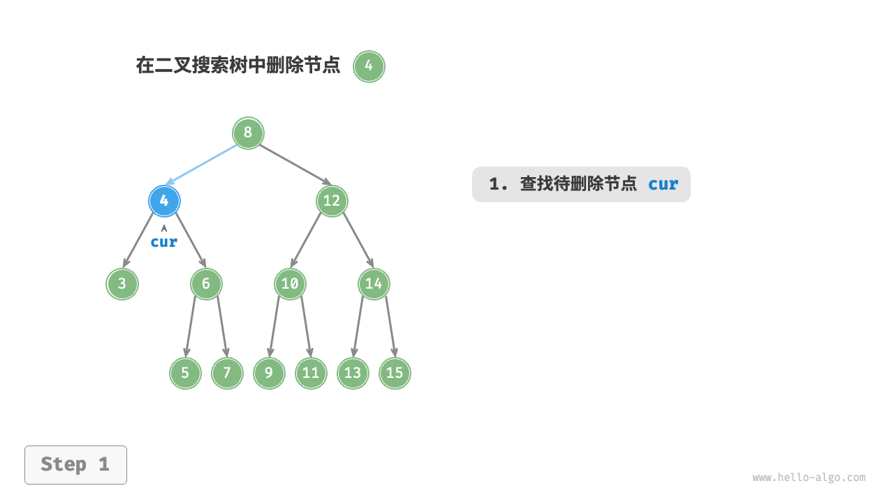
    </template>
    <template #4>
        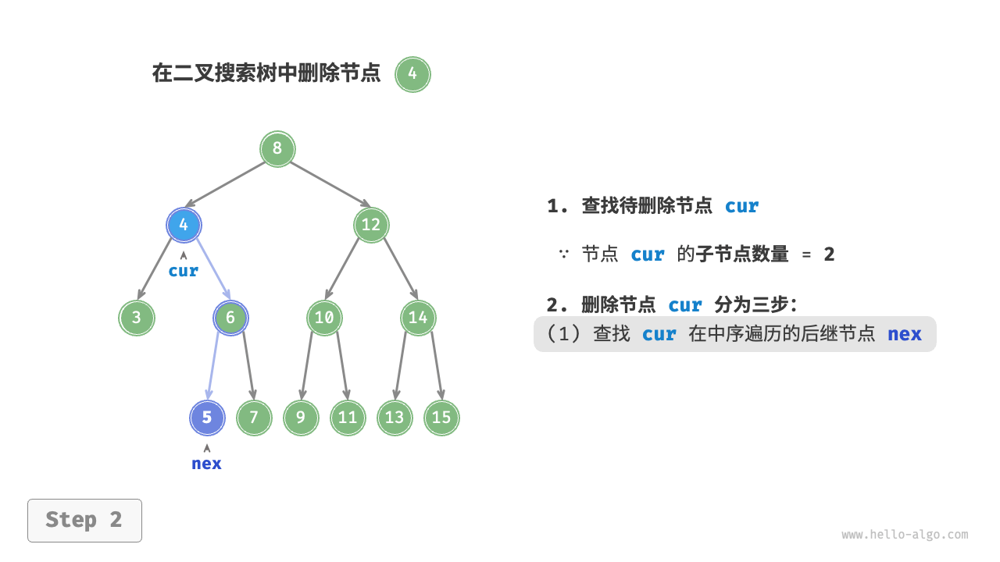
    </template>
    <template #5>
        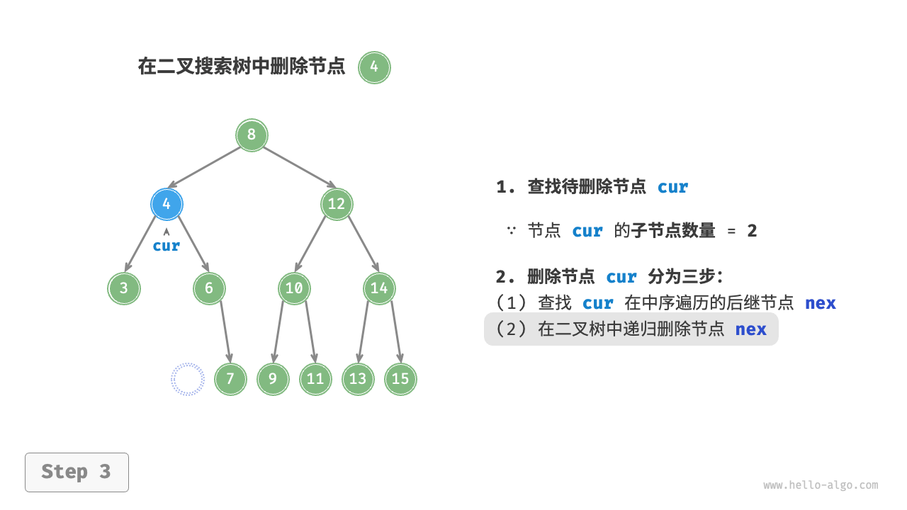
    </template>
    <template #6>
        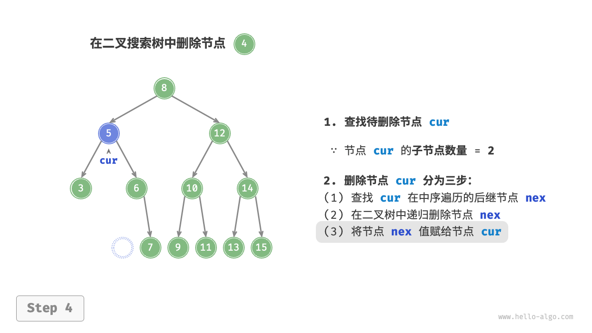
    </template>
</v-switch>

---

删除节点操作同样使用 $O(\log n)$ 时间复杂度，其中查找待删除节点需要 $O(\log n)$ 时间，获取中序遍历后继节点需要 $O(\log n)$ 时间。

```py {*}{maxHeight:'400px'}
def remove(self, num: int):
    """删除节点"""
    # 若树为空，直接提前返回
    if self._root is None:
        return
    # 循环查找，越过叶节点后跳出
    cur, pre = self._root, None
    while cur is not None:
        # 找到待删除节点，跳出循环
        if cur.val == num:
            break
        pre = cur
        # 待删除节点在 cur 的右子树中
        if cur.val < num:
            cur = cur.right
        # 待删除节点在 cur 的左子树中
        else:
            cur = cur.left
    # 若无待删除节点，则直接返回
    if cur is None:
        return

    # 子节点数量 = 0 or 1
    if cur.left is None or cur.right is None:
        # 当子节点数量 = 0 / 1 时， child = null / 该子节点
        child = cur.left or cur.right
        # 删除节点 cur
        if cur != self._root:
            if pre.left == cur:
                pre.left = child
            else:
                pre.right = child
        else:
            # 若删除节点为根节点，则重新指定根节点
            self._root = child
    # 子节点数量 = 2
    else:
        # 获取中序遍历中 cur 的下一个节点
        tmp: TreeNode = cur.right
        while tmp.left is not None:
            tmp = tmp.left
        # 递归删除节点 tmp
        self.remove(tmp.val)
        # 用 tmp 覆盖 cur
        cur.val = tmp.val
```

---

## 二叉搜索树的效率

给定一组数据，我们考虑使用数组或二叉搜索树存储。观察下表，二叉搜索树的各项操作的时间复杂度都是对数阶，具有稳定且高效的性能。只有在高频添加、低频查找删除数据的场景下，数组比二叉搜索树的效率更高。

| 操作 | 数组   | 二叉搜索树  |
| ---- | ------ | ----------- |
| 查找 | $O(1)$ | $O(\log n)$ |
| 插入 | $O(n)$ | $O(\log n)$ |
| 删除 | $O(n)$ | $O(\log n)$ |

场景分析：

- 用作系统中的多级索引，实现高效的查找、插入、删除操作。
- 作为某些搜索算法的底层数据结构。
- 用于存储数据流，以保持其有序状态。

---

## 二叉搜索树的局限性

在理想情况下，二叉搜索树是“平衡”的，这样就可以在 $O(\log n)$ 时间内完成查找、插入和删除操作。然而，如果我们在二叉搜索树中不断地插入和删除节点，使其不平衡，二叉搜索树的性能将会下降。当二叉搜索树退化为链表时，这些操作的时间复杂度将退化为 $O(n)$ 。


---

## AVL 树

1962 年 G. M. Adelson-Velsky (AV) 和 E. M. Landis (L)在论文“An algorithm for the organization of information”中提出了 AVL 树。论文中详细描述了一系列操作，确保在持续添加和删除节点后，AVL 树不会退化，从而使得各种操作的时间复杂度保持在 $O(\log n)$ 级别。换句话说，在需要频繁进行增删查改操作的场景中，AVL 树能始终保持高效的数据操作性能，具有很好的应用价值。

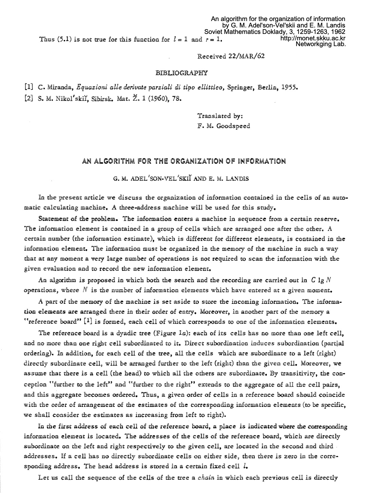

---

### AVL 树的定义

AVL 树既是二叉搜索树，也是平衡二叉树，同时满足这两类二叉树的所有性质，因此是一种平衡二叉搜索树`balanced binary search tree`。

节点高度: 由于 AVL 树的相关操作需要获取节点高度，因此我们需要为节点类添加 `height` 变量：

```py
class TreeNode:
"""AVL 树节点类"""
def __init__(self, val: int):
    self.val: int = val                 # 节点值
    self.height: int = 0                # 节点高度
    self.left: TreeNode | None = None   # 左子节点引用
    self.right: TreeNode | None = None  # 右子节点引用

def height(self, node: TreeNode | None) -> int:
    """获取节点高度"""
    # 空节点高度为 -1 ，叶节点高度为 0
    if node is not None:
        return node.height
    return -1

def update_height(self, node: TreeNode | None):
    """更新节点高度"""
    # 节点高度等于最高子树高度 + 1
    node.height = max([self.height(node.left), self.height(node.right)]) + 1
```

---

### 节点平衡因子

节点的平衡因子 `balance factor` 定义为节点左子树的高度减去右子树的高度，同时规定空节点的平衡因子为 0。在 AVL 树中，每个节点的平衡因子只能是 `-1`、`0` 或 `1`，否则就需要通过旋转操作来调整树的结构。我们同样将获取节点平衡因子的功能封装成函数，方便后续使用：

```py
def balance_factor(self, node: TreeNode | None) -> int:
    """获取平衡因子"""
    # 空节点平衡因子为 0
    if node is None:
        return 0
    # 节点平衡因子 = 左子树高度 - 右子树高度
    return self.height(node.left) - self.height(node.right)
```

---

## AVL 树旋转

AVL 树的特点在于“旋转”操作，它能够在不影响二叉树的中序遍历序列的前提下，使失衡节点重新恢复平衡。换句话说，旋转操作既能保持“二叉搜索树”的性质，也能使树重新变为“平衡二叉树”。

我们将平衡因子绝对值 > 1 的节点称为“失衡节点”。根据节点失衡情况的不同，旋转操作分为四种：右旋、左旋、先右旋后左旋、先左旋后右旋。下面详细介绍这些旋转操作。

1. 右旋 `right rotation`

<v-switch>
  <template #1> 
        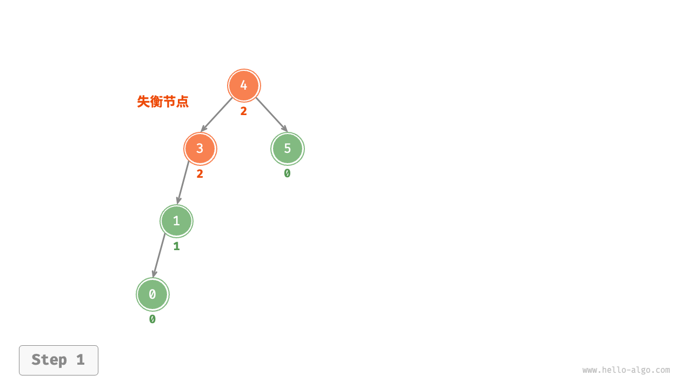
    </template>
    <template #2>
        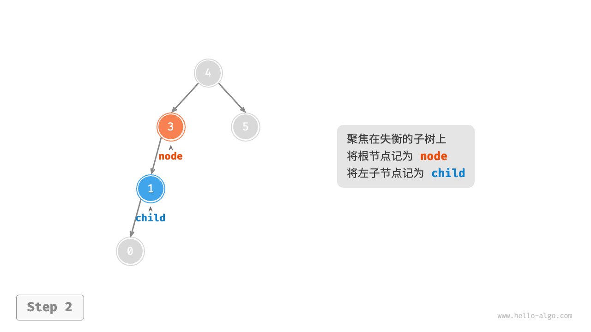
    </template>
    <template #3>
        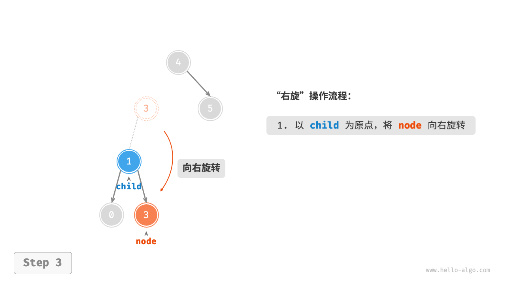
    </template>
    <template #4>
        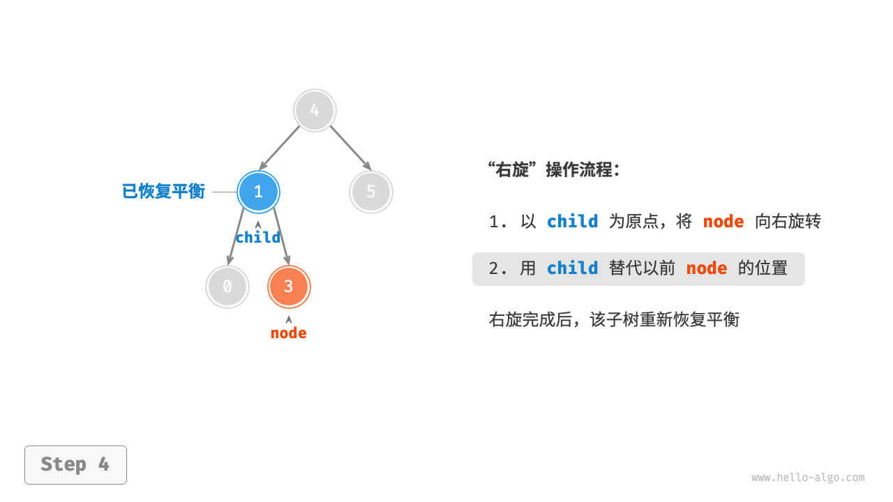
    </template>
</v-switch>

<!--
如图所示，节点下方为平衡因子。从底至顶看，二叉树中首个失衡节点是“节点 3”。我们关注以该失衡节点为根节点的子树，将该节点记为 `node` ，其左子节点记为 `child` ，执行“右旋”操作。完成右旋后，子树恢复平衡，并且仍然保持二叉搜索树的性质。
-->

---

当节点 child 有右子节点（记为 `grand_child` ）时

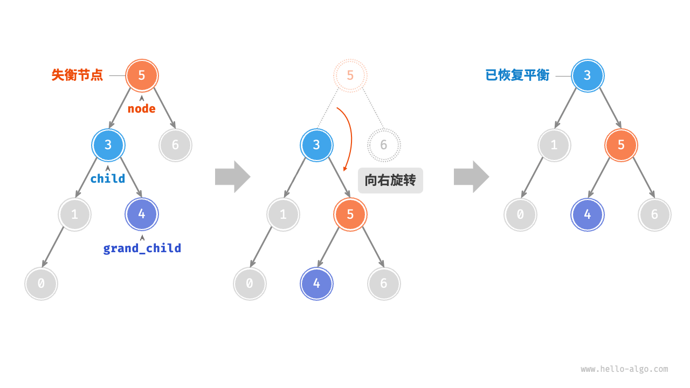

```py
def right_rotate(self, node: TreeNode | None) -> TreeNode | None:
    """右旋操作"""
    child = node.left
    grand_child = child.right
    # 以 child 为原点，将 node 向右旋转
    child.right = node
    node.left = grand_child
    # 更新节点高度
    self.update_height(node)
    self.update_height(child)
    # 返回旋转后子树的根节点
    return child
```

<!--
需要在右旋中添加一步：将 `grand_child` 作为 `node` 的左子节点。
-->

---

2. 左旋 `left rotation`

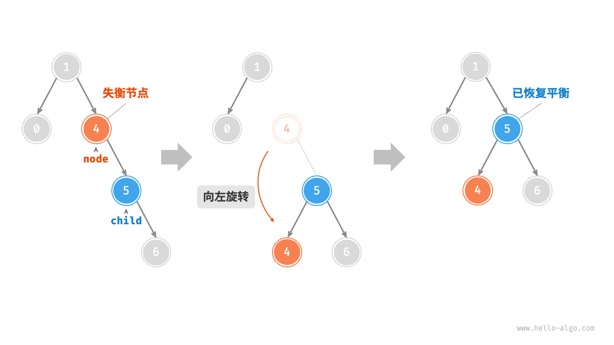

当节点 `child` 有左子节点（记为 `grand_child` ）时


<!--
需要在左旋中添加一步：将 `grand_child` 作为 node 的右子节点。
-->

---

可以观察到，右旋和左旋操作在逻辑上是镜像对称的，它们分别解决的两种失衡情况也是对称的。基于对称性，我们只需将右旋的实现代码中的所有的 left 替换为 right ，将所有的 right 替换为 left ，即可得到左旋的实现代码：

````md magic-move
```py
def right_rotate(self, node: TreeNode | None) -> TreeNode | None:
    """右旋操作"""
    child = node.left
    grand_child = child.right
    # 以 child 为原点，将 node 向右旋转
    child.right = node
    node.left = grand_child
    # 更新节点高度
    self.update_height(node)
    self.update_height(child)
    # 返回旋转后子树的根节点
    return child
```

```py
def left_rotate(self, node: TreeNode | None) -> TreeNode | None:
    """左旋操作"""
    child = node.right
    grand_child = child.left
    # 以 child 为原点，将 node 向左旋转
    child.left = node
    node.right = grand_child
    # 更新节点高度
    self.update_height(node)
    self.update_height(child)
    # 返回旋转后子树的根节点
    return child
```
````

---

3. 先左旋后右旋 `left-right rotation`, 需要先对 child 执行“左旋”，再对 node 执行“右旋”。

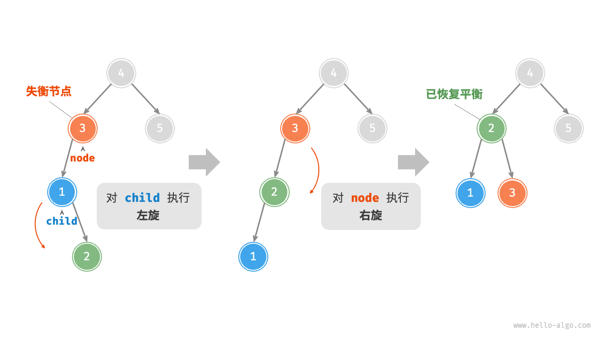

4. 先右旋后左旋 `right-left rotation`, 需要先对 child 执行“右旋”，再对 node 执行“左旋”。

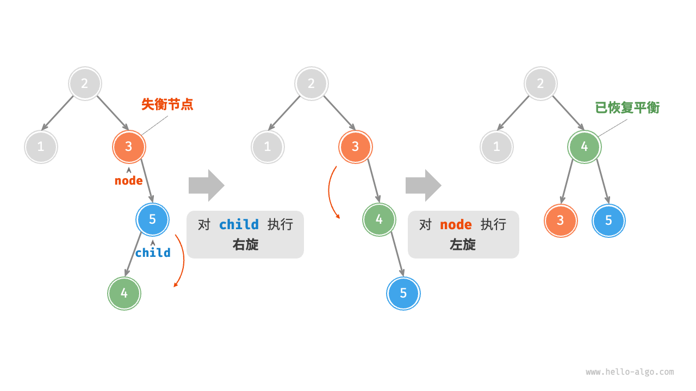

<!--
使用左旋或右旋都无法使子树恢复平衡
-->
