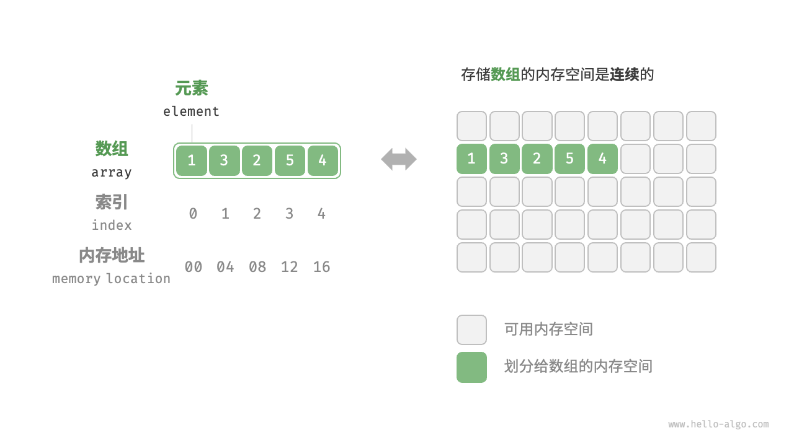
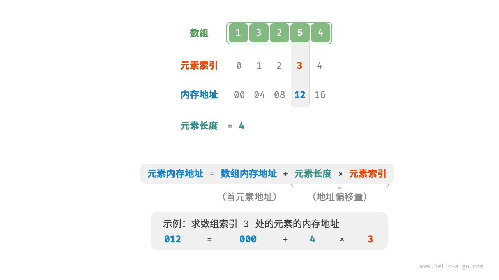
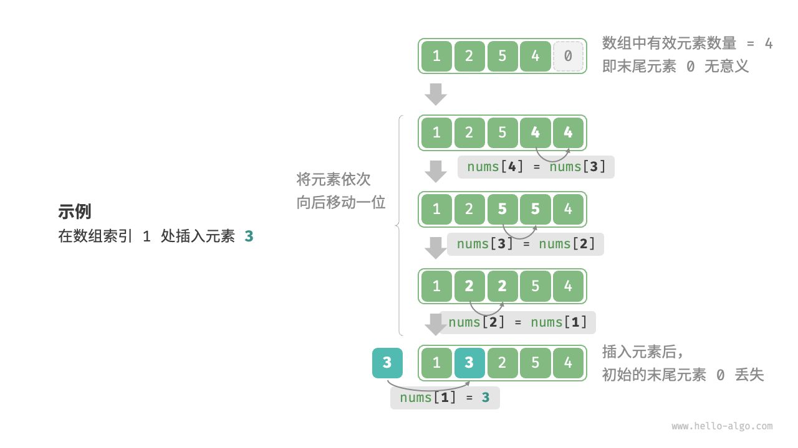
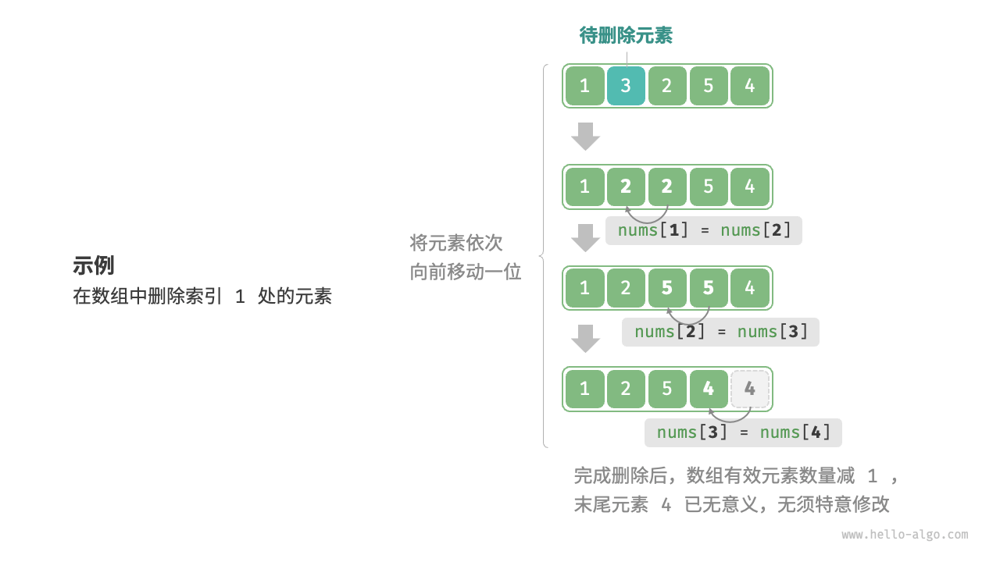

## 数组

数组（Array）是一种线性数据结构，其将相同类型的元素存储在连续的内存空间中。
元素在数组中的位置称为该元素的索引（Index）



初始化数组

```py {all|1|2-3}
nums: list[int] = [1, 3, 2, 5, 4] 
print(nums) 
# [1, 3, 2, 5, 4]
```

---

## 数组的访问

数组元素被存储在<span v-mark.red>连续的内存空间</span>中，这意味着计算数组元素的内存地址非常容易。给定数组内存地址（首元素内存地址）和某个元素的索引，我们可以使用图中所示的公式计算得到该元素的内存地址，从而直接访问该元素。



```py {all|1|2-3}
nums: list[int] = [1, 3, 2, 5, 4]
print(nums[2])
# 2
```

这种访问方式非常高效，可以在<span v-mark.red>`O(1)`</span>时间内随机访问数组中的任意一个元素。

<!--
我们发现数组首个元素的索引为0，这似乎有些反直觉，因为从1开始计数会更自然。但从地址计算公式的角度看，索引本质上是内存地址的偏移量。首个元素的地址偏移量是0，因此它的索引为1是合理的。
-->
---

## 数组的插入

数组元素在内存中是“紧挨着的”，它们之间没有空间再存放任何数据。如果想在数组中间插入一个元素，则需要将该元素之后的所有元素都向后移动一位，之后再把元素赋值给该索引。



```py {all|1|2-3}
nums: list[int] = [1, 3, 4, 5]
nums.insert(1,2)
print(nums)
# [1, 2, 3, 4, 5]
```

在数组中插入元素的时间复杂度为 `O(n)`，其中n为数组的长度。因为在最坏情况下，需要将数组中所有元素都向后移动一位。
---

## 数组的删除

若想删除索引`i`处的元素，则需要把索引`i`之后的所有元素都向前移动一位，之后再把数组的长度减一。



````md magic-move
```py 
nums: list[int] = [1, 2, 3, 4, 5]
nums.remove(1)
print(nums)
# [1, 3, 4, 5]
```
```py 
nums: list[int] = [1, 2, 3, 4, 5]
del nums[1]
print(nums)
# [1, 3, 4, 5]
```
````

在数组中插入元素的时间复杂度也为O(n)。
---

## 遍历数组

在大多数编程语言中，我们既可以通过索引遍历数组，也可以直接遍历获取数组中的每个元素。

```py {all|1-2|3-4|5-6|7-8|*}
# 有多种遍历方式
nums: list[int] = [1, 2, 3, 4, 5]
for num in nums:
    print(num)
for i in range(len(nums)):
    print(nums[i])
for i, num in enumerate(nums):
    print(nums[i])
# 1
# 2
# ...
```

在数组中查找指定元素需要遍历数组，每轮判断元素值是否匹配，若匹配则输出对应索引。
    
````md magic-move
```py {1|2|3-4}
nums: list[int] = [1, 2, 3, 4, 5]
pos = nums.index(3)
print(pos)
# 2
```
```py {1|2|3-4}
nums: list[int] = [1, 2, 3, 4, 5]
pos = nums.index(6)
print(pos)
# -1
```
````

在数组中遍历或者查找元素的时间复杂度为 `O(n)`。

<!--
因为数组是线性数据结构，所以上述查找操作被称为“线性查找”
-->
---

## 数组的扩容

在复杂的系统环境中，程序难以保证数组之后的内存空间是可用的，从而无法安全地扩展数组容量。因此在大多数编程语言中，数组的长度是不可变的。

如果我们希望扩容数组，则需重新建立一个更大的数组，然后把原数组元素依次复制到新数组。这是一个 O(n) 的操作，在数组很大的情况下非常耗时。

下面是底层是怎么实现的，扩容操作都位于`Objects/listobject.c`中。

```c {*}{maxHeight:'400px'}
static int
list_resize(PyListObject *self, Py_ssize_t newsize)
{   //参数self就是列表，newsize指的元素在添加之后的ob_size
    //比如列表的ob_size和容量都是5，append的时候发现容量不够
    //所以会扩容，那么这里的newsize就是6
    //如果是extend添加3个元素，那么这里的newsize就是8
    //当然list_resize这个函数不仅可以扩容，也可以缩容
    //假设列表原来有1000个元素，这个时候将列表清空了
    //那么容量肯定缩小，不然会浪费内存
    //如果清空了列表，那么这里的newsize显然就是0
    
    //items是一个二级指针，显然是用来指向指针数组的
    PyObject **items;
    //新的容量，以及对应的内存大小
    size_t new_allocated, num_allocated_bytes;
    //获取原来的容量
    Py_ssize_t allocated = self->allocated;
  
    //如果newsize达到了容量的一半，但还没有超过容量
    //那么意味着newsize、或者新的ob_size和容量是匹配的
    //所以不会变化
    if (allocated >= newsize && newsize >= (allocated >> 1)) {
        assert(self->ob_item != NULL || newsize == 0);
        //只需要将列表的ob_size设置为newsize即可
        Py_SIZE(self) = newsize;
        return 0;
    }

    //走到这里说明容量和ob_size不匹配了，所以要进行扩容或者缩容。
    //因此要申请新的底层数组，那么长度是多少呢？
    //这里给出了公式,一会儿我们可以通过Python进行测试
    new_allocated = (size_t)newsize + (newsize >> 3) + (newsize < 9 ? 3 : 6);
    //显然容量不可能无限大，是有范围的
    //当然这个范围基本上是达不到的
    if (new_allocated > (size_t)PY_SSIZE_T_MAX / sizeof(PyObject *)) {
        PyErr_NoMemory();
        return -1;
    }
  
    //如果newsize为0，那么容量也会变成0
    //假设将列表全部清空了，容量就会变成0
    if (newsize == 0)
        new_allocated = 0;
    
    //我们说数组中存放的都是PyObject *, 所以要计算内存
    num_allocated_bytes = new_allocated * sizeof(PyObject *);
    //申请相应大小的内存，将其指针交给items
    items = (PyObject **)PyMem_Realloc(self->ob_item, num_allocated_bytes);
    if (items == NULL) {
        //如果items是NULL, 代表申请失败
        PyErr_NoMemory();
        return -1;
    }
    //然后让ob_item = items, 也就是指向新的数组
    //此时列表就发生了扩容或缩容
    self->ob_item = items;
    //将ob_size设置为newsize, 因为它维护列表内部元素的个数
    Py_SIZE(self) = newsize;
    //将原来的容量大小设置为新的容量大小
    self->allocated = new_allocated;
    return 0;
}
```

---

## Python List 操作集合

```py {1-2|4-5|7-9|11-12|14-16|18-19}
list.append(x)
# 在列表末尾添加一个元素，相当于 a[len(a):] = [x] 。

list.extend(iterable)
# 用可迭代对象的元素扩展列表。相当于 a[len(a):] = iterable 。

list.insert(i, x)
# 在指定位置插入元素。第一个参数是插入元素的索引，
# 因此，a.insert(0, x) 在列表开头插入元素， a.insert(len(a), x) 等同于 a.append(x) 。

list.remove(x)
# 从列表中删除第一个值为 x 的元素。未找到指定元素时，触发 ValueError 异常。

list.pop([i])
# 移除列表中给定位置上的条目，并返回该条目。 
# 如果未指定索引号，则 a.pop() 将移除并返回列表中的最后一个条目。 如果列表为空或索引号在列表索引范围之外则会引发 IndexError。

list.clear()
# 删除列表里的所有元素，相当于 del a[:] 。
```

---

## Python List 操作集合

```py {1-3|5-6|8-9|11-12|14-15}
list.index(x[, start[, end]])
# 返回列表中第一个值为 x 的元素的零基索引。未找到指定元素时，触发 ValueError 异常。
# 可选参数 start 和 end 是切片符号，用于将搜索限制为列表的特定子序列。返回的索引是相对于整个序列的开始计算的，而不是 start 参数。

list.count(x)
# 返回列表中元素 x 出现的次数。

list.sort(*, key=None, reverse=False)
# 就地排序列表中的元素（要了解自定义排序参数，详见 sorted()）。

list.reverse()
# 翻转列表中的元素。

list.copy()
# 返回列表的浅拷贝。相当于 a[:] 。
```

---

## 数组的优缺点

数组存储在连续的内存空间内，且元素类型相同。这种做法包含丰富的先验信息，系统可以利用这些信息来优化数据结构的操作效率。

优点:
- **空间效率高** 数组为数据分配了连续的内存块，无须额外的结构开销。
- **支持随机访问** 数组允许在 `O(1)` 时间内访问任何元素。
- **缓存局部性** 当访问数组元素时，计算机不仅会加载它，还会缓存其周围的其他数据，从而借助高速缓存来提升后续操作的执行速度。

缺点:
- **插入与删除效率低** 数组的插入和删除的平均时间复杂度均为 `O(n)`，其中 n 为数组长度。
- **丢失元素** 由于数组的长度不可变，因此在插入元素后，超出数组长度范围的元素会丢失。
- **内存浪费** 我们可以初始化一个比较长的数组，只用前面一部分，这样在插入数据时，丢失的末尾元素都是“无意义”的，但这样做会造成部分内存空间浪费。

<!--
连续空间存储是一把双刃剑，其存在以下局限性。
当数组中元素较多时，插入与删除操作需要移动大量的元素。
长度不可变：数组在初始化后长度就固定了，扩容数组需要将所有数据复制到新数组，开销很大。
空间浪费：如果数组分配的大小超过实际所需，那么多余的空间就被浪费了。
-->
---

## 数组的应用

<br>
<v-clicks>

- **随机访问** 
- **排序和搜索** 
- **查找表** 
- **机器学习** 
- **数据结构实现** 

</v-clicks>

<!--
如果我们想随机抽取一些样本，那么可以用数组存储，并生成一个随机序列，根据索引实现随机抽样。
[click]
数组是排序和搜索算法最常用的数据结构。快速排序、归并排序、二分查找等都主要在数组上进行。
[click]
当需要快速查找一个元素或其对应关系时，可以使用数组作为查找表。假如我们想实现字符到 ASCII 码的映射，则可以将字符的 ASCII 码值作为索引，对应的元素存放在数组中的对应位置。
[click]
神经网络中大量使用了向量、矩阵、张量之间的线性代数运算，这些数据都是以数组的形式构建的。数组是神经网络编程中最常使用的数据结构。
[click]
数组可以用于实现栈、队列、哈希表、堆、图等数据结构。例如，图的邻接矩阵表示实际上是一个二维数组。
-->