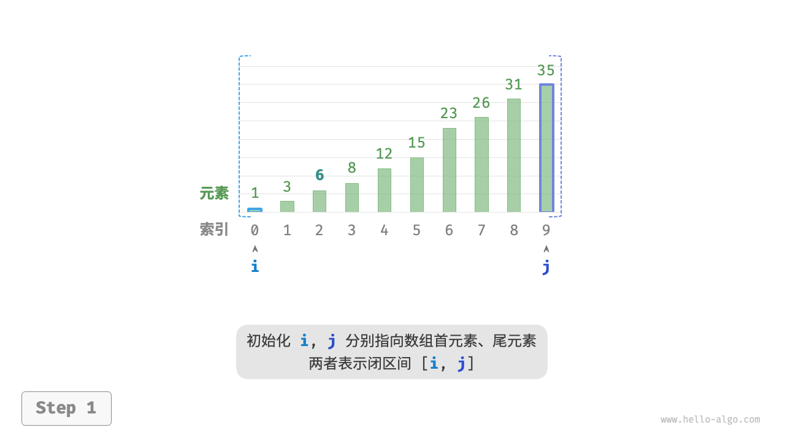
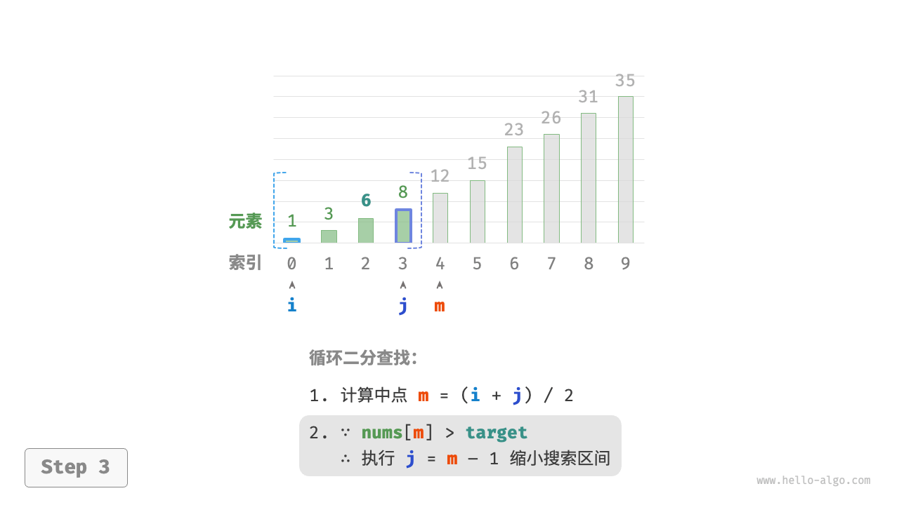
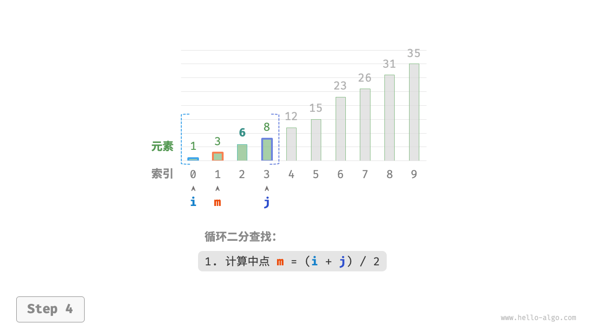
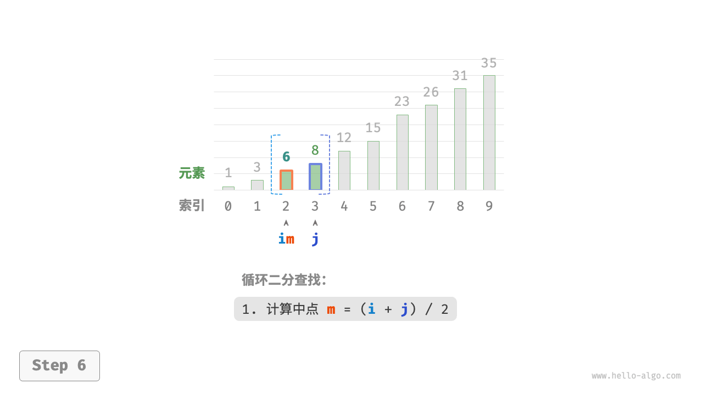
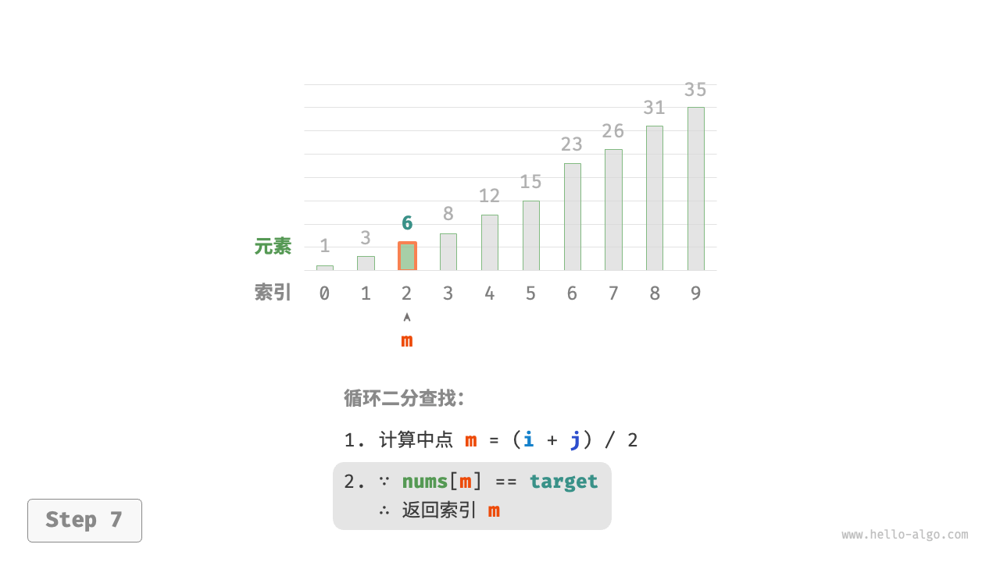

## 问题描述

二分查找（binary search）是一种基于分治策略的高效搜索算法。它利用数据的有序性，每轮缩小一半搜索范围，直至找到目标元素或搜索区间为空为止。

>给定一个长度为 n 的数组 nums ，元素按从小到大的顺序排列且不重复。请查找并返回元素 target 在该数组中的索引。若数组不包含该元素，则返回 -1。示例如图 10-1 所示。

---

我们先初始化指针 `i = 0` 和 `j = n - 1` ，分别指向数组首元素和尾元素，代表搜索区间 `[0 , n - 1]`。接下来，循环执行以下两步: 
1. 计算中点索引 $\bigl \lfloor (i + j)/2 \bigr \rfloor$ ，其中 $\bigl \lfloor  \bigr \rfloor$ 表示向下取整操作。
2. 判断 `nums[m]` 和 `target` 的大小关系，分为以下三种情况。
    1. 当 `nums[m]` < `target` 时，说明 `target` 在区间 $[ \, m + 1, i ] \,$ 中，因此执行 `i = m + 1`。
    2. 当 `nums[m]` > `target` 时，说明 `target` 在区间 $[ \, i, m - 1 ] \,$ 中，因此执行 `j = m - 1`。
    3. 当 `nums[m]` = `target` 时，说明找到 `target`，因此返回索引 `m`。
    4. 若数组不包含目标元素，搜索区间最终会缩小为空。此时返回 -1。

<v-switch>
    <template #0>  </template>
    <template #1>  </template>
    <template #2>  </template>
    <template #3>  </template>
    <template #4>  </template>
    <template #5>  </template>
    <template #6>  </template>
</v-switch>

<!--
请注意，中括号表示闭区间，其包含边界值本身。
-->
---

## 代码实现

值得注意的是，由于 `i` 和 `j` 都是 `int` 类型，因此 `m` 可能会超出 `int` 类型的取值范围。为了避免大数越界，我们通常采用公式 $\bigl \lfloor i + (j - i)/2 \bigr \rfloor$ 来计算中点。