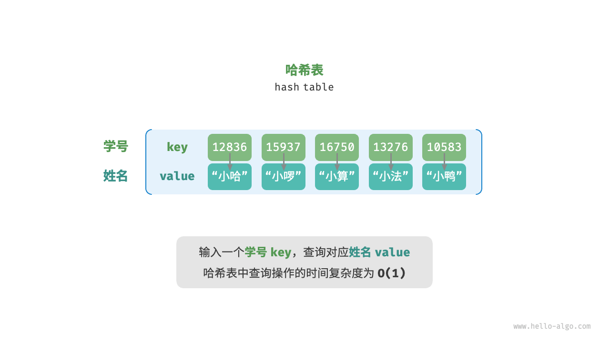
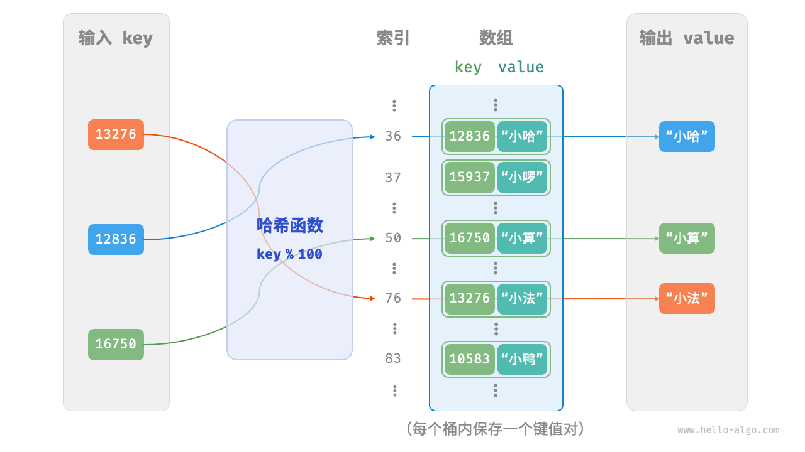
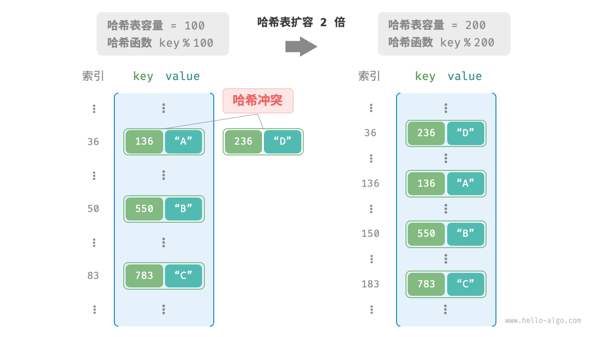
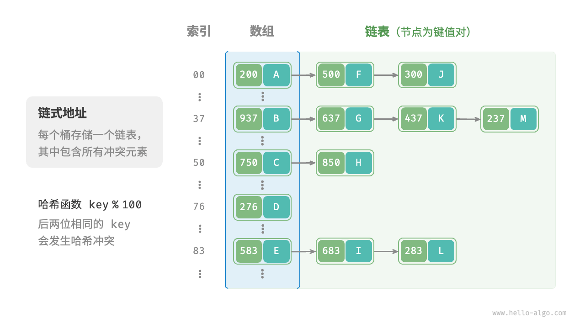
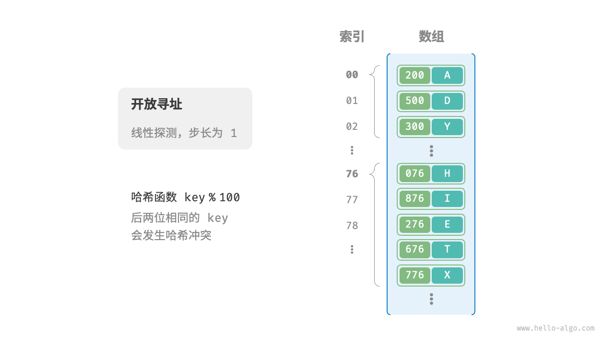
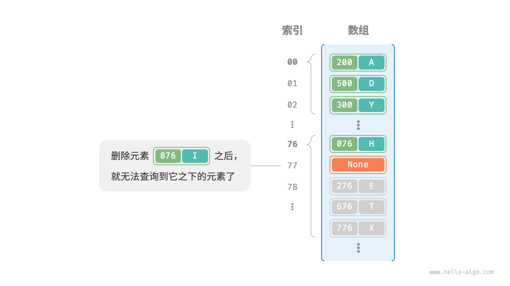

## 定义

哈希表 `hash table`，又称散列表，它通过建立键 `key` 与值 `value` 之间的映射，实现高效的元素查询。具体而言，我们向哈希表中输入一个键 `key` ，则可以在 `O(1)` 的时间内获取对应的 `value` 。

给定 `n` 个学生，每个学生都有“姓名”和“学号”两项数据。假如我们希望实现“输入一个学号，返回对应的姓名”的查询功能，则可以采用图中所示的哈希表来实现。



---

## 基本操作

除哈希表外，数组和链表也可以实现查询功能，它们的效率对比如下:

- 添加元素：仅需将元素添加至数组（链表）的尾部即可，使用 `O(1)` 时间。
- 查询元素：由于数组（链表）是乱序的，因此需要遍历其中的所有元素，使用 `O(n)` 时间。
- 删除元素：需要先查询到元素，再从数组（链表）中删除，使用 `O(n)` 时间。

| 操作 | 数组 |	链表 | 哈希表 |
| --- | --- | --- | --- |
| 查找元素 | O(n) | O(n) | O(1) |
| 添加元素 | O(1) | O(1) | O(1) |
| 删除元素 | O(n) | O(n) | O(1) |

观察发现，在哈希表中进行增删查改的时间复杂度都是 `O(1)`，非常高效。

---

## Python 实现

在 Python 中，我们可以使用 `dict` 类型来实现哈希表。`dict` 是 Python 内置的数据结构，它支持高效的增删查改操作。

```py
# 初始化哈希表
hmap: dict = {}

# 添加操作
# 在哈希表中添加键值对 (key, value)
hmap[12836] = "小哈"
hmap[15937] = "小啰"
hmap[16750] = "小算"
hmap[13276] = "小法"
hmap[10583] = "小鸭"

# 查询操作
# 向哈希表中输入键 key ，得到值 value
name: str = hmap[15937]

# 删除操作
# 在哈希表中删除键值对 (key, value)
hmap.pop(10583)
```

---

## 遍历

哈希表有三种常用的遍历方式：遍历键值对、遍历键和遍历值。

```py {1-3|5-7|9-11}
# 遍历键值对 key->value
for key, value in hmap.items():
    print(key, "->", value)

# 单独遍历键 key
for key in hmap.keys():
    print(key)
    
# 单独遍历值 value
for value in hmap.values():
    print(value)
```

---

## 哈希表简单实现

最简单的情况，仅用一个数组来实现哈希表。在哈希表中，我们将数组中的每个空位称为桶 `bucket`，每个桶可存储一个键值对。因此，查询操作就是找到 key 对应的桶，并在桶中获取 value 。

如何基于 key 定位对应的桶呢？这是通过哈希函数 `hash function` 实现的。哈希函数的作用是将一个较大的输入空间映射到一个较小的输出空间。在哈希表中，输入空间是所有 key ，输出空间是所有桶（数组索引）。换句话说，输入一个 key ，我们可以通过哈希函数得到该 key 对应的键值对在数组中的存储位置。



<!--
输入一个 key ，哈希函数的计算过程分为以下两步。
1. 通过某种哈希算法 hash() 计算得到哈希值。
2. 将哈希值对桶数量（数组长度）capacity 取模，从而获取该 key 对应的数组索引 index 。
-->
---

### 哈希函数

- **确定性**：对于相同的输入，哈希函数应始终返回相同的输出。
- **高效性**：哈希函数应尽可能高效，以便快速计算哈希值。
- **均匀性**：哈希函数应尽可能均匀地将键映射到哈希表的索引上，避免冲突。

常见哈希函数:
- **取模法**：哈希函数为 `hash(key) = key % size` ，其中 `size` 为哈希表的大小。
- **乘法哈希**：哈希函数为 `hash(key) = (key * A) % 2^B` ，其中 `A` 为常数，`B` 为位数。
- **MD5 哈希**：哈希函数为 `hash(key) = MD5(key)` ，通过 MD5 算法计算哈希值。

---

## 哈希冲突

哈希冲突 `hash collision` 是指两个不同的键 `136` 和 `236` 映射到同一个哈希表索引的情况。




哈希表扩容: 所有键值对从原哈希表迁移至新哈希表
- 非常耗时
- 重新计算所有键值对的存储位置

负载因子 `load factor` 是哈希表的一个重要概念，其定义为哈希表的元素数量除以桶数量，用于衡量哈希冲突的严重程度，也常作为哈希表扩容的触发条件。

<!--
编程语言通常会预留足够大的哈希表容量，防止频繁扩容。
例如在 Java 中，当负载因子超过 0.75 时，系统会将哈希表扩容至原先的 2 倍。
-->
---

### 解决哈希冲突

通常情况下哈希函数的输入空间远大于输出空间，因此理论上哈希冲突是不可避免的。比如，输入空间为全体整数，输出空间为数组容量大小，则必然有多个整数映射至同一桶索引。

哈希冲突会导致查询结果错误，严重影响哈希表的可用性。为了解决该问题，每当遇到哈希冲突时，我们就进行哈希表扩容，直至冲突消失为止。此方法简单粗暴且有效，但效率太低，因为哈希表扩容需要进行大量的数据搬运与哈希值计算。为了提升效率，我们可以采用以下策略。

1. 改良哈希表数据结构，使得哈希表可以在出现哈希冲突时正常工作。
2. 仅在必要时，即当哈希冲突比较严重时，才执行扩容操作。

哈希表的结构改良方法
- 链式地址
- 开放寻址

---

### 哈希表改良 - 链地址法

将哈希表的每个索引指向一个链表，当发生哈希冲突时，将新元素添加至链表末尾。



基于链式地址实现的哈希表的操作方法发生了以下变化:
- **查询元素**：输入 `key` ，经过哈希函数得到桶索引，即可访问链表头节点，然后遍历链表并对比 `key` 以查找目标键值对。
- **添加元素**：首先通过哈希函数访问链表头节点，然后将节点（键值对）添加到链表中。
- **删除元素**：根据哈希函数的结果访问链表头部，接着遍历链表以查找目标节点并将其删除。

<!--
链式地址存在以下局限性:
- 占用空间增大：链表包含节点指针，它相比数组更加耗费内存空间。
- 查询效率降低：因为需要线性遍历链表来查找对应元素。
-->
---

### 哈希表改良 - 开放寻址

不引入额外的数据结构，而是通过“多次探测”来处理哈希冲突，探测方式主要包括线性探测、平方探测和多次哈希等。这里我们以线性探测为例。

线性探测采用固定步长的线性搜索来进行探测，其操作方法与普通哈希表有所不同。

- **插入元素**：通过哈希函数计算桶索引，若发现桶内已有元素，则从冲突位置向后线性遍历，直至找到空桶，将元素插入其中。
- **查找元素**：若发现哈希冲突，则使用相同步长向后进行线性遍历，直到找到对应元素，返回 `value` 即可；如果遇到空桶，说明目标元素不在哈希表中，返回 `None` 。



线性探测的优点是实现简单，且不需要额外的空间。但是，线性探测存在以下问题:
- **聚集现象**：数组中连续被占用的位置越长，这些连续位置发生哈希冲突的可能性越大，从而进一步促使该位置的聚堆生长，形成恶性循环，最终导致增删查改操作效率劣化。
- **删除元素**：删除元素时，需要将目标元素标记为已删除，而非真正删除，否则会影响后续元素的查找。

---

### 哈希表改良 - 懒惰删除

我们不能在开放寻址哈希表中直接删除元素。这是因为删除元素会在数组内产生一个空桶 `None` ，而当查询元素时，线性探测到该空桶就会返回，因此在该空桶之下的元素都无法再被访问到，程序可能误判这些元素不存在，如图所示。



懒惰删除 `lazy deletion` 是指在删除元素时，不立即删除元素，而是利用一个常量 `TOMBSTONE` 来标记这个桶。在该机制下，`None` 和 `TOMBSTONE` 都代表空桶，都可以放置键值对。但不同的是，线性探测到 `TOMBSTONE` 时应该继续遍历，因为其之下可能还存在键值对。

---

## 常见的哈希算法

简单哈希算法都比较“脆弱”，远远没有达到哈希算法的设计目标。例如，由于加法和异或满足交换律，因此加法哈希和异或哈希无法区分内容相同但顺序不同的字符串，这可能会加剧哈希冲突，并引起一些安全问题。

在实际中，我们通常会用一些标准哈希算法，例如 MD5、SHA-1、SHA-2 和 SHA-3 等。它们可以将任意长度的输入数据映射到恒定长度的哈希值。

近一个世纪以来，哈希算法处在不断升级与优化的过程中。一部分研究人员努力提升哈希算法的性能，另一部分研究人员和黑客则致力于寻找哈希算法的安全性问题。

- MD5 和 SHA-1 已多次被成功攻击，因此它们被各类安全应用弃用。
- SHA-2 系列中的 SHA-256 是最安全的哈希算法之一，仍未出现成功的攻击案例，因此常用在各类安全应用与协议中。
- SHA-3 相较 SHA-2 的实现开销更低、计算效率更高，但目前使用覆盖度不如 SHA-2 系列。


---

## 哈希算法对比

<br>

| 哈希算法 | MD5 | SHA-1 | SHA-2 | SHA-3 |
| --- | --- | --- | --- | --- |
| 推出时间 | 1992 | 1995 | 2002 | 2008 |
| 输出长度 | 128 bit | 160 bit | 256/512 bit | 224/256/384/512 bit |
| 哈希冲突 | 较多 | 较多 | 很少 | 很少 |
| 安全等级 | 已被成功攻击 | 已被成功攻击 | 高 | 高 |
| 应用 | 仅用于数据完整性检查 | 已被弃用 | 加密货币交易验证、数字签名等 | 可用于替代 SHA-2
