## 算法举例 

    二分查找算法

在字典里，每个汉字都对应一个拼音，而字典是按照拼音字母顺序排列的。假设我们需要查找一个拼音首字母为 `R` 的字，通常会按照下面的方式实现:
1. 翻开字典约一半的页数，查看该页的首字母是什么，假设首字母为 `M`。
2. 由于在拼音字母表中 `R` 位于 `M` 之后，所以排除字典前半部分，查找范围缩小到后半部分。
3. 不断重复步骤 1. 和步骤 2. ，直至找到拼音首字母为 `R` 的页码为止。

<v-switch>
    <template #0> 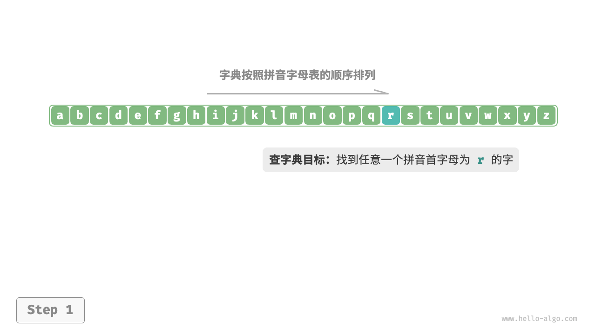 </template>
    <template #1> 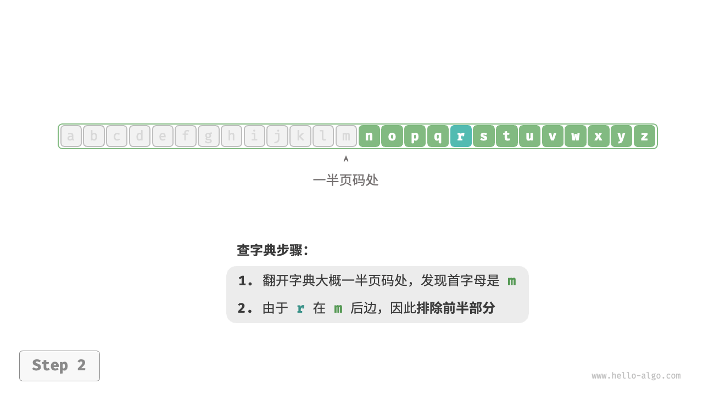 </template>
    <template #2> 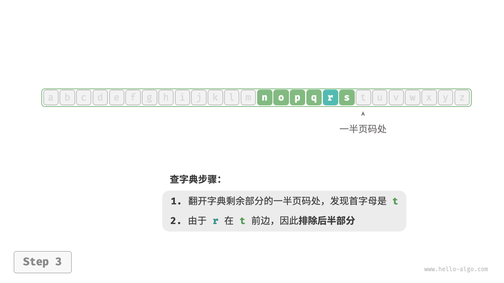 </template>
    <template #3> 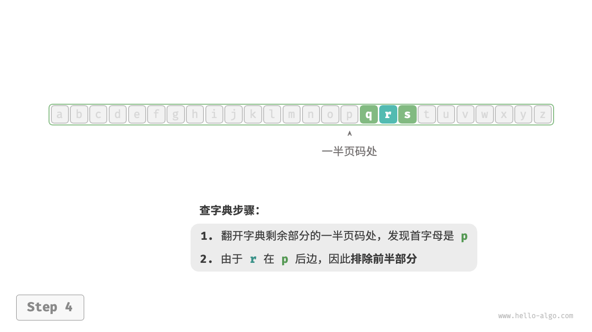 </template>
    <template #4> 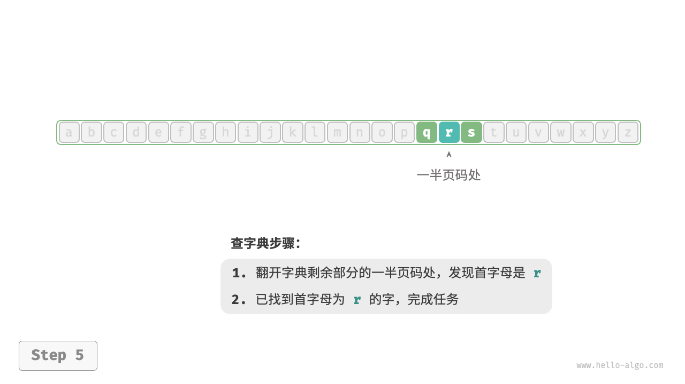 </template>
    <template #5>  </template>
</v-switch>
<!--
从数据结构的角度，我们可以把字典视为一个已排序的“数组”；从算法的角度，我们可以将上述查字典的一系列操作看作“二分查找”
-->
---

### 算法举例 - 整理扑克

    插入排序

在打牌时，每局都需要整理手中的扑克牌，使其从小到大排列，实现流程:
1. 将扑克牌划分为“有序”和“无序”两部分，并假设初始状态下最左 1 张扑克牌已经有序。
2. 在无序部分抽出一张扑克牌，插入至有序部分的正确位置；完成后最左 2 张扑克已经有序。
3. 不断循环步骤 2. ，每一轮将一张扑克牌从无序部分插入至有序部分，直至所有扑克牌都有序。

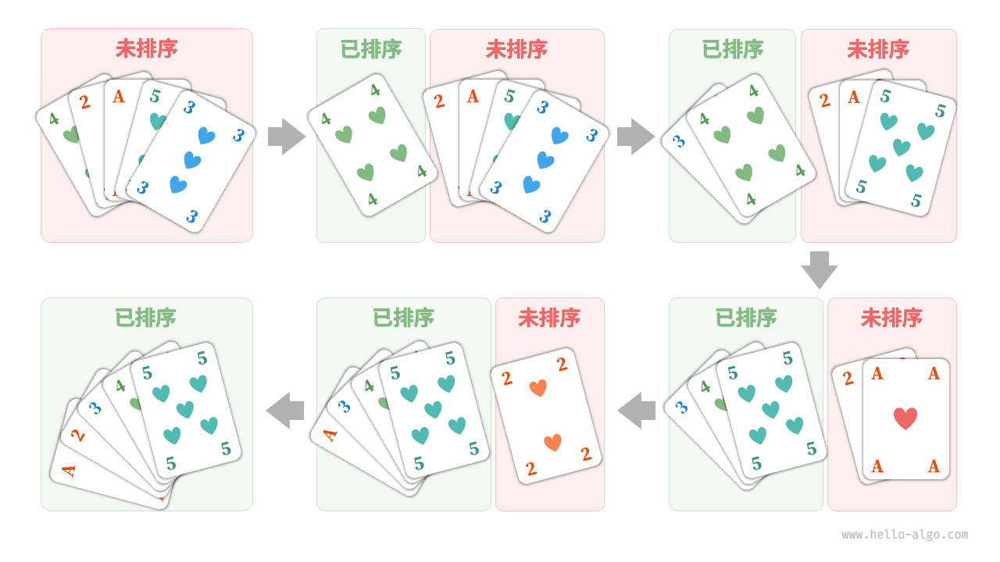
<!--
插入排序处理小型数据集时非常高效。许多编程语言的排序库函数中都有插入排序的身影。
-->
---

### 算法举例 - 货币找零

    贪心算法

假设我们在超市购买了 `69` 元的商品，给了收银员 `100` 元，则收银员需要找零 `31` 元:
1. 可选项是比 `31` 元面值更小的货币，包括 `20` 元、`10` 元、`5` 元、`1` 元。 
2. 优先使用面额最大的货币找零，即 20 元。
3. 从剩余可选项中继续选择面额最大的货币找零，直至找零完毕。
4. 最终找零结果为 `20` 元 + `10` 元 + `1` 元。

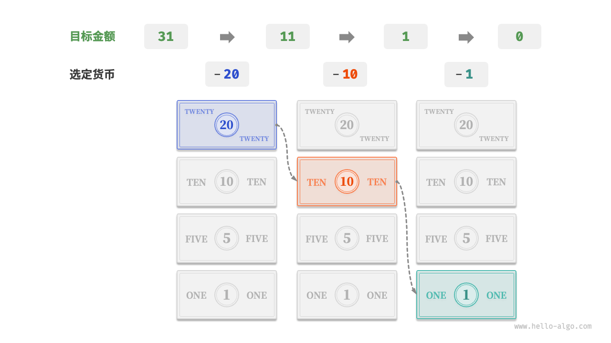
<!--
在以上步骤中，我们每一步都采取当前看来最好的选择（尽可能用大面额的货币），最终得到了可行的找零方案。从数据结构与算法的角度看，这种方法本质上是“贪心”算法。
小到烹饪一道菜，大到星际航行，几乎所有问题的解决都离不开算法。计算机的出现使得我们能够通过编程将数据结构存储在内存中，同时编写代码调用 CPU 和 GPU 执行算法。这样一来，我们就能把生活中的问题转移到计算机上，以更高效的方式解决各种复杂问题。
-->
---

## 算法 A

**算法 Algorithm** 是在有限时间内解决特定问题的一组指令或操作步骤，它具有以下特性:
- 问题是明确的，包含清晰的输入和输出定义。
- 具有可行性，能够在有限步骤、时间和内存空间下完成。
- 各步骤都有确定的含义，在相同的输入和运行条件下，输出始终相同。

算法无处不在:
- 广义上算法是解决问题的思路和方法。
- 狭义上算法是计算机科学的核心。
<!--
在计算机问世之前，算法和数据结构就已经存在于世界的各个角落。例如，数学家们通过算法解决了很多数学问题，工程师们通过算法设计了很多建筑和机械。算法和数据结构是人类智慧的结晶，是人类文明的重要组成部分。
-->
---

## 数据结构 DS

**数据结构 Data Structure** 是组织和存储数据的方式，涵盖数据内容、数据之间关系和数据操作方法，它具有以下设计目标。
- 空间占用尽量少，以节省计算机内存。
- 数据操作尽可能快速，涵盖数据访问、添加、删除、更新等。
- 提供简洁的数据表示和逻辑信息，以便算法高效运行。

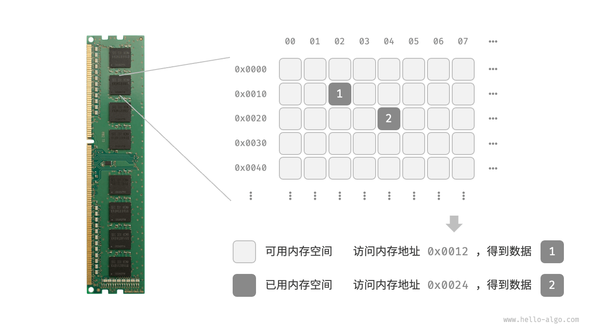

<!--
图展示了一个计算机内存条，其中每个黑色方块都包含一块内存空间。我们可以将内存想象成一个巨大的 Excel 表格，其中每个单元格都可以存储一定大小的数据.
当算法程序运行时，正在处理的数据主要存储在内存中。系统通过内存地址来访问目标位置的数据。计算机根据特定规则为每个内存空间分配了编号，确保每个内存空间都有唯一的内存地址。有了这些地址，程序便可以访问内存中的数据。
-->
---

## 数据结构与算法的关系

数据结构与算法高度相关、紧密结合，具体表现在以下三个方面。
- 数据结构是算法的基石。数据结构为算法提供了结构化存储的数据，以及操作数据的方法。
- 算法是数据结构发挥作用的舞台。数据结构本身仅存储数据信息，结合算法才能解决特定问题。
- 算法通常可以基于不同的数据结构实现，但执行效率可能相差很大，选择合适的数据结构是关键。

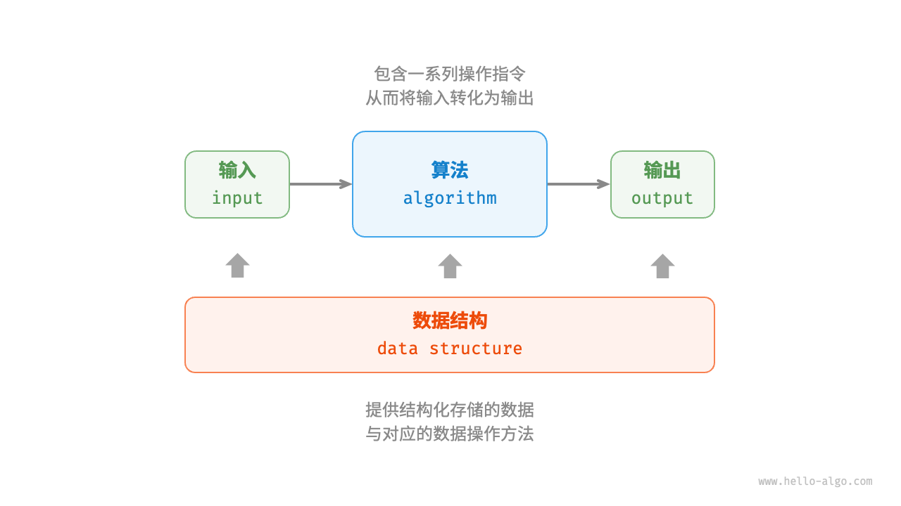

---

## 数据结构的分类

逻辑结构可分为“线性”和“非线性”两大类。线性结构比较直观，指数据在逻辑关系上呈线性排列；非线性结构则相反，呈非线性排列。

所有数据结构都是基于数组、链表或二者的组合实现的。

**数据结构设计是一个充满权衡的过程**。如果想在某方面取得提升，往往需要在另一方面作出妥协。

<!--
在数组和链表中，数据按照一定顺序排列，体现了数据之间的线性关系；而在树中，数据从顶部向下按层次排列，表现出“祖先”与“后代”之间的派生关系；图则由节点和边构成，反映了复杂的网络关系。
权衡例子：
- 链表相较于数组，在数据添加和删除操作上更加便捷，但牺牲了数据访问速度。
- 图相较于链表，提供了更丰富的逻辑信息，但需要占用更大的内存空间。
-->
---

## 为何要学 DS&A

- **提升编程能力**。数据结构和算法是编程的基础，掌握它们可以提高编程效率和代码质量。
- **提升解决问题的能力**。数据结构和算法是解决问题的利器，可以帮助我们更好地理解问题、分析问题和解决问题。
- **提升职业发展**。数据结构和算法是技术面试的重要考察点，掌握它们可以提升面试成功率。

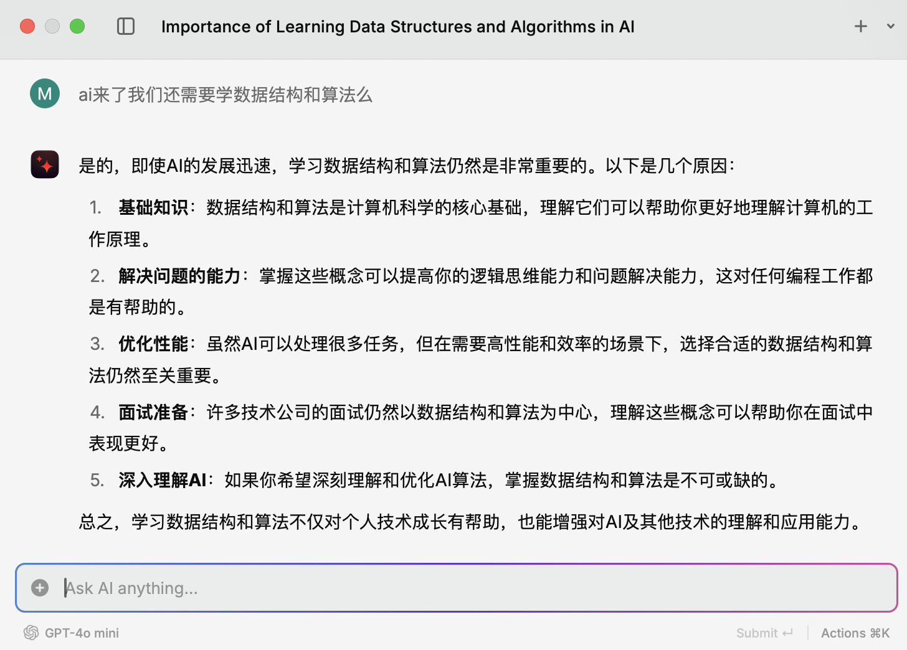

---

## 共同的语言 - DS&A

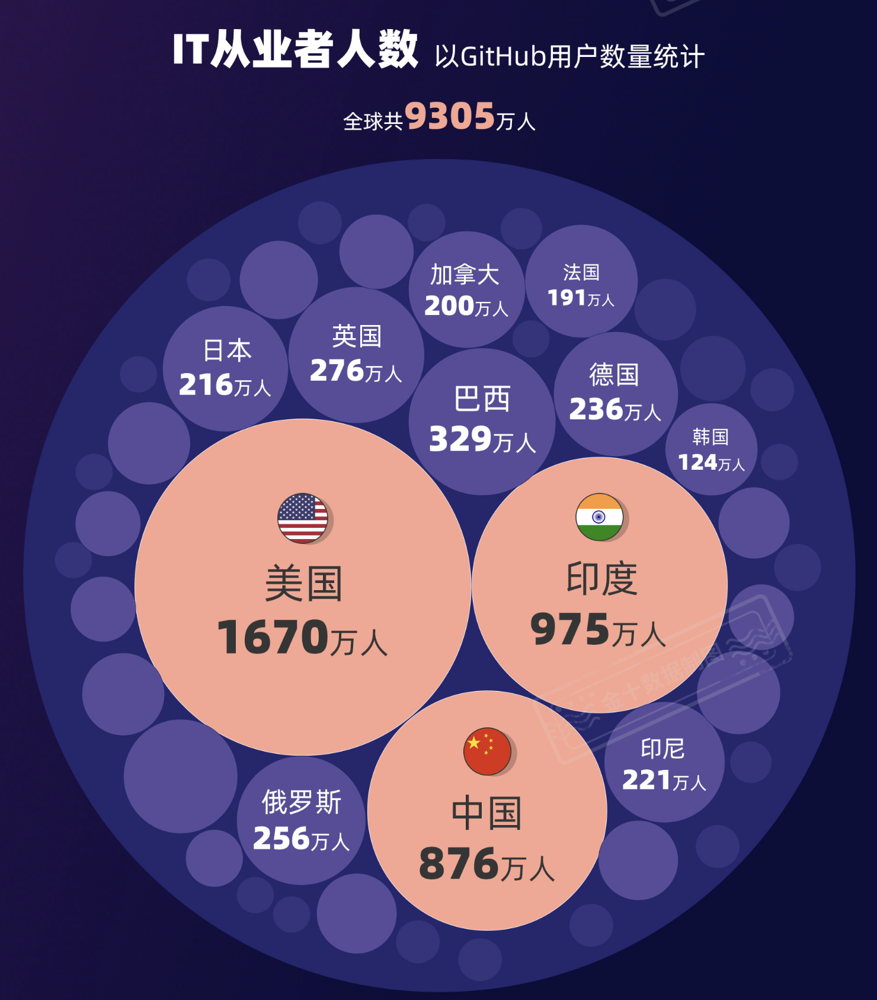

<!-- 
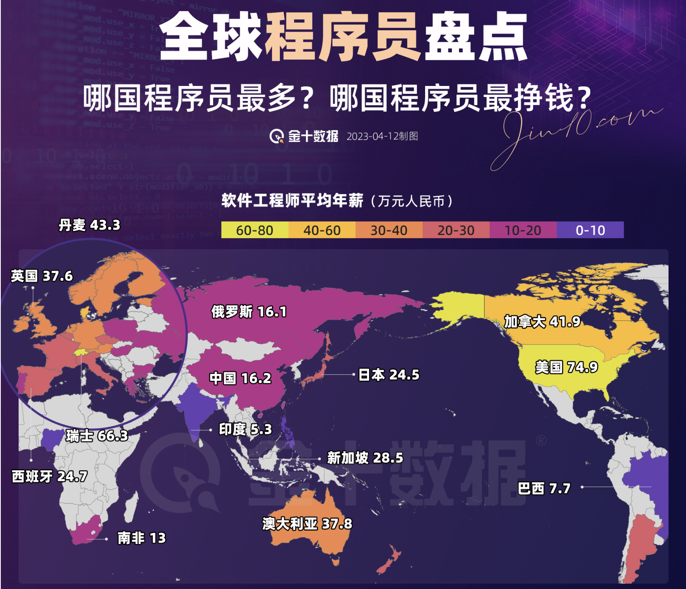
数据来源: [金十数据](https://xnews.jin10.com/details/110194)
::right::
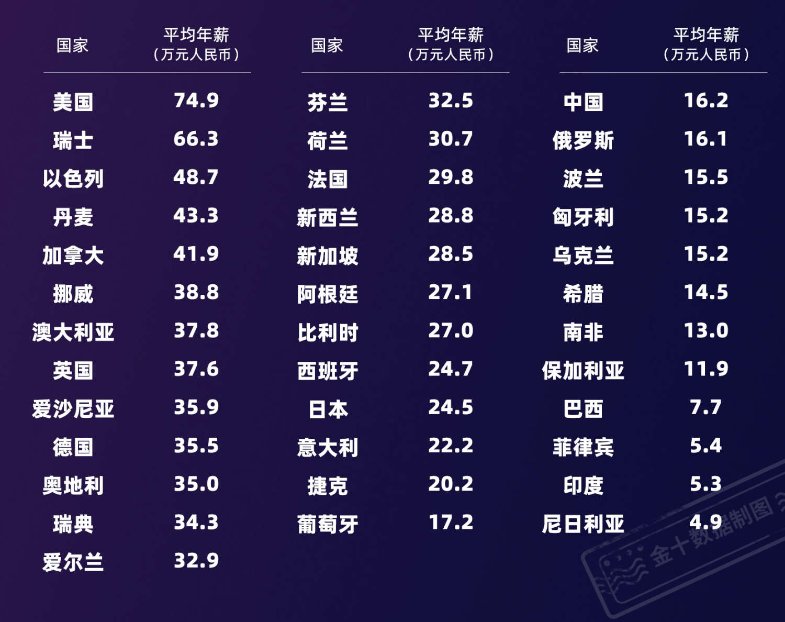 
-->
