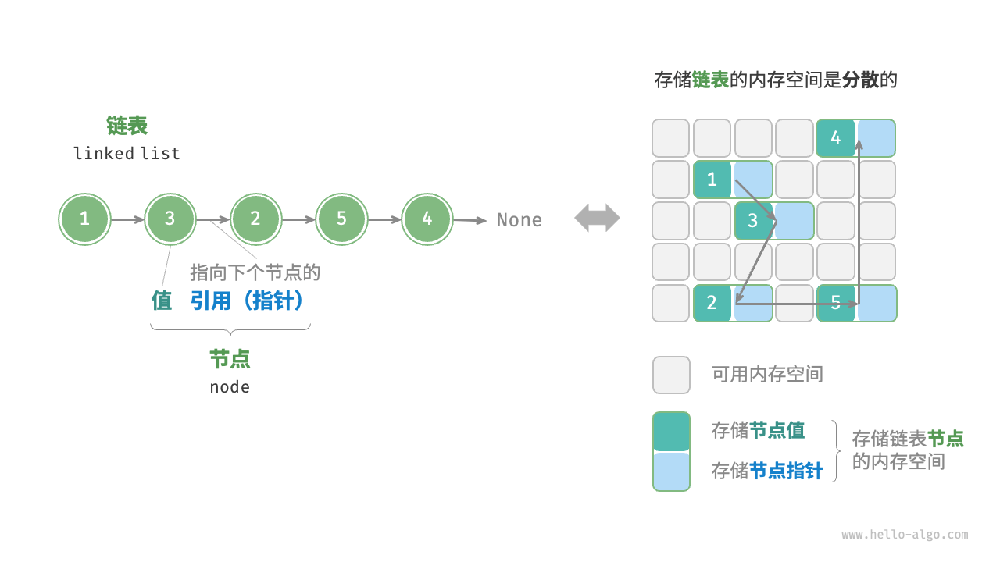
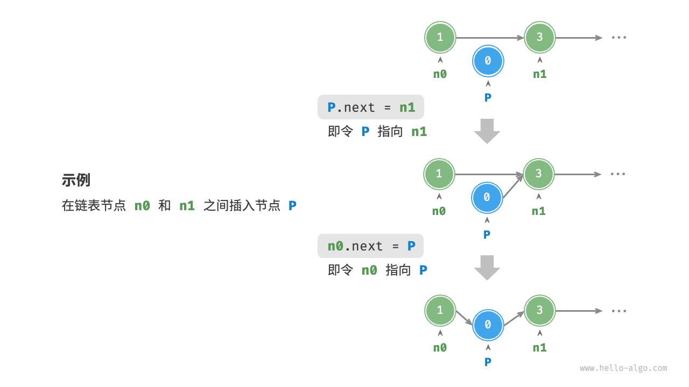
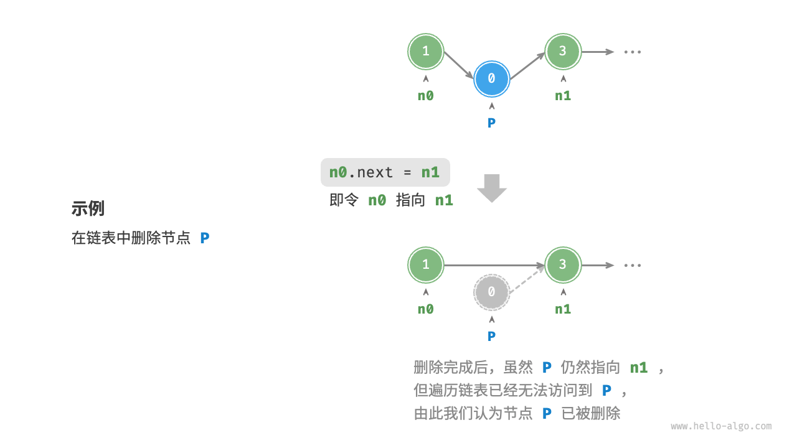
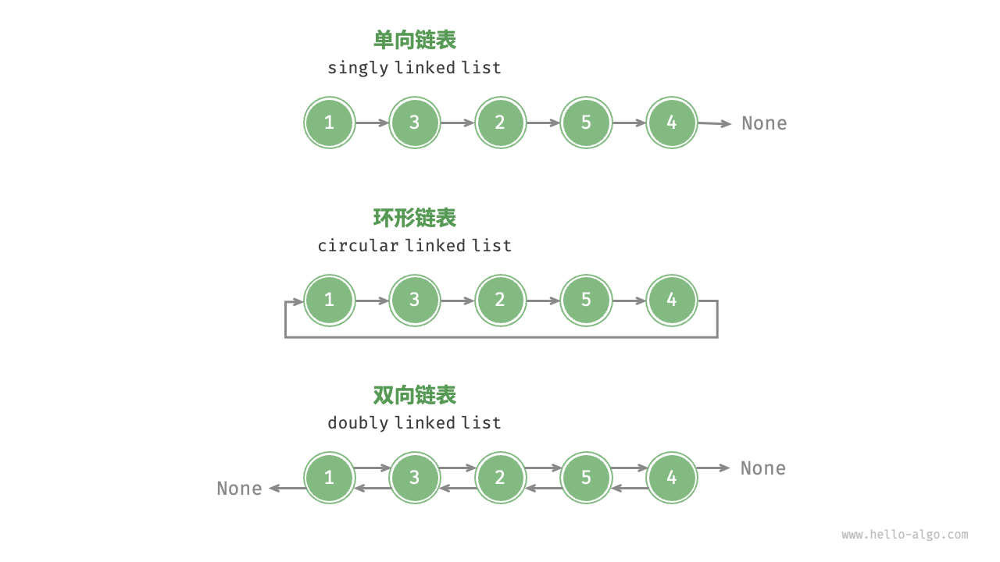

## 链表

链表（linked list）是一种线性数据结构，其中的每个元素都是一个节点对象，各个节点通过“引用”相连接。引用记录了下一个节点的内存地址，通过它可以从当前节点访问到下一个节点。

链表的设计使得各个节点可以分散存储在内存各处，它们的内存地址无须连续。



内存空间是所有程序的公共资源，在一个复杂的系统运行环境下，空闲的内存空间可能散落在内存各处。我们知道，存储数组的内存空间必须是连续的，而当数组非常大时，内存可能无法提供如此大的连续空间。此时链表的灵活性优势就体现出来了。

<!--
链表的组成单位是节点（node）对象。每个节点都包含两项数据：节点的“值”和指向下一节点的“引用”。
链表的首个节点被称为“头节点”，最后一个节点被称为“尾节点”。
尾节点指向的是“空”，在 Python 中被记为 None 。
-->
---

## 链表节点 ListNode

链表节点 ListNode 除了包含值，还需额外保存一个引用（指针）。因此在相同数据量下，链表比数组占用更多的内存空间。

```py {all|1|3-5}
class ListNode:
    """链表节点类"""
    def __init__(self, val: int):
        self.val: int = val               # 节点值
        self.next: ListNode | None = None # 指向下一节点的引用     
```

---

## 链表的初始化

建立链表分为两步，第一步是初始化各个节点对象，第二步是构建节点之间的引用关系。初始化完成后，我们就可以从链表的头节点出发，通过引用指向 next 依次访问所有节点。
    
```py {1|2-6|7-10}
# 初始化链表 1 -> 3 -> 2 -> 5 -> 4
# 1. 初始化各个节点
n0 = ListNode(1)
n1 = ListNode(3)
n2 = ListNode(2)
n3 = ListNode(5)
n4 = ListNode(4)
# 2. 构建节点之间的引用
n0.next = n1
n1.next = n2
n2.next = n3
n3.next = n4
```

----

在链表中插入节点非常容易。如图 4-6 所示，假设我们想在相邻的两个节点 n0 和 n1 之间插入一个新节点 P ，则只需改变两个节点引用（指针）即可，时间复杂度为 O(1)。



相比之下，在数组中插入元素的时间复杂度为 O(n)，在大数据量下的效率较低。


```py
def insert(n0: ListNode, P: ListNode):
    """在链表的节点 n0 之后插入节点 P"""
    n1 = n0.next
    P.next = n1
    n0.next = P
```

---

在链表中删除节点也非常方便，只需改变一个节点的引用（指针）即可。



```py
def remove(n0: ListNode):
    """删除链表的节点 n0 之后的首个节点"""
    if not n0.next:
        return
    # n0 -> P -> n1
    P = n0.next
    n1 = P.next
    n0.next = n1
```

<!--
请注意，尽管在删除操作完成后节点 P 仍然指向 n1 ，但实际上遍历此链表已经无法访问到 P ，这意味着 P 已经不再属于该链表了。
-->
---

## 访问节点

在链表中访问节点的效率较低。如上一节所述，我们可以在 O(1) 时间下访问数组中的任意元素。链表则不然，程序需要从头节点出发，逐个向后遍历，直至找到目标节点。也就是说，访问链表的第 i 个节点需要循环 i-1 轮，时间复杂度为 O(n)。


```py
def access(head: ListNode, index: int) -> ListNode | None:
    """访问链表中索引为 index 的节点"""
    for _ in range(index):
        if not head:
            return None
        head = head.next
    return head
```

---

## 查找节点

遍历链表，查找其中值为 target 的节点，输出该节点在链表中的索引。此过程也属于线性查找。

```py
def find(head: ListNode, target: int) -> int:
    """在链表中查找值为 target 的首个节点"""
    index = 0
    while head:
        if head.val == target:
            return index
        head = head.next
        index += 1
    return -1
```

---

## 链表的遍历

链表的遍历是指从链表的头节点出发，通过引用指向 next 依次访问所有节点。遍历链表的时间复杂度为 O(n)。

```py
def traverse(head: ListNode):
    """遍历链表"""
    cur = head
    while cur:
        print(cur.val)
        cur = cur.next
```

---

## 常见链表类型

- 单向链表：即前面介绍的普通链表。单向链表的节点包含值和指向下一节点的引用两项数据。我们将首个节点称为头节点，将最后一个节点称为尾节点，尾节点指向空 None 。
- 环形链表：如果我们令单向链表的尾节点指向头节点（首尾相接），则得到一个环形链表。在环形链表中，任意节点都可以视作头节点。
- 双向链表：与单向链表相比，双向链表记录了两个方向的引用。双向链表的节点定义同时包含指向后继节点（下一个节点）和前驱节点（上一个节点）的引用（指针）。相较于单向链表，双向链表更具灵活性，可以朝两个方向遍历链表，但相应地也需要占用更多的内存空间。



---

## 单向链表的应用

**单向链表**通常用于实现栈、队列、哈希表和图等数据结构。

- 栈与队列：当插入和删除操作都在链表的一端进行时，它表现的特性为先进后出，对应栈；当插入操作在链表的一端进行，删除操作在链表的另一端进行，它表现的特性为先进先出，对应队列。
- 哈希表：链式地址是解决哈希冲突的主流方案之一，在该方案中，所有冲突的元素都会被放到一个链表中。
- 图：邻接表是表示图的一种常用方式，其中图的每个顶点都与一个链表相关联，链表中的每个元素都代表与该顶点相连的其他顶点。

---

## 双向链表的应用

**双向链表**常用于需要快速查找前一个和后一个元素的场景。

- 高级数据结构：比如在红黑树、B 树中，我们需要访问节点的父节点，这可以通过在节点中保存一个指向父节点的引用来实现，类似于双向链表。
- 浏览器历史：在网页浏览器中，当用户点击前进或后退按钮时，浏览器需要知道用户访问过的前一个和后一个网页。双向链表的特性使得这种操作变得简单。
- LRU 算法：在缓存淘汰（LRU）算法中，我们需要快速找到最近最少使用的数据，以及支持快速添加和删除节点。这时候使用双向链表就非常合适。

---

## 环形链表的应用

**环形链表**常用于需要周期性操作的场景，比如操作系统的资源调度。

- 时间片轮转调度算法：在操作系统中，时间片轮转调度算法是一种常见的 CPU 调度算法，它需要对一组进程进行循环。每个进程被赋予一个时间片，当时间片用完时，CPU 将切换到下一个进程。这种循环操作可以通过环形链表来实现。
- 数据缓冲区：在某些数据缓冲区的实现中，也可能会使用环形链表。比如在音频、视频播放器中，数据流可能会被分成多个缓冲块并放入一个环形链表，以便实现无缝播放。

---

## 链表 vs 数组

链表和数组是两种最基本的数据结构，它们各有优势和劣势。链表的优势在于插入和删除操作的时间复杂度为 O(1)，而数组的优势在于随机访问的时间复杂度为 O(1)。

| 对比 | 数组 | 链表
| --- | --- | --- |
|存储方式 | 连续内存空间 | 分散内存空间|
|存储类型 | 相同类型元素 | 可存储不同类型元素|
|容量扩展 | 长度不可变 | 可灵活扩展|
|内存效率 | 元素占用内存少、但可能浪费空间 | 元素占用内存多|
|访问元素 | O(1) | O(n)|
|添加元素 | O(n) | O(1)|
|删除元素 | O(n) | O(1)|

<!--
[click]
为什么数组要求相同类型的元素，而在链表中却没有强调相同类型呢？
链表由节点组成，节点之间通过引用（指针）连接，各个节点可以存储不同类型的数据，例如 int、double、string、object 等。
相对地，数组元素则必须是相同类型的，这样才能通过计算偏移量来获取对应元素位置。例如，数组同时包含 int 和 long 两种类型，单个元素分别占用 4 字节和 8 字节 ，此时就不能用以下公式计算偏移量了，因为数组中包含了两种“元素长度”。
[click]
如果添加元素时超出列表长度，则需要先扩容列表再添加。系统会申请一块新的内存，并将原列表的所有元素搬运过去，这时候时间复杂度就会是 O(n)。
[click]
在链表中插入和删除操作的时间复杂度是 O(1) 。但是增删之前都需要 O(n) 的时间查找元素，那为什么时间复杂度不是 O(n)呢？
如果是先查找元素、再删除元素，时间复杂度确实是 O(n)。然而，链表的 O(1) 增删的优势可以在其他应用上得到体现。例如，双向队列适合使用链表实现，我们维护一个指针变量始终指向头节点、尾节点，每次插入与删除操作都是 O(1) 。
-->
---

