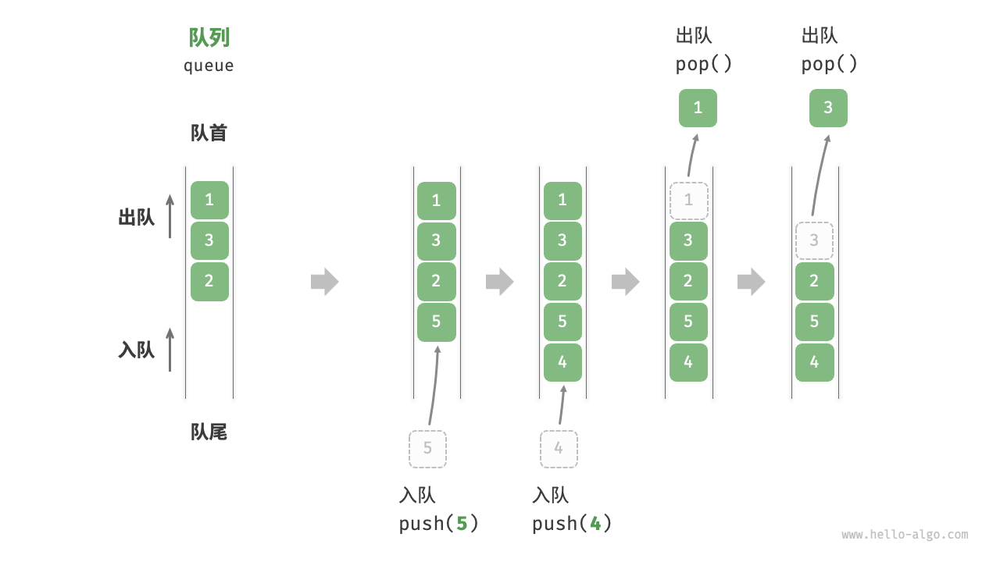
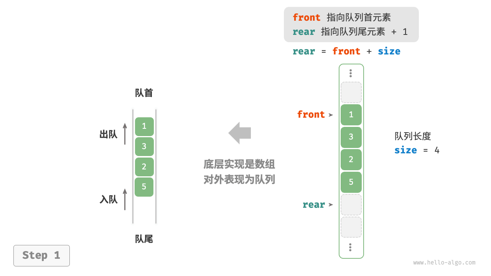
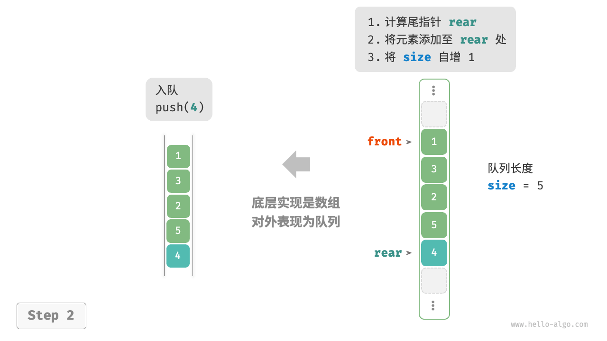
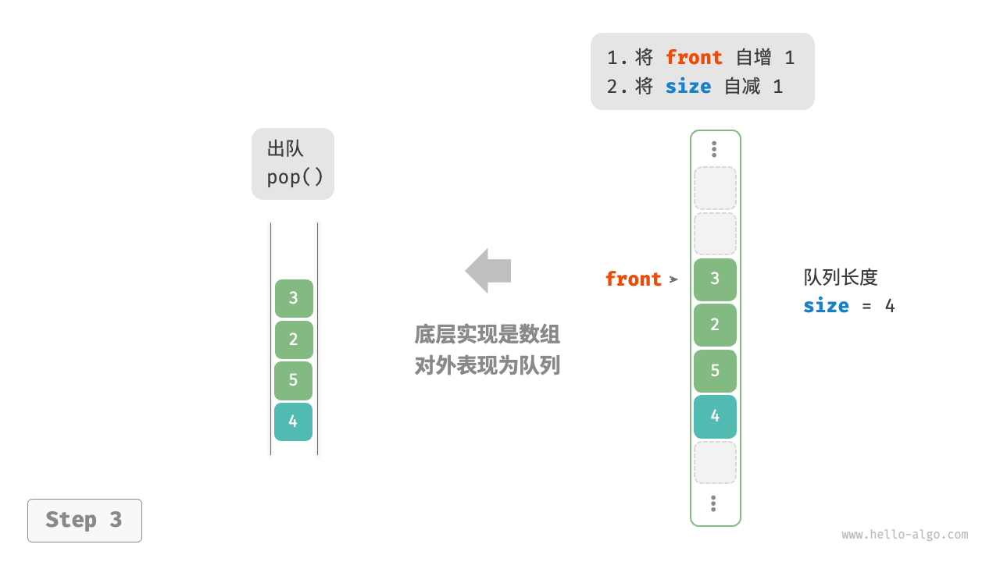
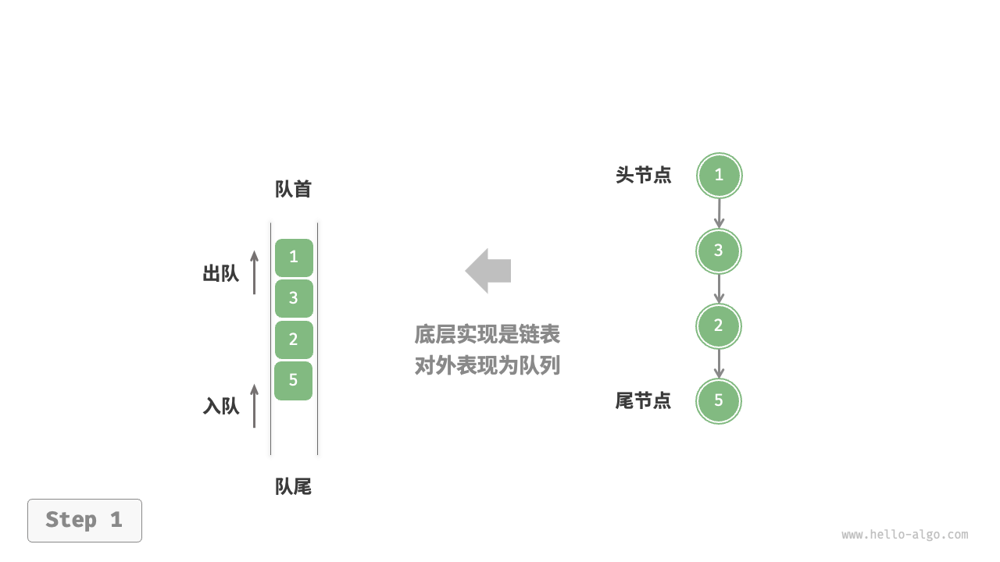
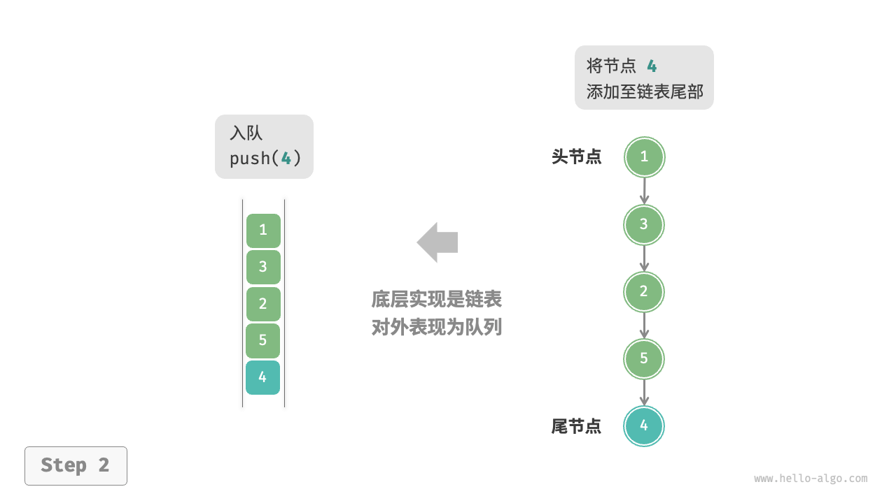
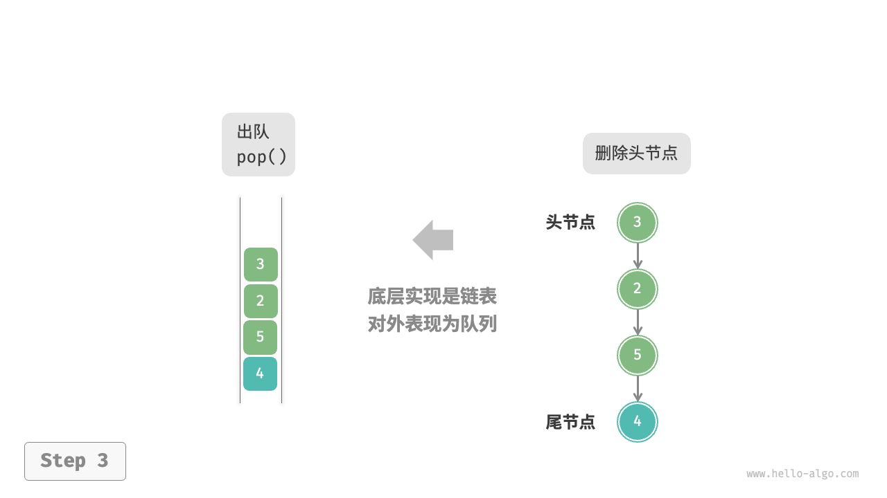
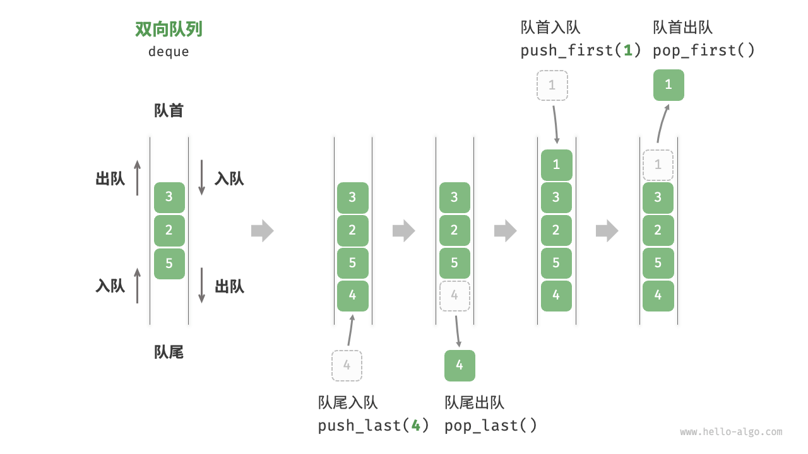
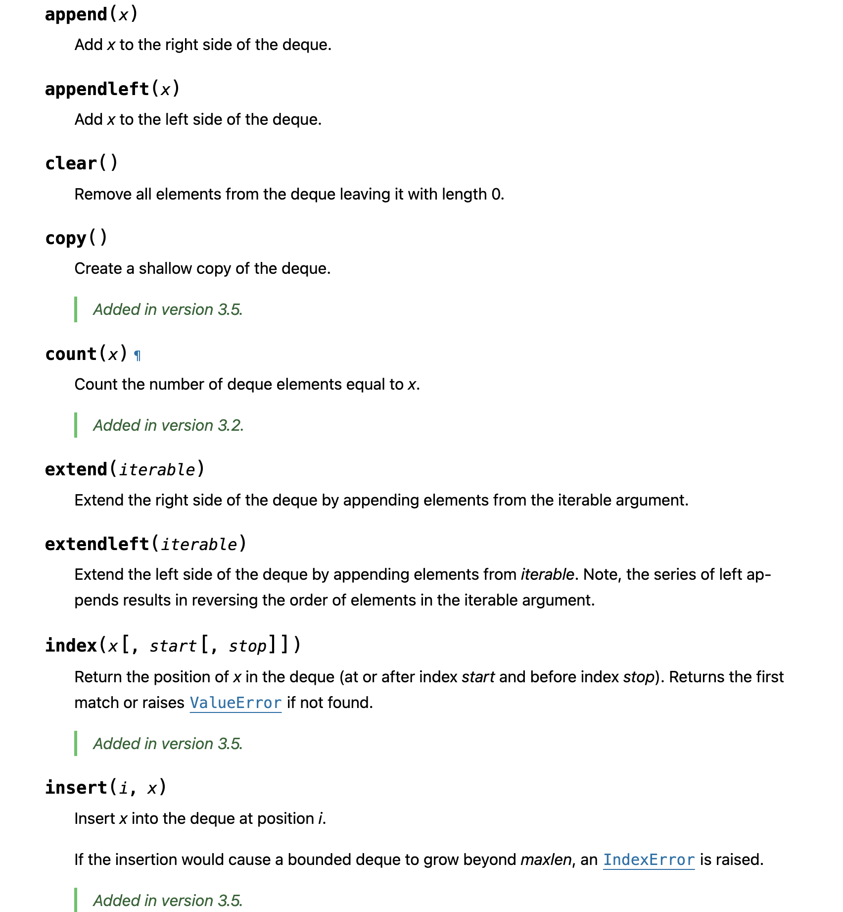
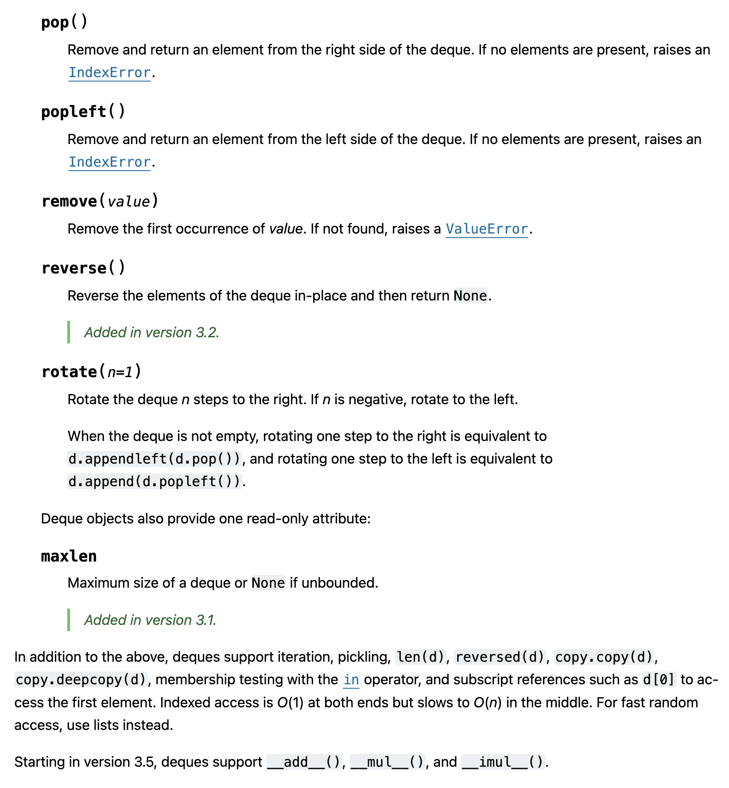

## 定义

队列 `Queue` 是一种遵循先入先出规则的线性数据结构。顾名思义，队列模拟了排队现象，即新来的人不断加入队列尾部，而位于队列头部的人逐个离开。

如图所示，我们将队列头部称为 `Head 队首`，尾部称为 `Tail 队尾`，将把元素加入队尾的操作称为 `Push 入队` 或者 `Enqueue`，删除队首元素的操作称为 `Popleft 出队` 或者 `Dequeue`。



----

## 常用操作

| 方法 | 描述 | 时间复杂度 |
| --- | --- | --- |
| push() | 元素入队，即将元素添加至队尾 | O(1) |
| pop() | 队首元素出队 | O(1) |
| peek() | 访问队首元素 | O(1) |
| size() | 获取队列的长度 | O(1) |
| is_empty() | 判断队列是否为空 | O(1) |

---

## 队列实现 - 基于数组

在数组中删除首元素的时间复杂度为 `O(n)`，这会导致出队操作效率较低。然而，我们可以采用以下巧妙方法来避免这个问题。

我们可以使用一个变量 `front` 指向队首元素的索引，并维护一个变量 size 用于记录队列长度。定义 `rear = front + size` ，这个公式计算出的 `rear` 指向队尾元素之后的下一个位置。

基于此设计，数组中包含元素的有效区间为 `[front, rear - 1]`，各种操作的实现方法如图所示。

入队操作：将输入元素赋值给 rear 索引处，并将 size 增加 1 。
出队操作：只需将 front 增加 1 ，并将 size 减少 1 。
可以看到，入队和出队操作都只需进行一次操作，时间复杂度均为 `O(1)` 。

<v-switch>
  <template #0>  </template>
  <template #1>  </template>
  <template #2>  </template>
</v-switch>

---

````md magic-move
```py 
class ArrayQueue:

    def __init__(self, size: int):
        """构造方法"""
        pass

    def capacity(self) -> int:
        """获取队列的容量"""
        pass

    def size(self) -> int:
        """获取队列的长度"""
        pass

    def is_empty(self) -> bool:
        """判断队列是否为空"""
        pass

    def push(self, num: int):
        """入队"""
        pass

    def pop(self) -> int:
        """出队"""
        pass

    def peek(self) -> int:
        """访问队首元素"""
        pass
```
```py
class ArrayQueue:

    def __init__(self, size: int):
        """构造方法"""
        self._nums: list[int] = [0] * size  # 用于存储队列元素的数组
        self._front: int = 0  # 队首指针，指向队首元素
        self._size: int = 0  # 队列长度

    def capacity(self) -> int:
        """获取队列的容量"""
        return len(self._nums)

    def size(self) -> int:
        """获取队列的长度"""
        return self._size

    def is_empty(self) -> bool:
        """判断队列是否为空"""
        return self._size == 0

    # ...
```
```py
class ArrayQueue:
    # ...

    def push(self, num: int):
        """入队"""
        if self._size == self.capacity():
            raise IndexError("队列已满")
        # 计算队尾指针，指向队尾索引 + 1
        # 通过取余操作实现 rear 越过数组尾部后回到头部
        rear: int = (self._front + self._size) % self.capacity()
        # 将 num 添加至队尾
        self._nums[rear] = num
        self._size += 1

    def pop(self) -> int:
        """出队"""
        num: int = self.peek()
        # 队首指针向后移动一位，若越过尾部，则返回到数组头部
        self._front = (self._front + 1) % self.capacity()
        self._size -= 1
        return num

    def peek(self) -> int:
        """访问队首元素"""
        if self.is_empty():
            raise IndexError("队列为空")
        return self._nums[self._front]
```
````

---

## 队列实现 - 基于单链表

使用链表实现队列时，我们可以将链表的“头节点”和“尾节点”分别视为“队首”和“队尾”，规定队尾仅可添加节点，队首仅可删除节点。

<v-switch>
  <template #0>  </template>
  <template #1>  </template>
  <template #2>  </template>
</v-switch>

---

````md magic-move
```py
class ListNode:
    def __init__(self, val=0, next=None):
        self.val = val
        self.next = next
```
```py
class LinkedListQueue:

    def __init__(self):
        """构造方法"""
        pass

    def size(self) -> int:
        """获取队列的长度"""
        pass

    def is_empty(self) -> bool:
        """判断队列是否为空"""
        pass

    def peek(self) -> int:
        """访问队首元素"""
        pass

    def push(self, num: int):
        """入队"""
        pass

    def pop(self) -> int:
        """出队"""
        pass
```
```py
class LinkedListQueue:
    """基于链表实现的队列"""

    def __init__(self):
        """构造方法"""
        self._front: ListNode | None = None  # 头节点 front
        self._rear: ListNode | None = None  # 尾节点 rear
        self._size: int = 0

    def size(self) -> int:
        """获取队列的长度"""
        return self._size

    def is_empty(self) -> bool:
        """判断队列是否为空"""
        return self._size == 0

    def peek(self) -> int:
        """访问队首元素"""
        if self.is_empty():
            raise IndexError("队列为空")
        return self._front.val
    # ...
```
```py
class LinkedListQueue:
    # ...
    
    def push(self, num: int):
        """入队"""
        # 在尾节点后添加 num
        node = ListNode(num)
        # 如果队列为空，则令头、尾节点都指向该节点
        if self._front is None:
            self._front = node
            self._rear = node
        # 如果队列不为空，则将该节点添加到尾节点后
        else:
            self._rear.next = node
            self._rear = node
        self._size += 1

    def pop(self) -> int:
        """出队"""
        num = self.peek()
        # 删除头节点
        self._front = self._front.next
        self._size -= 1
        return num
```
````

---

## 队列应用

<br>
<v-clicks>

- **打印任务**
- **淘宝订单**
- **各类待办事项** 

</v-clicks>

<!--
[click]
购物者下单后，订单将加入队列中，系统随后会根据顺序处理队列中的订单。在双十一期间，短时间内会产生海量订单，高并发成为工程师们需要重点攻克的问题。
[click]
任何需要实现“先来后到”功能的场景，例如打印机的任务队列、餐厅的出餐队列等，队列在这些场景中可以有效地维护处理顺序。
-->
---

## 双向队列

在队列中，我们仅能删除头部元素或在尾部添加元素。

双向队列 `double-ended queue` 提供了更高的灵活性，允许在头部和尾部执行元素的添加或删除操作。



---

## Python Deque

Python 中的 `collections` 模块提供了 `deque` 类，它是一个双向队列的实现。


---

## Python Deque

```py
from collections import deque

# 初始化队列
# 在 Python 中，我们一般将双向队列类 deque 当作队列使用
# 虽然 queue.Queue() 是纯正的队列类，但不太好用，因此不推荐
que: deque[int] = deque()

# 元素入队
que.append(1)
que.append(3)
que.append(2)

# 访问队首元素
front: int = que[0]

# 元素出队
pop: int = que.popleft()

# 获取队列的长度
size: int = len(que)

# 判断队列是否为空
is_empty: bool = len(que) == 0
```

---
layout: two-cols
layoutClass: gap-4
---


::right::


---

## 双向队列总结

| 方法 | 描述 | 时间复杂度 |
| --- | --- | --- |
| appendleft() | 将元素添加至队首 | O(1) |
| append() | 将元素添加至队尾 | O(1) |
| popleft() | 删除队首元素 | O(1) |
| pop() | 删除队尾元素 | O(1) |
| deque[0] | 访问队首元素 | O(1) |
| dequed[-1] | 访问队尾元素 | O(1) |

双向队列兼具栈与队列的逻辑，因此它可以实现这两者的所有应用场景，同时提供更高的自由度。

<!--
例如，软件的“撤销”功能通常使用栈来实现：系统将每次更改操作 `push` 到栈中，然后通过 `pop` 实现撤销。然而，考虑到系统资源的限制，软件通常会限制撤销的步数（例如仅允许保存 `50` 步）。当栈的长度超过 `50`时，软件需要在栈底（队首）执行删除操作。但栈无法实现该功能，此时就需要使用双向队列来替代栈。请注意，“撤销”的核心逻辑仍然遵循栈的先入后出原则，只是双向队列能够更加灵活地实现一些额外逻辑。
-->
---
layout: image

# the image source
image: ../images/kent.png

backgroundSize: contain
---

---

#### 实现一个浏览器的“前进”和“后退”功能

```py {*}{maxHeight: '450px'}
from collections import deque

class Browser:
    def __init__(self):
        self._back = deque()
        self._forward = deque()
        self._current = None
    
    def visit(self, url: str):
        self._back.append(self._current)
        self._current = url
        self._forward.clear()
    
    def back(self) -> str:
        if not self._back:
            return self._current
        self._forward.append(self._current)
        self._current = self._back.pop()
        return self._current

    def forward(self) -> str:
        if not self._forward:
            return self._current
        self._back.append(self._current)
        self._current = self._forward.pop()
        return self._current
```

---

#### 实现LRU缓存

LRU 缓存是一种常见的缓存策略，它会删除最近最少使用的元素。我们可以使用双向队列和哈希表来实现 LRU 缓存。

```py {*}{maxHeight: '450px'}
from collections import deque

class LRUCache:
    def __init__(self, capacity: int):
        self._capacity = capacity
        self._cache = dict()
        self._queue = deque()
    
    def get(self, key: int) -> int:
        if key not in self._cache:
            return -1
        self._queue.remove(key)
        self._queue.append(key)
        return self._cache[key]
    
    def put(self, key: int, value: int):
        if key in self._cache:
            self._queue.remove(key)
        elif len(self._cache) == self._capacity:
            oldest = self._queue.popleft()
            self._cache.pop(oldest)
        self._cache[key] = value
        self._queue.append(key)
```
