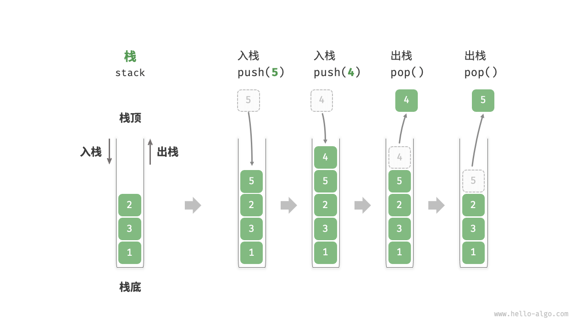
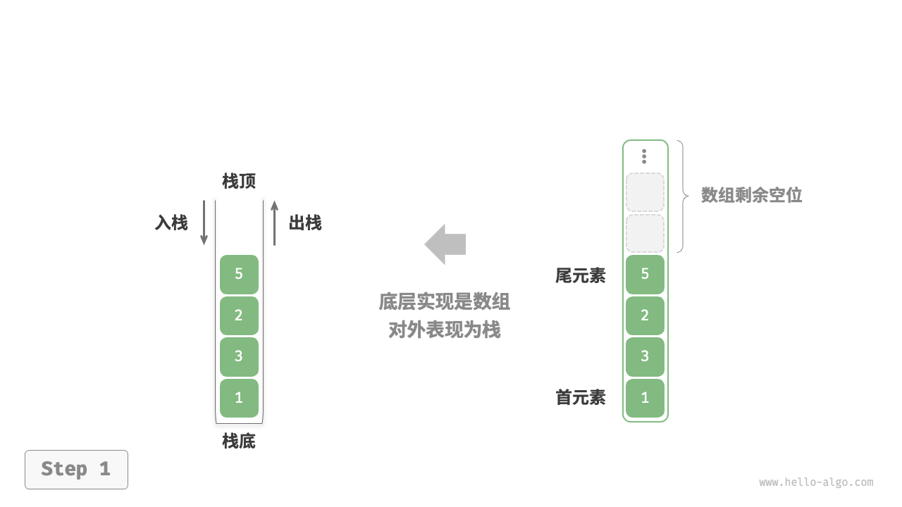
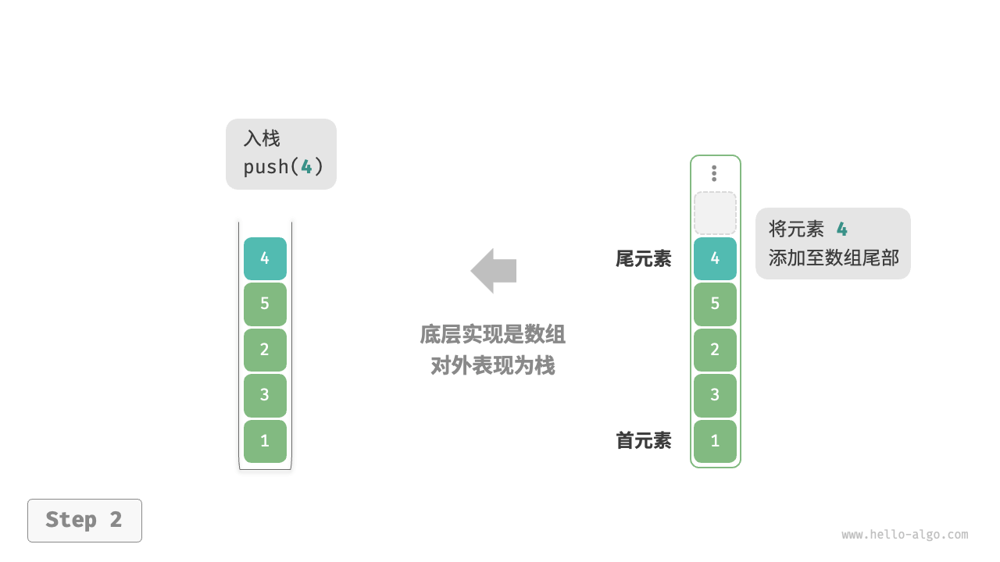
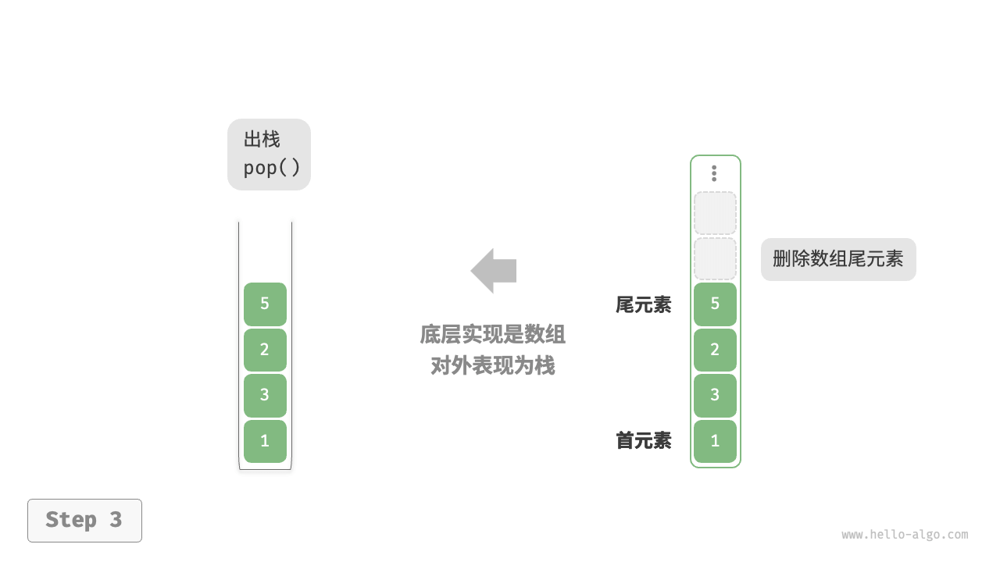
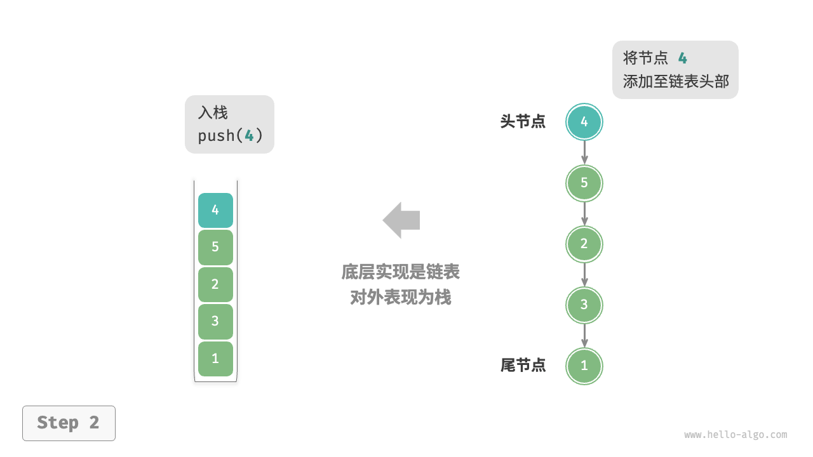
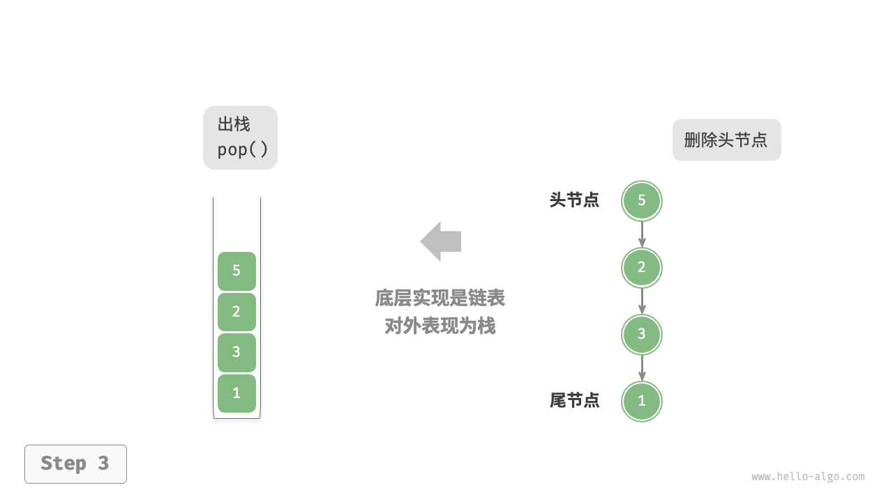

## 定义

栈（stack）是一种遵循先入后出逻辑的线性数据结构。

我们可以将栈类比为桌面上的一摞盘子，如果想取出底部的盘子，则需要先将上面的盘子依次移走。我们将盘子替换为各种类型的元素（如整数、字符、对象等），就得到了栈这种数据结构。

如图所示，我们把堆叠元素的顶部称为“栈顶”，底部称为“栈底”。将把元素添加到栈顶的操作叫作“入栈”，删除栈顶元素的操作叫作“出栈”。



<!-- 
羽毛球盒子、书本堆、餐盘堆等都是栈的实例，它们都遵循先入后出的原则。栈的应用非常广泛，例如函数调用栈、表达式求值、括号匹配等。
-->
---

## 常用操作

| 方法 | 描述 | 时间复杂度 |
| --- | --- | --- |
| push() | 元素入栈（添加至栈顶） | O(1) |
| pop() | 栈顶元素出栈 | O(1) |
| peek() | 访问栈顶元素 | O(1) |
| size() | 获取栈的长度 | O(1) |
| is_empty() | 判断栈是否为空 | O(1) |

<!--
我们重点优化的是入栈和出栈操作，因为这两个操作是栈的核心操作。在栈的实现中，我们通常使用数组或链表来存储元素，这两种数据结构的特点如下。
-->
---

## 链表实现 - 基于数组

使用数组实现栈时，我们可以将数组的尾部作为栈顶。如图所示，入栈与出栈操作分别对应在数组尾部添加元素与删除元素，时间复杂度都为 `O(1)` 。

<v-switch>
  <template #0>  </template>
  <template #1>  </template>
  <template #2>  </template>
</v-switch>

---

````md magic-move
```py 
class ArrayStack:

    def __init__(self):
        """构造方法"""
        pass

    def size(self) -> int:
        """获取栈的长度"""
        pass

    def is_empty(self) -> bool:
        """判断栈是否为空"""
        pass

    def peek(self) -> int:
        """访问栈顶元素"""
        pass

    def push(self, val: int):
        """入栈"""
        pass

    def pop(self) -> int:
        """出栈"""
        pass
```
```py
class ArrayStack:

    def __init__(self):
        self._data: list[int] = []

    def size(self) -> int:
        return len(self._data)

    def is_empty(self) -> bool:
        return self.size() == 0

    def peek(self) -> int:
        if self.is_empty():
            raise IndexError("栈为空")
        return self._data[-1]

    def push(self, val: int):
        self._data.append(val)

    def pop(self) -> int:
        if self.is_empty():
            raise IndexError("栈为空")
        return self._data.pop()
```
````

---

## 链表实现 - 基于单链表

使用链表实现栈时，我们可以将链表的头节点视为栈顶，尾节点视为栈底。

如图所示，对于入栈操作，我们只需将元素插入链表头部，这种节点插入方法被称为“头插法”。而对于出栈操作，只需将头节点从链表中删除即可。

<v-switch>
  <template #0>  </template>
  <template #1>  </template>
  <template #2>  </template>
</v-switch>

---

````md magic-move
```py
class ListNode:
    """链表节点"""

    def __init__(self, val=0, next=None):
        self.val = val
        self.next = next
```
```py
class LinkedListStack:

    def __init__(self):
        """构造方法"""
        pass

    def size(self) -> int:
        """获取栈的长度"""
        pass

    def is_empty(self) -> bool:
        """判断栈是否为空"""
        pass

    def peek(self) -> int:
        """访问栈顶元素"""
        pass

    def push(self, val: int):
        """入栈"""
        pass

    def pop(self) -> int:
        """出栈"""
        pass
```
```py
class LinkedListStack:

    def __init__(self):
        self._peek: ListNode | None = None
        self._size: int = 0

    def size(self) -> int:
        return self._size

    def is_empty(self) -> bool:
        return self._size == 0

    def peek(self) -> int:
        if self.is_empty():
            raise IndexError("栈为空")
        return self._peek.val

    def push(self, val: int):
        node = ListNode(val)
        node.next = self._peek
        self._peek = node
        self._size += 1

    def pop(self) -> int:
        num = self.peek()
        self._peek = self._peek.next
        self._size -= 1
        return num
```
````

---

## 两种实现的对比

|  | 基于数组 | 基于链表 |
| --- | --- | --- |
| 支持操作 | 入栈、出栈、访问栈顶元素，随机访问 | 入栈、出栈、访问栈顶元素 |
| 时间复杂度 | 入栈、出栈、访问栈顶元素: `O(1)`，扩容: `O(n)` | 入栈、出栈、访问栈顶元素: `O(1)` |
| 空间复杂度 | 预分配内存，可能存在空间浪费 | 链表节点占用额外空间 |

Trade-offs: 扩容时效率、空间利用率

当入栈与出栈操作的元素是基本数据类型时，例如 `int` 或 `double`，我们可以使用数组实现栈。但是，如果入栈与出栈操作的元素是对象，我们可以使用链表实现栈。

<!--
两种实现都支持栈定义中的各项操作。数组实现额外支持随机访问，但这已超出了栈的定义范畴，因此一般不会用到。
在基于数组的实现中，入栈和出栈操作都在预先分配好的连续内存中进行，具有很好的缓存本地性，因此效率较高。然而，如果入栈时超出数组容量，会触发扩容机制，导致该次入栈操作的时间复杂度变为O(n)。
在基于链表的实现中，链表的扩容非常灵活，不存在上述数组扩容时效率降低的问题。但是，入栈操作需要初始化节点对象并修改指针，因此效率相对较低。不过，如果入栈元素本身就是节点对象，那么可以省去初始化步骤，从而提高效率。
基于数组实现的栈在触发扩容时效率会降低，但由于扩容是低频操作，因此平均效率更高。基于链表实现的栈可以提供更加稳定的效率表现。
在初始化列表时，系统会为列表分配“初始容量”，该容量可能超出实际需求；并且，扩容机制通常是按照特定倍率（例如 2 倍）进行扩容的，扩容后的容量也可能超出实际需求。因此，基于数组实现的栈可能造成一定的空间浪费。然而，由于链表节点需要额外存储指针，因此链表节点占用的空间相对较大。综上，我们不能简单地确定哪种实现更加节省内存，需要针对具体情况进行分析。
-->
---

## 栈的应用

<br>
<v-clicks>

- **浏览器中的后退与前进、软件中的撤销与反撤销** 
- **程序内存管理，函数调用栈** 
- **表达式求值**
- **括号匹配**

</v-clicks>
<!--
[click]
每当我们打开新的网页，浏览器就会对上一个网页执行入栈，这样我们就可以通过后退操作回到上一个网页。后退操作实际上是在执行出栈。如果要同时支持后退和前进，那么需要两个栈来配合实现。
在软件中，我们经常会使用撤销和反撤销功能。撤销操作实际上是在执行出栈，而反撤销操作则是在执行入栈。这两个操作可以通过两个栈来实现。
[click]
在程序内存管理中，栈用于存储函数调用的上下文信息。每次调用函数时，系统都会在栈顶添加一个栈帧，用于记录函数的上下文信息。在递归函数中，向下递推阶段会不断执行入栈操作，而向上回溯阶段则会不断执行出栈操作。
每次调用函数时，系统都会在栈顶添加一个栈帧，用于记录函数的上下文信息。在递归函数中，向下递推阶段会不断执行入栈操作，而向上回溯阶段则会不断执行出栈操作。
[click]
在表达式求值中，我们可以使用两个栈来实现。一个栈用于存储操作数，另一个栈用于存储运算符。当遇到运算符时，我们可以通过比较优先级来决定是否执行计算。这种方法可以处理多种运算符，例如加减乘除、括号等。
[click]
在括号匹配中，我们可以使用栈来实现。遍历字符串时，遇到左括号时执行入栈操作，遇到右括号时执行出栈操作。如果最终栈为空，则说明括号匹配成功；否则，说明括号匹配失败。
-->