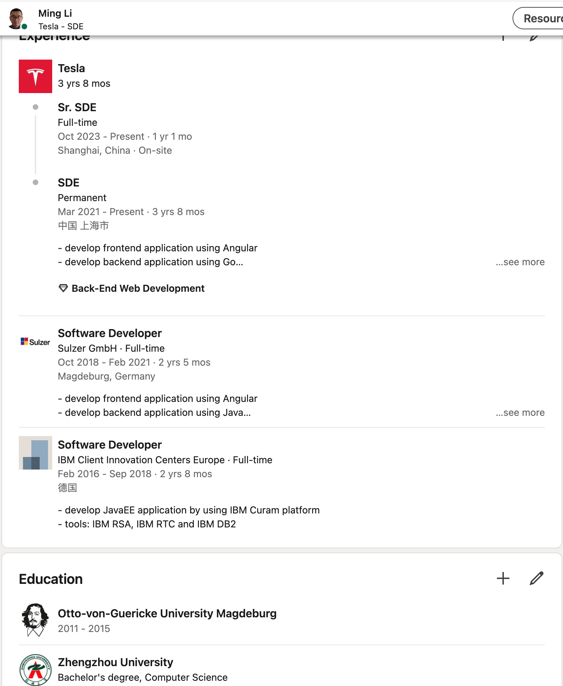

# 数据结构

上海海事大学 - 2024.11

  
    Let's Go 🚀<carbon:arrow-right class="inline"/>
  

  <a href="https://github.com/MingLi19/slides" target="_blank" alt="GitHub" title="Open in GitHub"
    class="text-xl slidev-icon-btn opacity-50 !border-none !hover:text-white">
    <carbon-logo-github />
  </a>

---
hideInToc: true
layout: two-cols
layoutClass: gap-4
---

## 自我介绍

 
<v-clicks>

- 二十岁前没出过省
- 十年旅德，没在家过年
- 一份中国学历，一份德国学历
- 一半德国工作经验，一半中国工作经验
- 十年磨一剑 **数字化**
</v-clicks>

::right::

[领英](https://www.linkedin.com/in/ming-li-714a88105)

<!--
学业和工作都是中外都经历过，对于数据结构和算法有着深刻的理解和实践。希望通过这门课程，能够帮助大家更好地理解数据结构和算法。
-->
---
hideInToc: true
---

# 课程大纲

<Toc minDepth="1" maxDepth="2" columns="3"></Toc>

---
layout: center
---

# 数据结构和算法之个人见解

---
src: ./pages/intro.md
---

---
layout: center
---

# 数组 Array

---
src: ./pages/array.md
---

---
layout: center
---

# 链表 Linked List

---
src: ./pages/linkedlist.md
---

---
layout: center
---

# 栈 Stack

---
src: ./pages/stack.md
---

---
layout: center
---

# 队列 Queue

---
src: ./pages/queue.md
---

---
layout: center
---

# 二分查找 Binary Search

---
src: ./pages/binary_search.md
---

